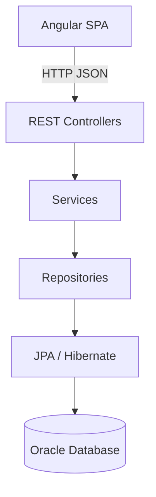

# StockSmart — B.Tech Project Specification

## Purpose

**StockSmart** is a college-level (B.Tech) full-stack project that demonstrates retail inventory management using:

- **Frontend:** Angular (standalone components), TypeScript, Reactive Forms, HttpClient
- **Backend:** Java, Spring Boot, Spring Data JPA, Hibernate, Spring Security, REST APIs
- **Database:** Oracle Database

This is **not** a production enterprise platform. The goal is a **well-structured, functional, demonstrable** application with clear layers, CRUD, business workflows, authentication, KPIs, and Mermaid documentation that matches the **actual** implementation.

---

## Architecture (College Level)

Simple **monolithic layered** architecture:



### Backend package layout

```
com.stocksmart
├── config/
├── exception/
├── security/
├── auth/
├── user/
├── product/
├── category/
├── supplier/
├── location/
├── inventory/
├── transfer/
├── purchase/
├── order/
├── alert/
├── dashboard/
└── report/
```

Each feature package contains: `controller`, `service`, `repository`, `entity`, `dto`.

Shared layers: `controller/`, `service/`, `repository/`, `entity/`, `dto/`, `config/`, `exception/` may also be used as a single-package-per-layer tree during early scaffolding.

### Explicitly out of scope (architecture)

- Microservices, event-driven design, CQRS, Kafka, Redis
- Hexagonal / ports-and-adapters as a formal architecture
- Double-entry accounting ledger, immutable stock transactions
- Optimistic concurrency (`@Version`) on inventory rows
- Flyway (schema via JPA `ddl-auto` or manual Oracle scripts for demo)
- MapStruct (manual DTO mapping is acceptable)
- RFC 7807 Problem Details (simple JSON error responses instead)

---

## Security

- **Authentication:** Login with username/password; **JWT** access token (straightforward implementation).
- **Authorization:** Role-based access with **three roles:**
  - `ADMIN` — users, full access
  - `INVENTORY_MANAGER` — inventory, POs, transfers, reports
  - `STAFF` — read inventory, create orders, basic operations
- Enforce roles on REST endpoints (`@PreAuthorize("hasRole('...')")`) and Angular route guards.
- Passwords hashed with **BCrypt**.

---

## Inventory model (simplified)

Per **product** and **location**:

- Current **quantity**
- **Reorder level** (for low-stock alerts)

Stock changes happen in **service layer** business methods:

| Operation        | Behavior |
|------------------|----------|
| Stock In         | Increase quantity (e.g. PO receive) |
| Stock Out        | Decrease quantity (e.g. sale/order) |
| Adjustment       | Set or delta quantity with reason |
| Transfer         | Decrease source, increase destination |

Optional **`InventoryTransaction`** rows record history (type, quantity, reference, user, timestamp) for reports and demonstration — **not** an immutable accounting ledger.

---

## Barcode (academic)

- `Product.barcode` (unique, optional until assigned)
- Manual entry and search by barcode
- Keyboard-wedge / fast input in a dedicated field (no GS1 parser required)
- Optional: camera scan via browser API if time permits

**Not in scope:** GS1 compliance, EPCIS, offline scan queues, idempotency keys.

---

## RFID (future)

- Document only: placeholder field or design note on `Product` (`rfidTag` optional)
- **No** hardware integration, SGTIN-96 parsing, or EPCIS pipeline in MVP
- Real RFID hardware integration is a **future enhancement**

---

## Workflows (simplified)

### Sales order

`Order` → `OrderItem` → **Confirm** → reduce stock at location → `COMPLETED`

### Purchase order

`PurchaseOrder` → `PurchaseOrderItem` → **Received** → increase stock at destination location

### Stock transfer

Create transfer → complete (deduct source, add destination) in one service transaction for demo clarity.

---

## Frontend pages

| Page | Purpose |
|------|---------|
| Login | Authentication |
| Dashboard | KPI widgets |
| Products | Product CRUD, barcode |
| Categories | Category CRUD |
| Suppliers | Supplier CRUD, link products |
| Locations | Store/warehouse CRUD |
| Inventory | Levels, stock in/out, adjustments |
| Stock Transfers | Inter-location moves |
| Purchase Orders | Create, receive |
| Orders | Create, confirm, complete |
| Alerts | Low / out of stock |
| Reports | Tables/exports from DB metrics |
| Users | Admin user management |

Use **Reactive Forms**, **HttpClient**, **AuthInterceptor**, functional **route guards**. No mandatory NgRx.

---

## KPI dashboard (from real data)

- Total products
- Total inventory quantity (all locations)
- Total inventory value (quantity × product unit cost/price)
- Low-stock count (quantity < reorder level)
- Out-of-stock count (quantity = 0)
- Products by category
- Stock by location
- Pending purchase orders
- Total orders

No ML forecasting.

---

## Database entities (implementation target)

| Entity | Notes |
|--------|--------|
| `User` | Credentials, profile, active flag |
| `Role` | ADMIN, INVENTORY_MANAGER, STAFF |
| `UserRole` | Many-to-many (or role enum on User) |
| `Category` | Optional parent for hierarchy |
| `Product` | SKU, name, price/cost, category, **barcode** |
| `Location` | Name, type (STORE/WAREHOUSE) |
| `Inventory` | product + location + quantity + reorder_level |
| `InventoryTransaction` | Optional movement history |
| `Supplier` | Contact fields |
| `SupplierProduct` | supplier ↔ product, unit cost |
| `PurchaseOrder` | supplier, location, status |
| `PurchaseOrderItem` | lines, qty ordered/received |
| `Order` | location, status, totals |
| `OrderItem` | lines |
| `StockTransfer` | source, dest, status |
| `StockTransferItem` | lines |
| `Alert` | Low-stock / out-of-stock alerts |

**Removed vs enterprise docs:** `Permission`, `RolePermission`, `Brand`, `ProductIdentifier` table, heavy `AuditLog` CLOB snapshots.

---

## Documentation map

| Document | Role |
|----------|------|
| `PROJECT.md` | This file — college scope & entities |
| `README.md` | Setup, run, demo |
| `TODO.md` | Implementation phases |
| `CLAUDE.md` | Agent/dev conventions (simplified) |
| `docs/architecture.md` | Layered monolith + diagrams |
| `docs/database.md` | ER model for Oracle |
| `docs/requirements.md` | Functional requirements |
| Other `docs/*` | Flows, API sketch, security, KPIs, testing |

Existing documentation is **preserved**. Enterprise sections were **replaced** so diagrams and text match this specification.

---

## Implementation phases

0. Documentation alignment (this file and `docs/`)
1. Project scaffolding (Spring Boot + Angular layout, Oracle/JPA config)
2. Security and users (JWT, three roles)
3. Master data (categories, products, locations, suppliers)
4. Inventory core + barcode lookup
5. Purchase orders, sales orders, transfers
6. Alerts and KPI dashboard
7. Demo polish and seed data

---

## Future enhancements (post-project)

- Real RFID readers and tag encoding (EPC Gen2)
- GS1 barcode validation and application identifiers
- Double-entry immutable stock ledger and audit snapshots
- Flyway migrations, MapStruct, RFC 7807, refresh-token rotation
- Offline scanner buffering, optimistic locking, multi-node deployment
- Advanced analytics / demand forecasting
