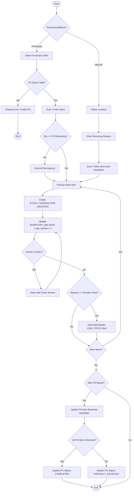
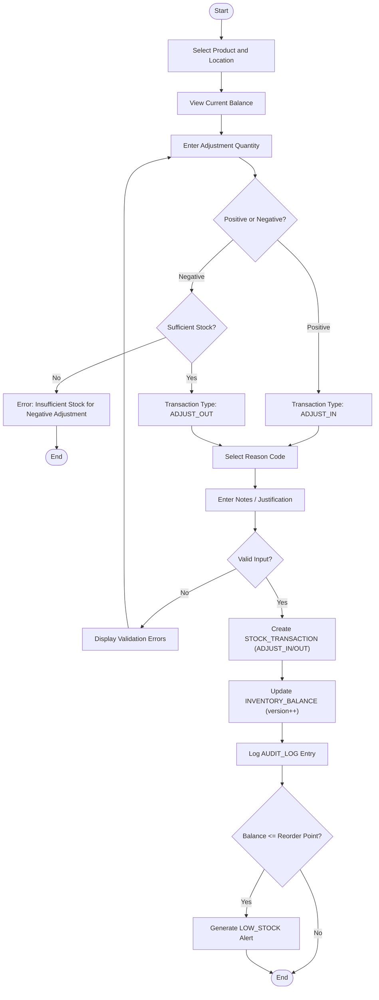
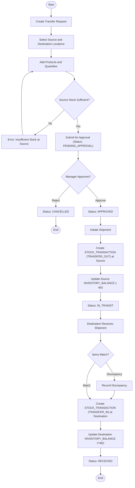
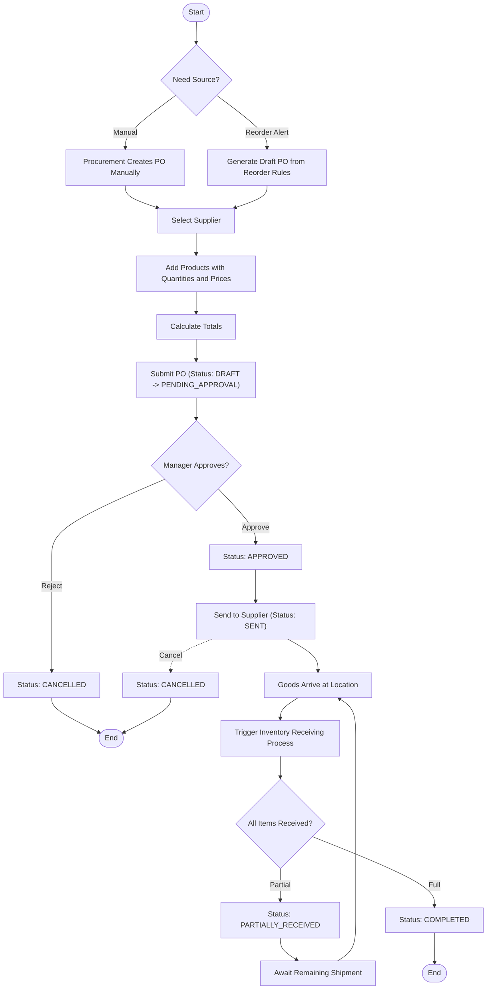
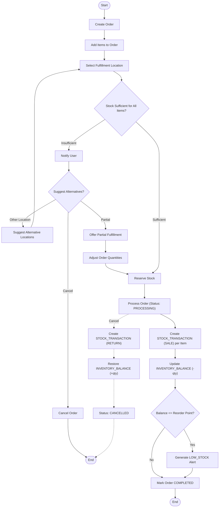
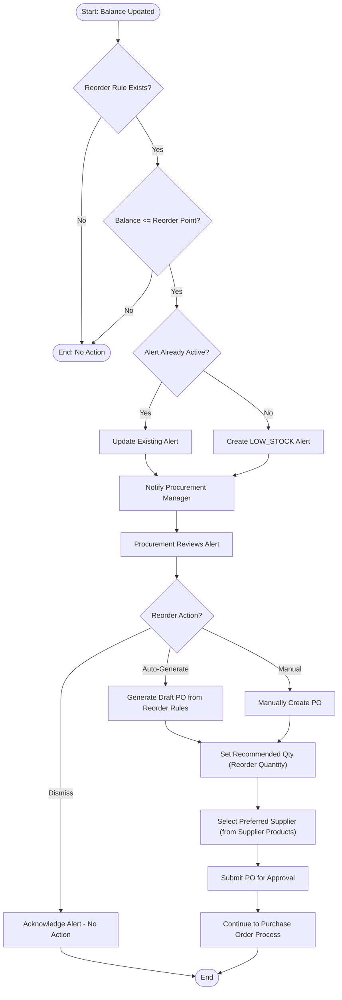

# StockSmart Activity Diagrams

This document contains activity diagrams (modeled as Mermaid flowcharts) for major business processes in the StockSmart system. Each diagram documents the decision logic, error paths, and the double-entry ledger interactions.

---

## 1. Inventory Receiving Process

---

## 2. Stock Adjustment Process

---

## 3. Stock Transfer Process

---

## 4. Purchase Order Process

---

## 5. Order Processing

---

## 6. Reorder Process

