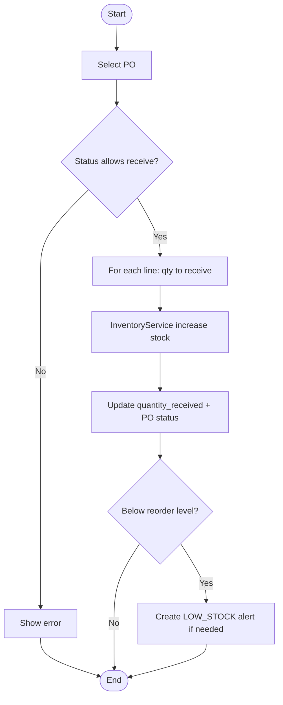
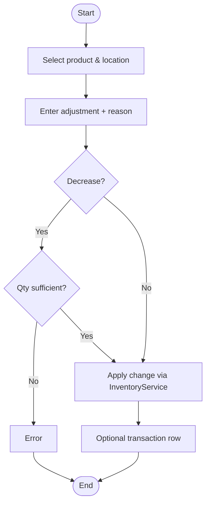
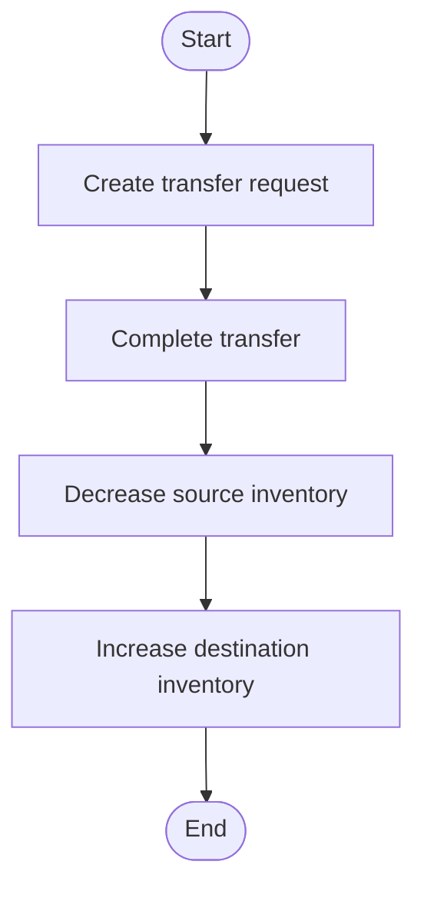
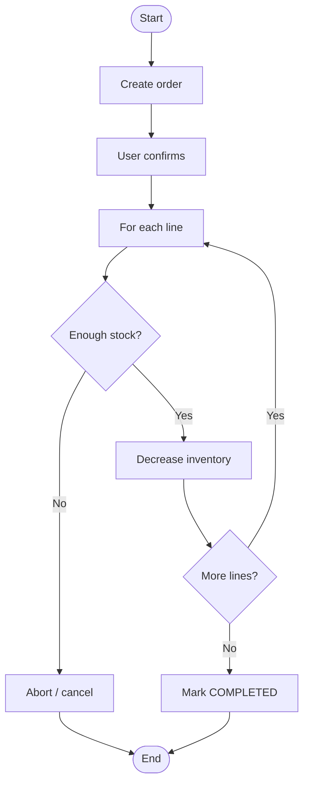
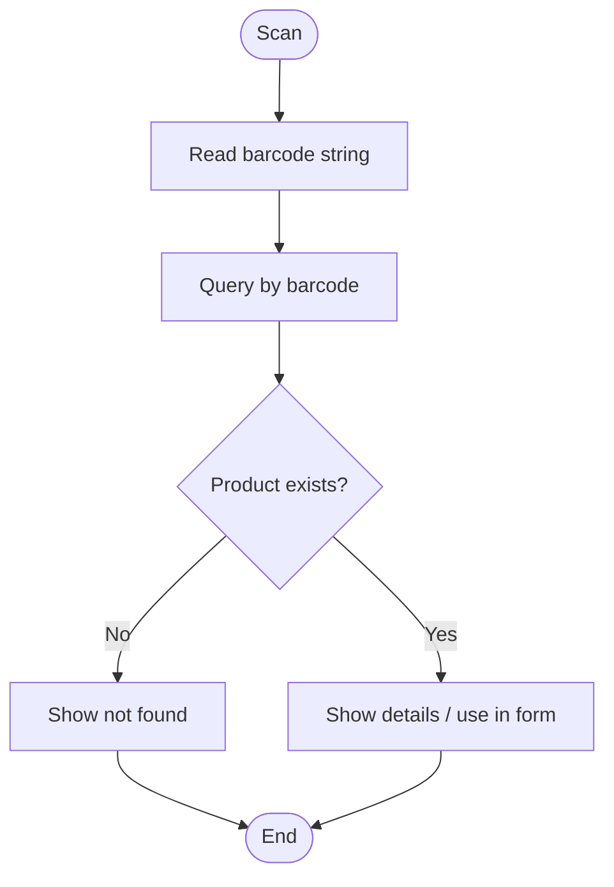

# StockSmart Activity Diagrams

Business process flowcharts for the **simplified** inventory model (no double-entry ledger, no optimistic locking).

---

## 1. Purchase order receiving

---

## 2. Stock adjustment

---

## 3. Stock transfer

---

## 4. Sales order fulfillment

---

## 5. Barcode product lookup

---

## Future diagrams (not MVP)

- Multi-step transfer approval chain
- RFID bulk reconcile
- Offline scan queue flush
