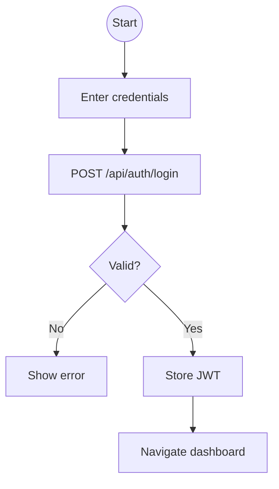
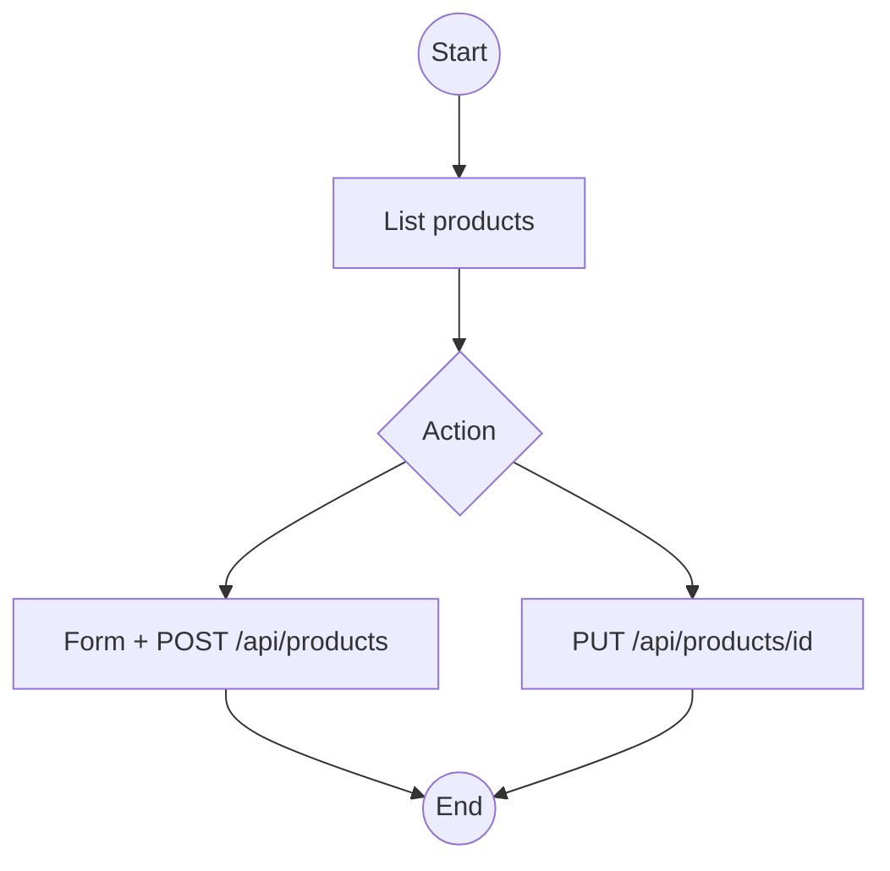
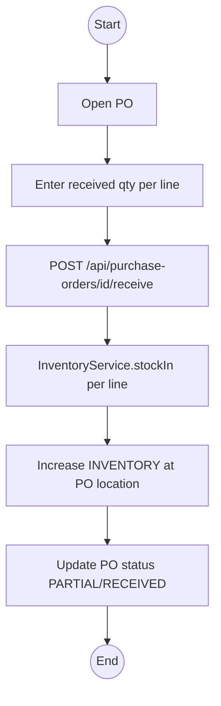
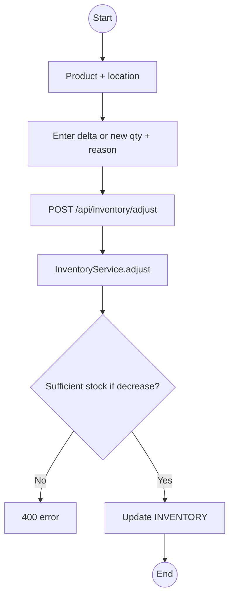
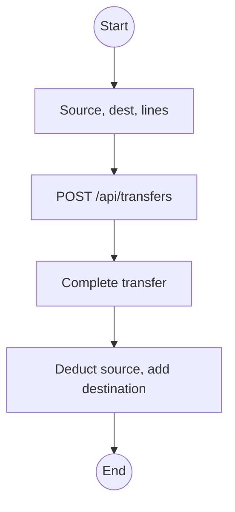
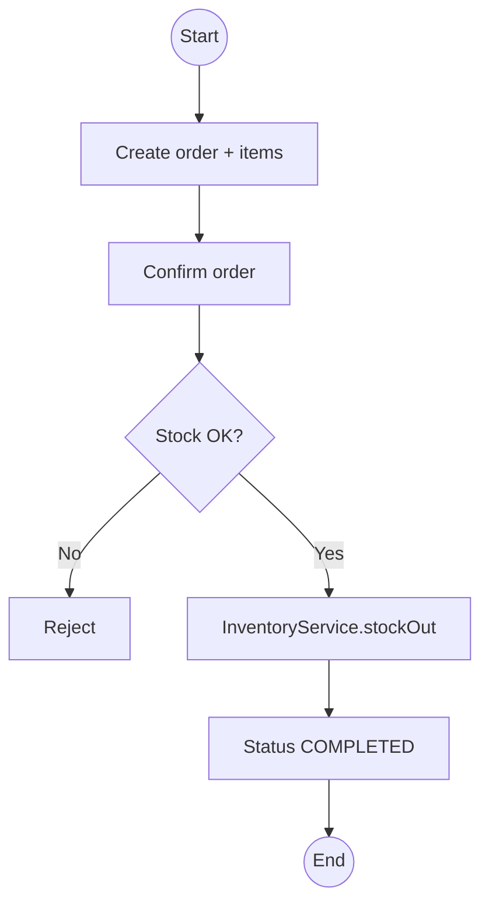
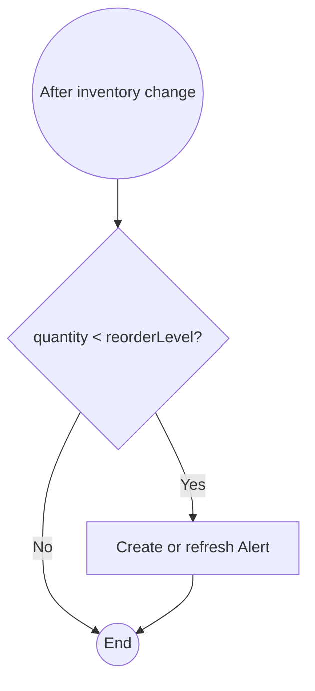
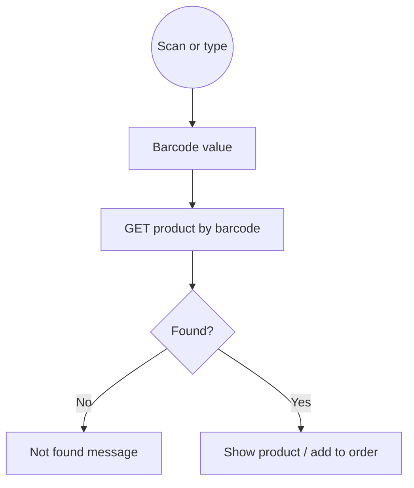
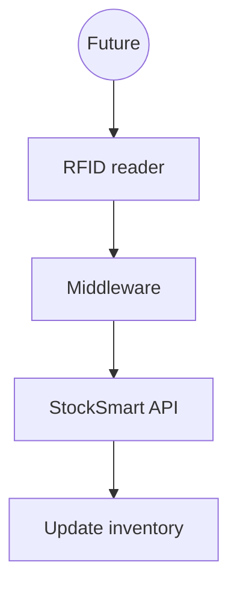
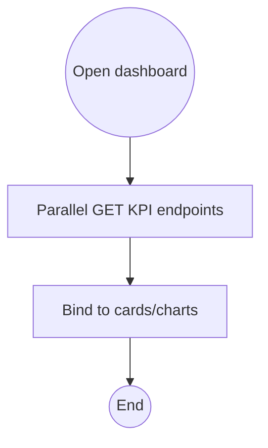

# StockSmart — Application Flow

Core workflows for the **college-level** implementation. Inventory changes run through **InventoryService** (update `INVENTORY.quantity`, optional `INVENTORY_TRANSACTION` row).

## 1. Application startup

```mermaid
flowchart TD
    Start((Start)) --> Init[Bootstrap Angular]
    Init --> Token{JWT present?}
    Token -->|Yes| Load[Load user / dashboard]
    Token -->|No| Login[/login]
```

## 2. Login



## 3. Product management



Include **barcode** on create/edit; validate uniqueness.

## 4. PO receive → stock in



## 5. Stock adjustment



## 6. Stock transfer



Optional two-step (PENDING → COMPLETED) — document chosen approach in implementation.

## 7. Sales order



No payment gateway in MVP.

## 8. Low-stock detection



## 9. Barcode lookup



No GS1 parsing step.

## 10. RFID (future — diagram only)



Not implemented in MVP — see [barcode-rfid.md](./barcode-rfid.md).

## 11. KPI dashboard load



See [kpi-reporting.md](./kpi-reporting.md).
