# StockSmart - Application Flow Documentation

This document outlines the core business workflows and technical execution paths in the StockSmart system. 

## 1. Application Startup
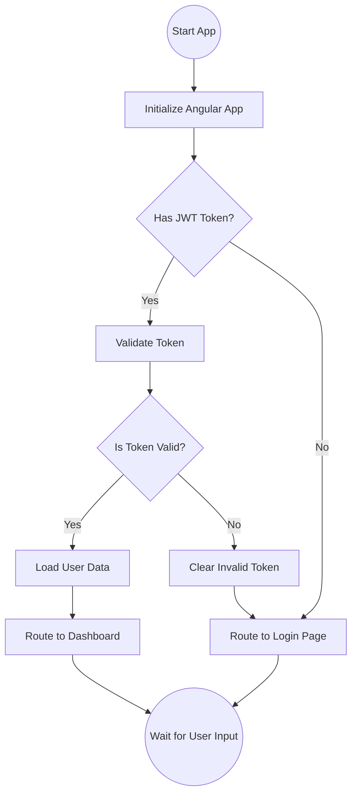

## 2. Registration
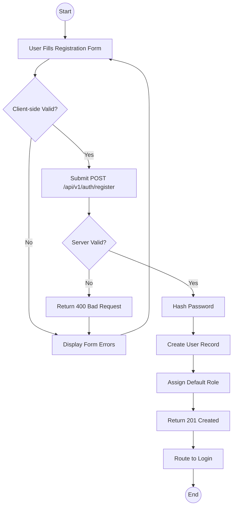

## 3. Login
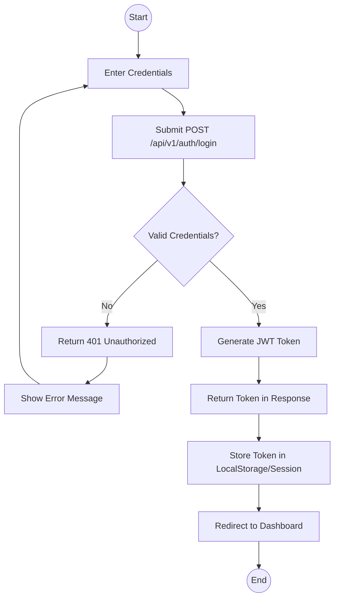

## 4. Authentication Flow
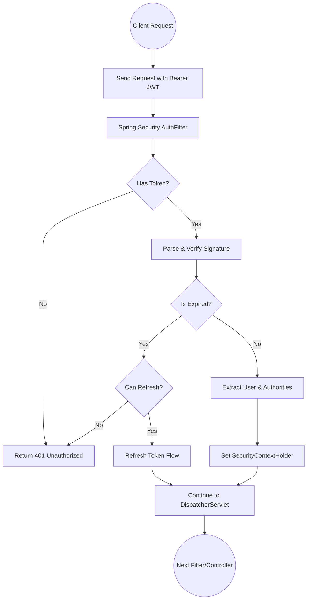

## 5. Authorization Flow
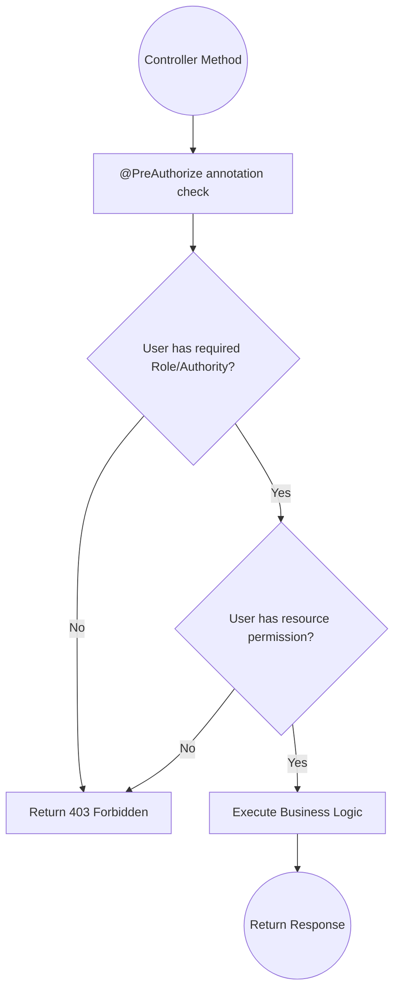

## 6. Product Management
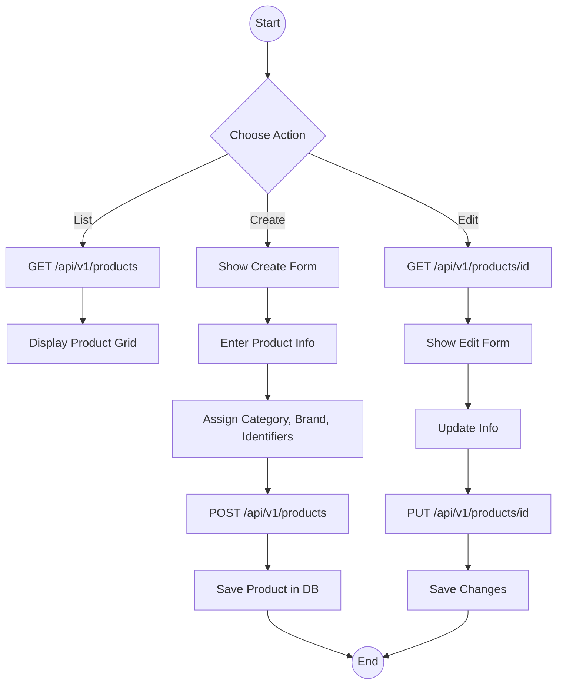

## 7. Inventory Receiving
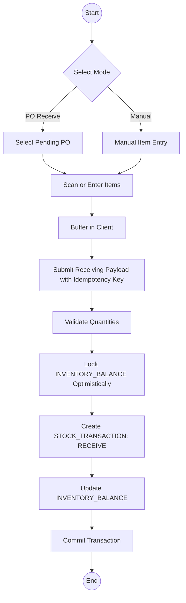

## 8. Inventory Adjustment
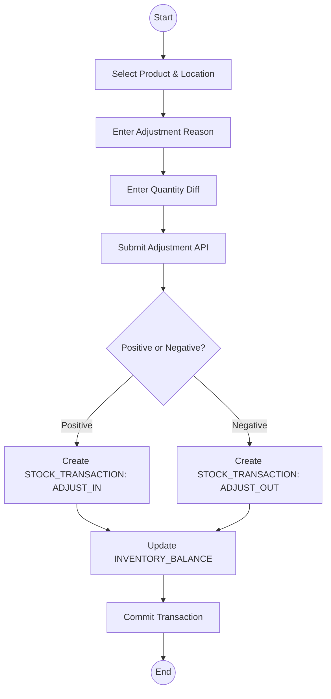

## 9. Stock Transfer
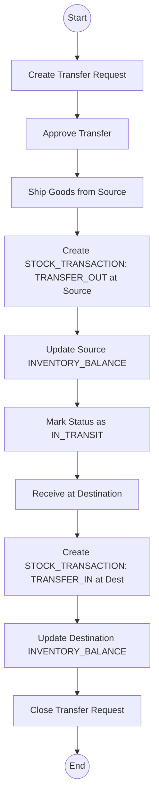

## 10. Purchase Order
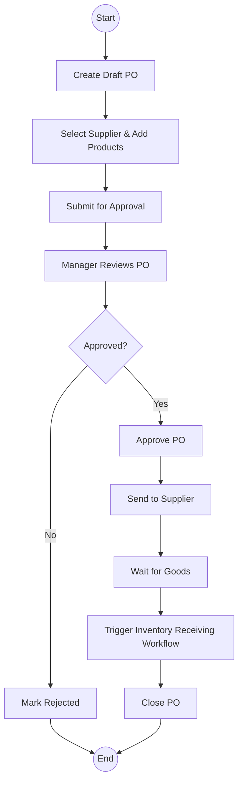

## 11. Order Processing
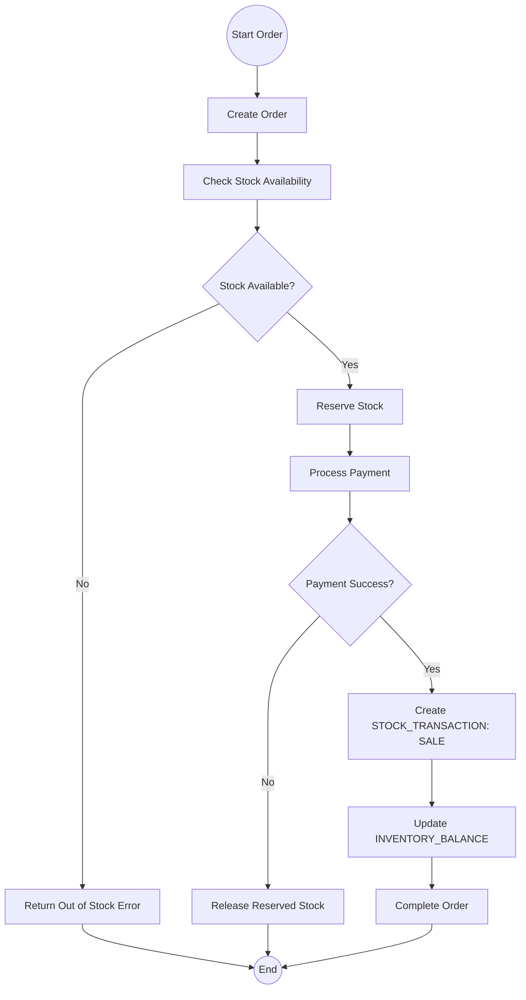

## 12. Low-Stock Detection
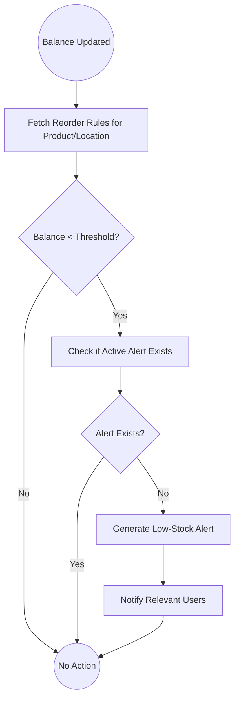

## 13. Reorder Workflow
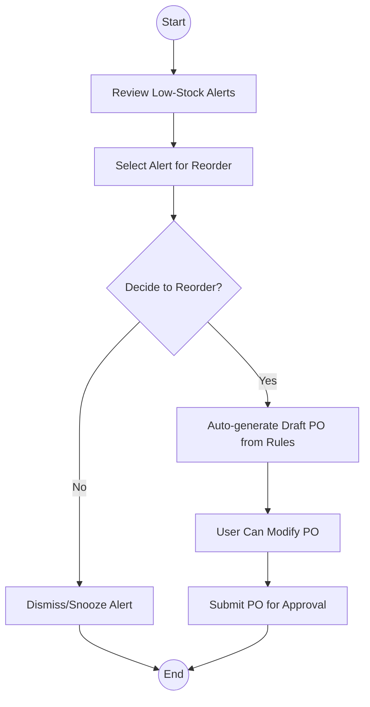

## 14. Barcode Workflow
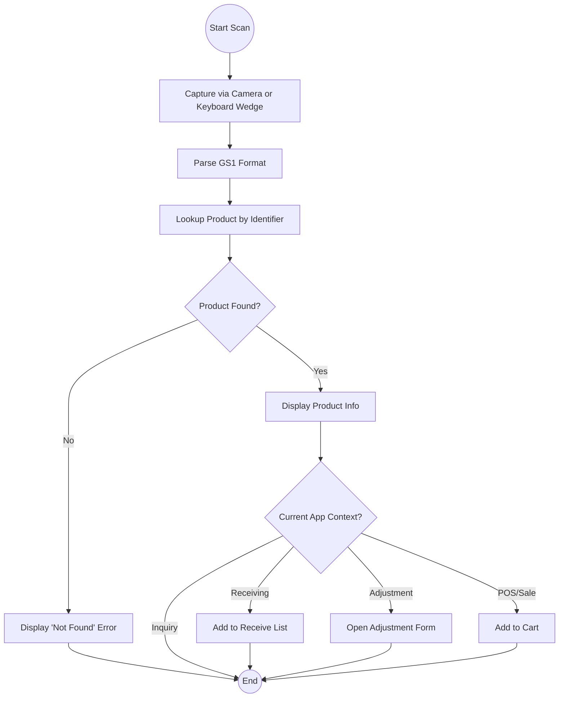

## 15. RFID-Ready Workflow
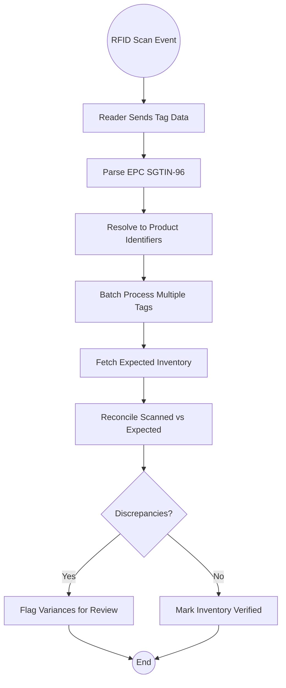

## 16. KPI Generation
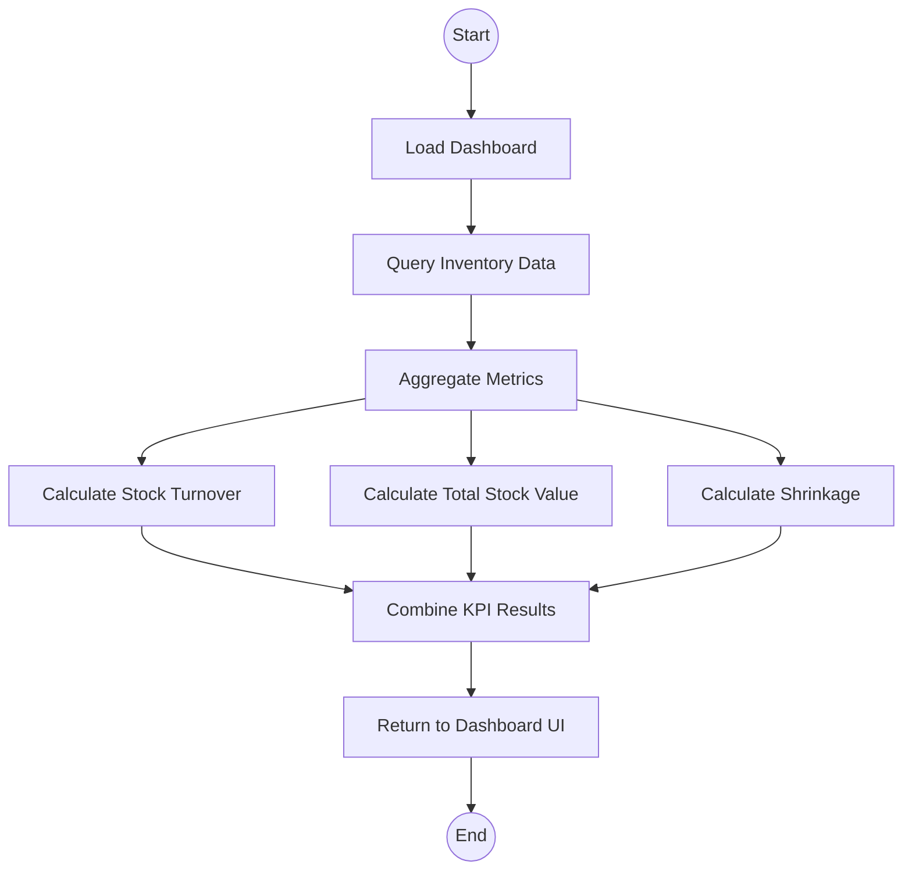

## 17. Reporting
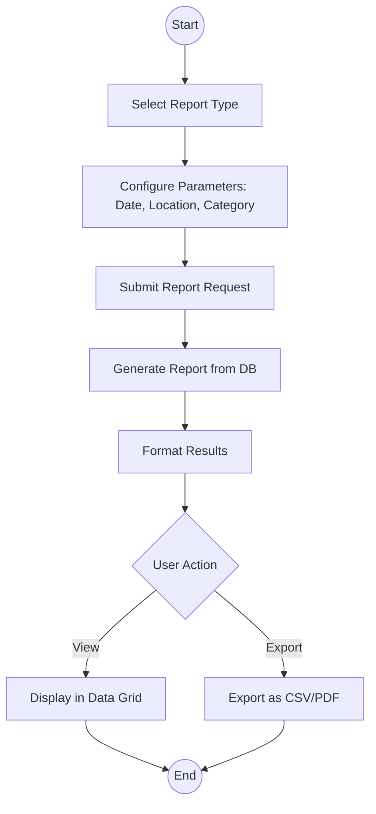

## 18. Logout
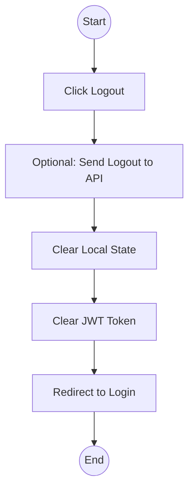
