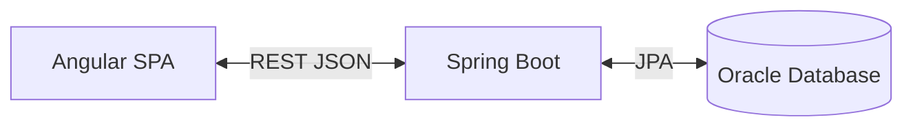
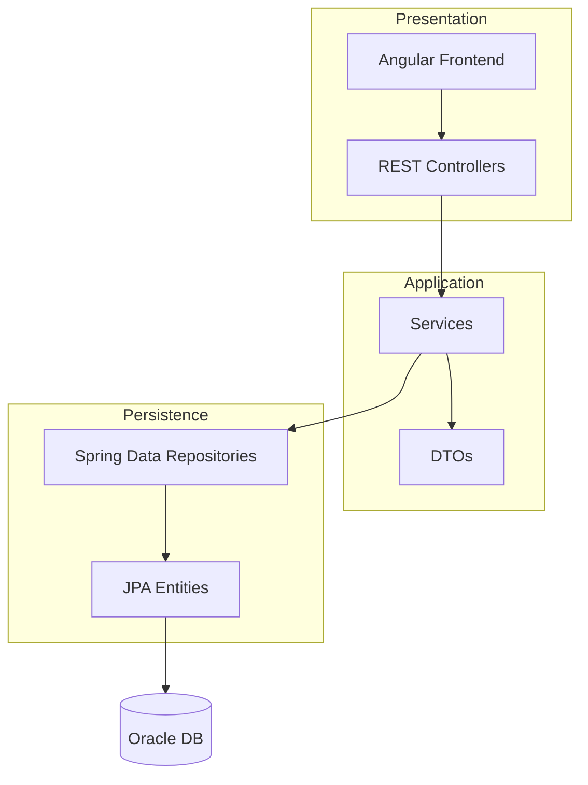
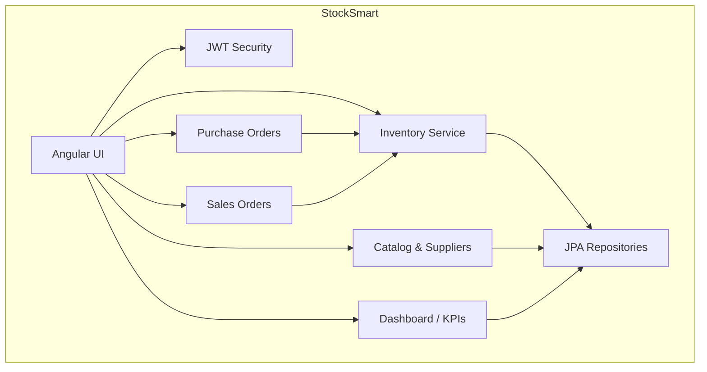
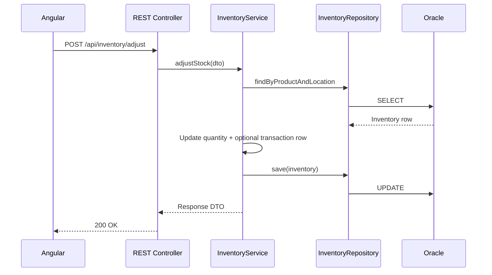
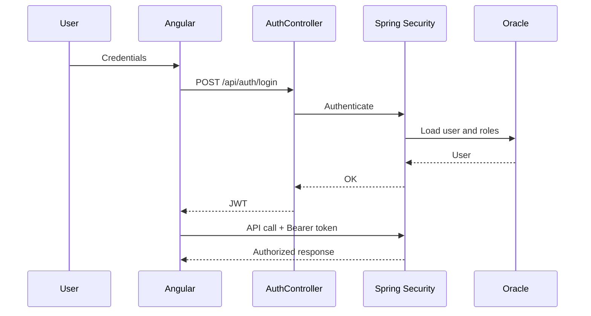
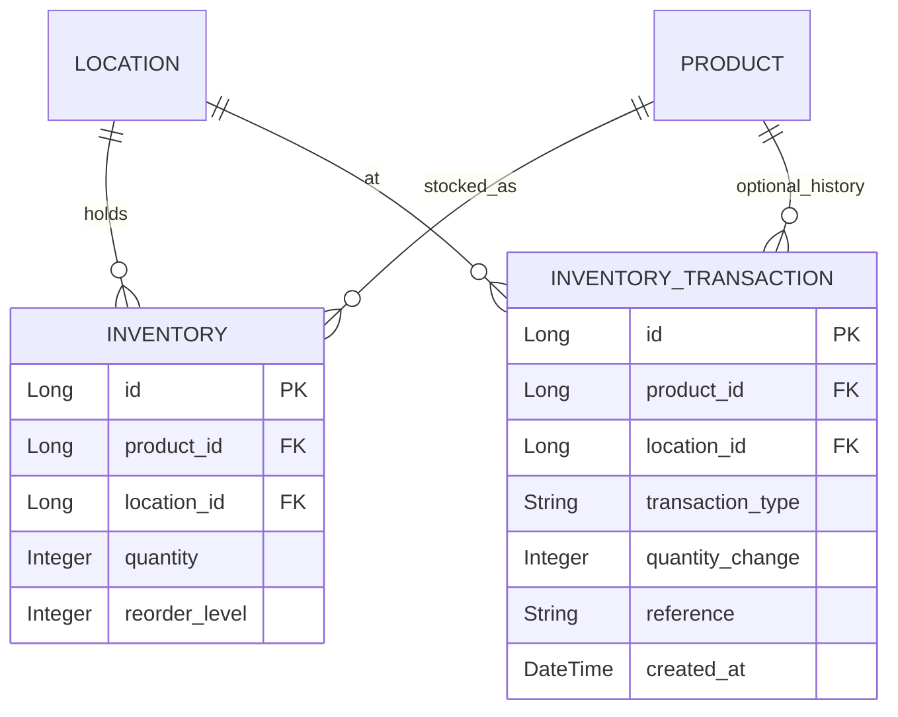

# StockSmart Architecture Document

## 1. Architectural Style

StockSmart uses a **simple monolithic layered architecture** suitable for a B.Tech demonstration project:

**Angular → REST API → Controller → Service → Repository → JPA/Hibernate → Oracle**

There is no microservice split, no hexagonal ports/adapters layer, and no event bus.

## 2. Major Layers

### Presentation — Angular SPA

- Standalone components, Reactive Forms, HttpClient
- Pages: login, dashboard, master data, inventory workflows, reports
- JWT attached via `AuthInterceptor`; routes protected by guards

### Presentation — REST controllers

- Spring `@RestController` endpoints
- Jakarta Validation on request DTOs
- Returns response DTOs (not entities)

### Service layer

- Business rules: stock checks, order confirmation, PO receiving, transfers
- Transaction boundaries (`@Transactional`)
- Manual DTO ↔ entity mapping

### Persistence layer

- Spring Data JPA repositories
- JPA entities mapped to Oracle tables

## 3. Error Handling

- `@RestControllerAdvice` maps exceptions to HTTP status and a **simple JSON** body (`message`, `status`, optional `errors[]`)
- No requirement for RFC 7807 Problem Details

## 4. Validation

- **Backend:** Jakarta Validation on DTOs
- **Frontend:** Reactive Form validators

## 5. Logging

- SLF4J / Logback for development and debugging

## 6. Configuration

- Spring profiles: `dev`, (optional) `prod`
- Externalize datasource URL, username, password, JWT secret via environment or `application-dev.yml`

## 7. Security

- Stateless **JWT** after login
- **Role-based** access: `ADMIN`, `INVENTORY_MANAGER`, `STAFF`
- `@PreAuthorize` on sensitive endpoints

## 8. Audit trail (lightweight)

- Standard fields on entities: `createdAt`, `updatedAt`, optional `createdBy` / `updatedBy` via JPA auditing
- Optional `InventoryTransaction` rows for stock movement history
- No separate immutable audit log with full JSON snapshots (future enhancement)

## 9. Inventory design

- **`Inventory`:** one row per product per location (`quantity`, `reorderLevel`)
- Changes via service methods; optional **`InventoryTransaction`** records for reporting
- **Not used:** double-entry ledger, compensating transactions, `@Version` optimistic locking

## 10. Barcode & RFID

- **Barcode:** stored on `Product`; lookup by barcode API
- **RFID:** documented as future hardware integration only

## Diagrams

### 1. High-Level System Architecture

### 2. Layered Architecture

### 3. Component Diagram

### 4. Request Flow (example: stock adjustment)

### 5. Security Flow

### 6. Inventory Data Model (conceptual)

