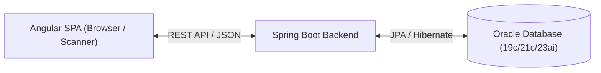
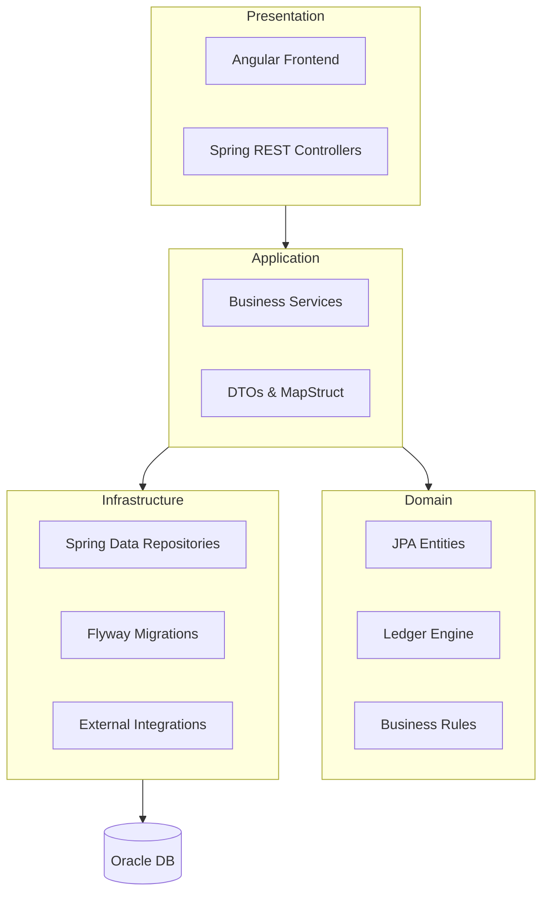
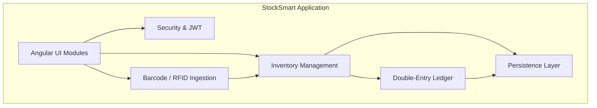
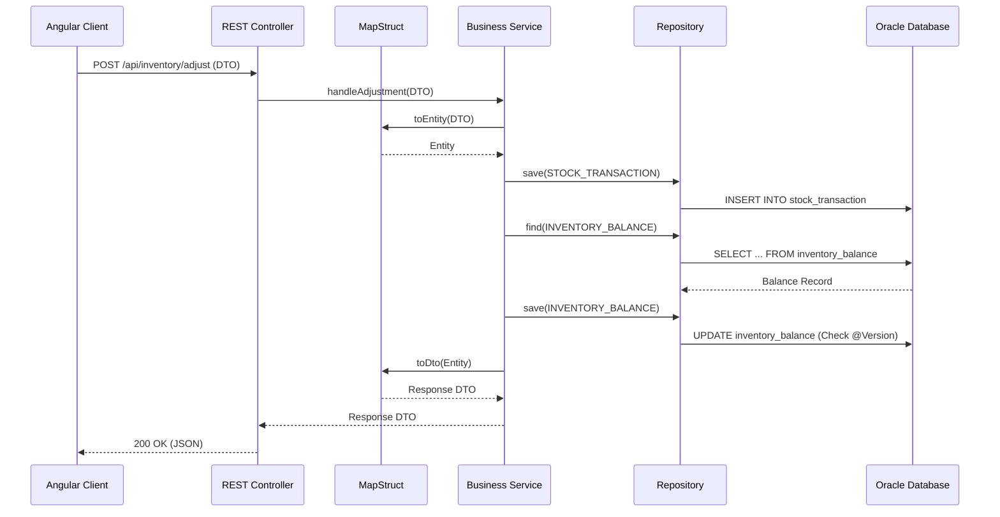
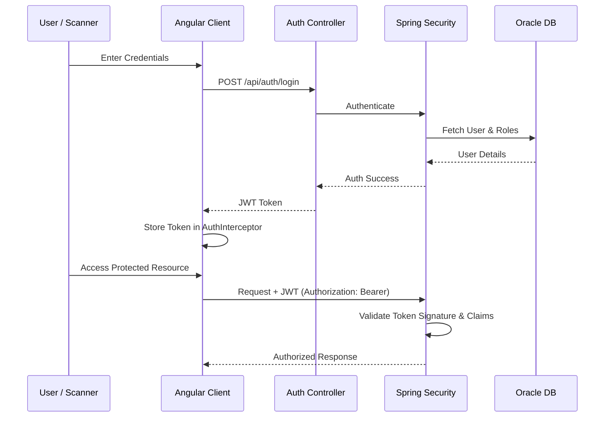
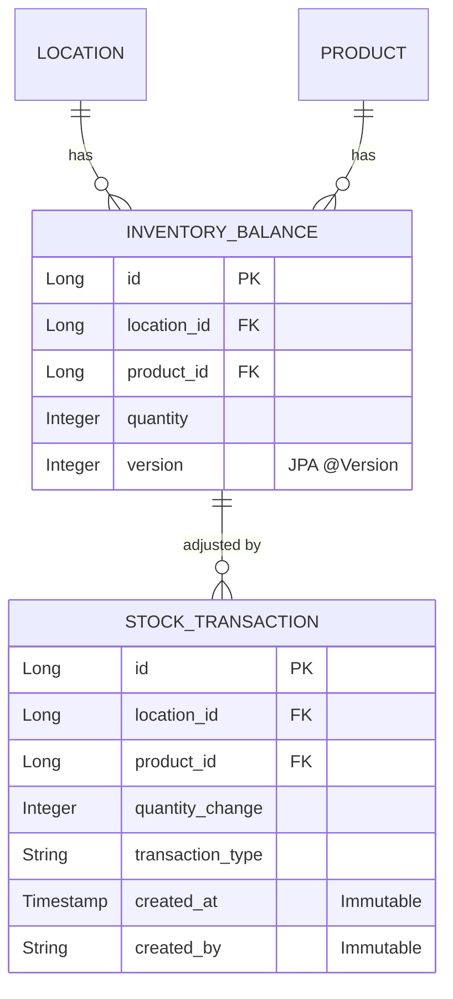

# StockSmart Architecture Document

## 1. Architectural Style
StockSmart follows a **Hexagonal / Layered Architecture**. The primary objective is to enforce strict separation of concerns, isolating core domain logic from external concerns like the presentation layer and data access layer.

## 2. Major Layers

### Presentation Layer (Angular SPA & REST Controllers)
- **Angular SPA:** Uses Standalone Components, Reactive Forms, and Signals/RxJS for state management. It is divided into Smart (container) and Presentational (UI) components.
- **REST API:** Spring Boot `@RestController`s serve as the primary entry point for client requests, validating incoming payload using Jakarta Validation and mapping them to DTOs.

### Application Layer (Services, DTOs, Mappers)
- Acts as the orchestrator for business use cases.
- Employs **MapStruct** to convert between Domain Entities and request/response DTOs (ensuring JPA Entities are never exposed in the REST layer).
- Manages transaction boundaries (e.g., `@Transactional`).

### Domain Layer (Entities, Business Rules, Ledger Engine)
- The heart of the system.
- Contains the core **Double-Entry Stock Ledger Engine**, which ensures that inventory is never mutated in place.
- Defines JPA Entities with no Lombok `@Data` annotations to prevent infinite recursion and lazy-loading issues. Uses explicit `@Getter`, `@Setter`, and business keys for `equals`/`hashCode`.

### Infrastructure Layer (Repositories, Oracle Adapters, External Integrators)
- **Repositories:** Spring Data JPA interfaces for database access.
- **Database:** Oracle Database (19c/21c/23ai) using Flyway for schema migrations.
- **Integrations:** Handles integration with GS1/EPCIS barcode and RFID scanners.

## 3. Communication Between Layers
- **Dependency Direction:** Dependencies point inwards. Presentation depends on Application; Application depends on Domain and Infrastructure abstractions.
- **Interfaces:** Services typically implement interfaces defined in the domain layer, promoting loose coupling.

## 4. Error Handling
- Follows **RFC 7807 Problem Details** for HTTP APIs.
- Global exception handling is implemented via `@RestControllerAdvice`, converting business exceptions into standard JSON envelopes.

## 5. Validation
- **Backend:** Jakarta Validation (`hibernate-validator`) on incoming DTOs.
- **Frontend:** Angular Reactive Forms with strictly-typed models.

## 6. Logging
- Uses SLF4J and Logback for structured logging.
- Audit logs capture `created_by`, `updated_by`, IP, and state changes.

## 7. Configuration
- Externalized configuration using Spring Profiles (`dev`, `test`, `prod`).
- Application properties and secrets are managed outside the codebase.

## 8. Security Boundaries
- **Authentication:** Stateless JWT Authentication via Spring Security 6.x.
- **Authorization:** Granular RBAC (Role-Based Access Control).
- API endpoints are protected; tokens are centrally handled in Angular via `AuthInterceptor`.

## 9. Auditability
- **Ledger Immutability:** `STOCK_TRANSACTION` and `AUDIT_LOG` records are NEVER updated or deleted.
- Every state-altering action records timestamp, user, client IP, and snapshots.

## 10. Cross-Cutting Concerns
- **Transaction Management:** `@Transactional(readOnly=true)` by default. Write operations explicitly use `@Transactional(rollbackFor=Exception.class)`.
- **Exception Translation:** Handled by Spring Data and global advice.
- **Caching:** Can be applied at the service layer for read-heavy operations like location lookups.

## 11. Integration Points
- **Barcode & RFID:** Keyboard-wedge event listener service, ZXing/BarcodeDetector for WebRTC camera scanning. RFID support via EPCIS-compatible event ingestion (SGTIN-96).
- **Offline Resilience:** Client-side buffering and idempotency keys to tolerate intermittent network drops for scanners.

## 12. Double-Entry Stock Ledger Architecture
Inventory balances are not mutated via raw updates.
Every change generates an immutable `STOCK_TRANSACTION` that credits/debits stock. The `InventoryLedgerService` writes audit records and ledger transactions before adjusting cached `INVENTORY_BALANCE` rows.

## 13. Optimistic Concurrency Control
- `INVENTORY_BALANCE` entity uses JPA `@Version` to prevent race conditions during concurrent scans and checkout/receiving operations.

## Diagrams

### 1. High-Level System Architecture

### 2. Layered Architecture

### 3. Component Diagram

### 4. Request Flow Diagram

### 5. Security Architecture Diagram

### 6. Double-Entry Ledger Architecture

