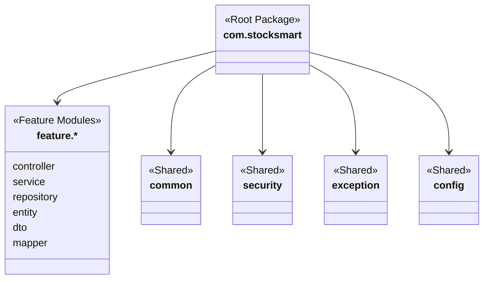
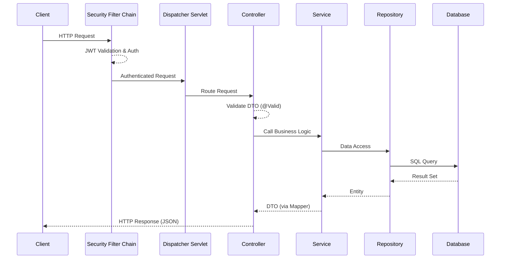
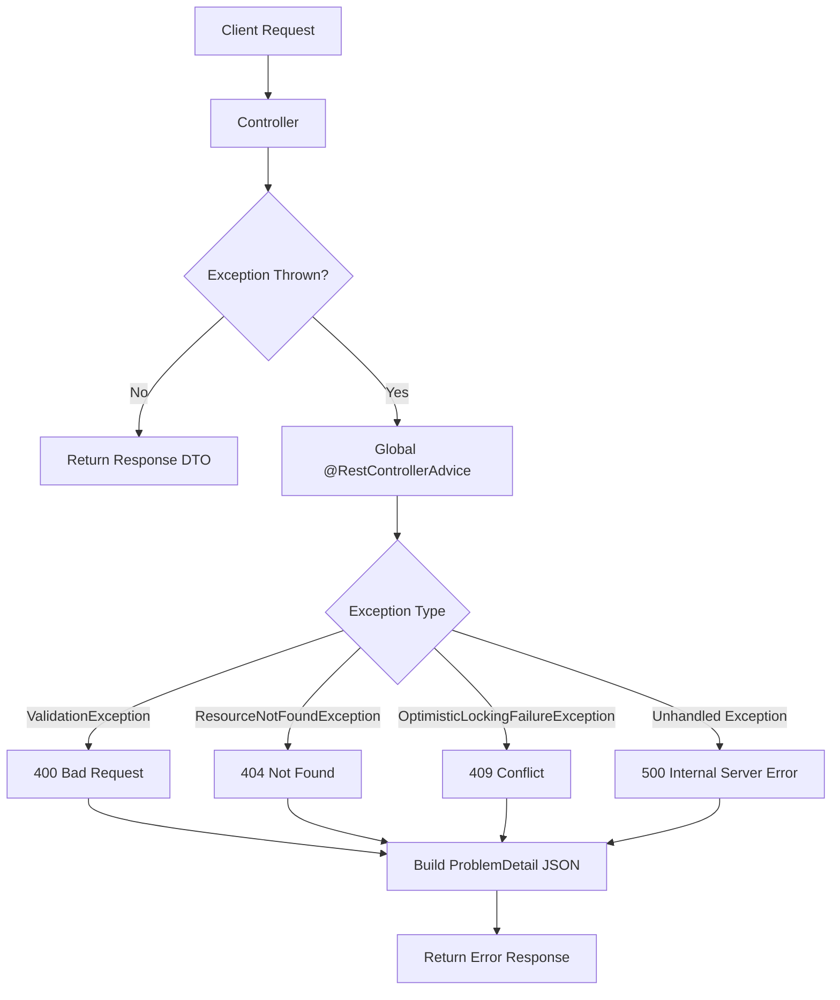
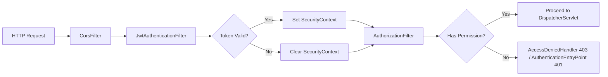
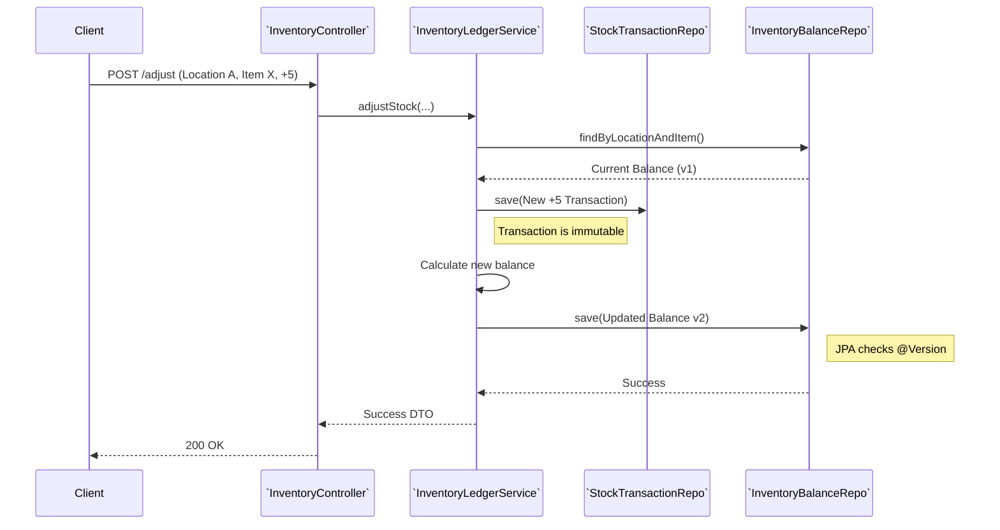

# StockSmart Backend Architecture

This document outlines the architecture, design patterns, and conventions for the StockSmart Java Spring Boot backend. It is designed to be maintainable, scalable, and secure, following a Hexagonal/Layered Architecture with feature-first packaging.

---

## 1. Package Structure

We follow a **feature-first** (or package-by-feature) organization strategy, with shared layers for common concerns. This approach keeps related components together, making modularization and microservices extraction easier in the future.

### Recommended Package Tree

```text
com.stocksmart
├── audit           // Global auditing configuration and listeners
├── auth            // Authentication, login, JWT generation, refresh tokens
├── common          // Shared utilities, constants, base classes
├── config          // Global Spring configurations (OpenAPI, Flyway, etc.)
├── exception       // Global exception handling, RFC 7807 problem details
├── security        // Spring Security config, JWT filters, permission evaluation
├── validation      // Custom validation annotations and logic
├── feature         // Feature modules
│   ├── alert       // Stock alerts, notifications
│   ├── barcode     // GS1 barcode parsing and resolution
│   ├── dashboard   // Analytics and dashboard aggregations
│   ├── inventory   // Ledger engine, stock balances, transactions
│   ├── location    // Store and warehouse management
│   ├── order       // Sales orders, fulfillment
│   ├── product     // Product catalog, categories, SKUs
│   ├── purchase    // Purchase orders, receiving
│   ├── report      // Report generation
│   ├── rfid        // RFID tag EPC Gen2 (SGTIN-96) resolution
│   ├── supplier    // Supplier management
│   ├── transfer    // Multi-location stock transfers
│   └── user        // User management, roles
```

Within each feature package (e.g., `com.stocksmart.feature.inventory`), the structure is layered:

```text
com.stocksmart.feature.inventory
├── controller      // REST Controllers
├── service         // Business Logic Interfaces & Implementations
├── repository      // Spring Data JPA Repositories
├── entity          // JPA Entities
├── dto             // Request & Response DTOs
└── mapper          // MapStruct Interfaces
```

### Package Structure Overview Diagram



---

## 2. Request Processing Pipeline

### Pipeline Diagram



## 3. Controller Layer

- **Responsibility:** Handle HTTP requests, input validation, delegate to services, map responses.
- **Conventions:** 
  - Expose REST endpoints using `@RestController` and `@RequestMapping`.
  - Accept Request DTOs and return Response DTOs (e.g., `ResponseEntity<ProductResponse>`).
  - Use `@Valid` on request bodies.
  - Implement pagination using Spring Data `Pageable` and return `Page<T>` or a custom paginated wrapper.
  - Never leak JPA entities.

## 4. Service Layer

- **Responsibility:** Core business logic, transaction management, orchestrating multiple repositories.
- **Conventions:**
  - Define interfaces (e.g., `ProductService`) and implementations (`ProductServiceImpl`).
  - **Transaction Management:** 
    - Use `@Transactional(readOnly = true)` at the class level by default.
    - Explicitly override with `@Transactional(rollbackFor = Exception.class)` for mutating methods (create, update, delete).

## 5. Repository Layer

- **Responsibility:** Database access, query generation.
- **Conventions:**
  - Use Spring Data JPA `JpaRepository` or `ListCrudRepository`.
  - Use custom JPQL queries via `@Query` for complex reads.
  - Utilize JPA Specifications for dynamic filtering and complex search parameters.

## 6. Entity Layer

- **Responsibility:** Map Java objects to database tables.
- **Conventions:**
  - Use `@Entity`, `@Table`.
  - **NO `@Data` from Lombok:** Use `@Getter`, `@Setter`, `@ToString(exclude = {...})`.
  - Implement explicit `equals()` and `hashCode()` based on business keys, not database IDs (or handle surrogate IDs safely).
  - **Optimistic Locking:** Include `@Version` on entities like `INVENTORY_BALANCE` to prevent concurrent modification issues.
  - **Audit Fields:** Include `@CreatedBy`, `@CreatedDate`, `@LastModifiedBy`, `@LastModifiedDate`.

## 7. DTO Layer

- **Responsibility:** Define API contracts.
- **Conventions:**
  - Suffix request bodies with `Request` (e.g., `ProductCreateRequest`).
  - Suffix responses with `Response` (e.g., `ProductResponse`).
  - Use Java 16+ `record` where applicable for immutable request DTOs.

## 8. Mapper Strategy

- **Responsibility:** Map between Entities and DTOs.
- **Conventions:**
  - Use **MapStruct**.
  - Define mappers as interfaces annotated with `@Mapper(componentModel = "spring")`.
  - Inject Mappers into the Service or Controller layer.

## 9. Exception Handling

- **Responsibility:** Translate Java exceptions to standard HTTP error responses.
- **Conventions:**
  - Use `@RestControllerAdvice`.
  - Implement **RFC 7807 Problem Details** using Spring Boot 3's built-in `ProblemDetail` class.
  - Create a custom exception hierarchy extending `RuntimeException` (e.g., `ResourceNotFoundException`, `BusinessValidationException`, `ConcurrentModificationException`).

### Exception Handling Flow Diagram



## 10. Security

- **Responsibility:** Secure endpoints, prevent unauthorized access.
- **Conventions:**
  - Use Spring Security 6.x.
  - **Stateless Session:** Configure session creation policy to `STATELESS`.
  - Protect endpoints using `SecurityFilterChain`.

### Security Filter Chain Diagram



## 11. Authentication

- **Responsibility:** Verify user identity.
- **Conventions:**
  - `/api/v1/auth/login` endpoint accepts credentials.
  - Generates short-lived **JWT Access Tokens** and long-lived **Refresh Tokens**.
  - Refresh tokens are stored in the database to allow revocation.

## 12. Authorization

- **Responsibility:** Enforce RBAC (Role-Based Access Control).
- **Conventions:**
  - Use Method-Level Security: `@PreAuthorize("hasAuthority('INVENTORY_WRITE')")`.
  - Granular permissions (e.g., `PRODUCT_READ`, `STOCK_ADJUST`) rather than broad roles.

## 13. Audit Logging

- **Responsibility:** Track who changed what and when.
- **Conventions:**
  - Enable JPA Auditing with `@EnableJpaAuditing`.
  - Use `AuditingEntityListener` on entities.
  - Custom `AuditService` for capturing deep state changes (previous/new state snapshots) in the `AUDIT_LOG` table.

## 14. Configuration

- **Responsibility:** Application configuration across environments.
- **Conventions:**
  - Spring Profiles: `dev`, `test`, `prod`.
  - `application.yml` for base config, `application-{profile}.yml` for overrides.
  - Use environment variables or external secrets managers for sensitive data (DB passwords, JWT secrets).

## 15. Logging

- **Responsibility:** System observability.
- **Conventions:**
  - SLF4J + Logback.
  - Implement MDC (Mapped Diagnostic Context) to include a `traceId` and `userId` in every log statement for request tracing.

## 16. Inventory Ledger Service

The core of StockSmart is the double-entry stock ledger. 

- **Invariant:** `INVENTORY_BALANCE` is NEVER updated in isolation. 
- **Process:** 
  1. Action initiated (e.g., Stock Adjustment).
  2. `InventoryLedgerService` creates an immutable `STOCK_TRANSACTION` record.
  3. The service calculates the new balance.
  4. The service updates the `INVENTORY_BALANCE` row (using `@Version` for optimistic locking).
  5. If an `OptimisticLockingFailureException` occurs, the transaction is rolled back and the client must retry.
- All operations are strictly scoped to a `LOCATION_ID`.

### Ledger Service Interaction Diagram



## 17. Barcode/RFID Service

- **Responsibility:** Decode physical identifiers into standard internal representations.
- **Conventions:**
  - **Barcode Parsing:** Logic to decode GS1 standards (EAN-13, UPC-A, GS1-128).
  - **RFID Resolution:** Translate EPC Gen2 (SGTIN-96) bit streams into company prefix, item reference, and serial number.
  - **Identifier Abstraction:** The rest of the application deals with an internal `ScanContext` or `ItemIdentifier` DTO, shielding the business logic from raw barcode/RFID string manipulation.
