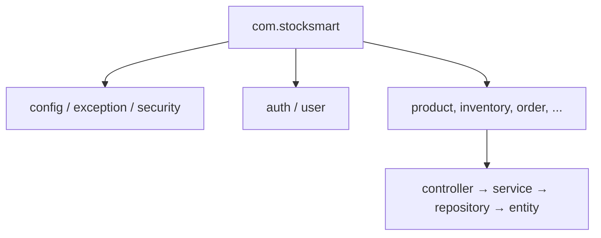
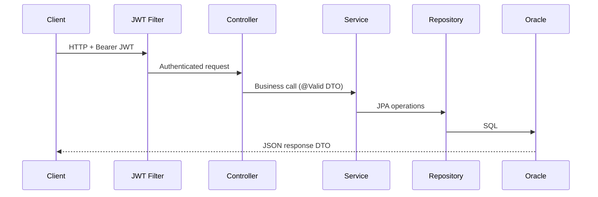
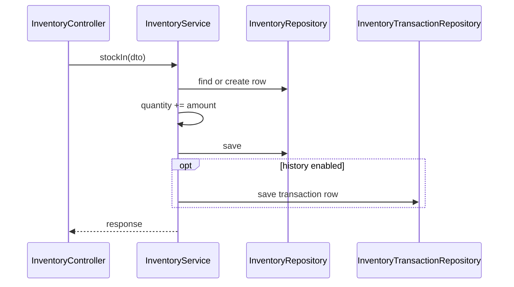

# StockSmart Backend Architecture

Spring Boot backend for the **B.Tech** project: monolithic, feature packages, classic layers.

---

## 1. Package structure

```
com.stocksmart
├── config/              # Security, JPA auditing, CORS, OpenAPI (optional)
├── exception/           # GlobalExceptionHandler, custom exceptions
├── security/            # JWT filter, UserDetailsService
├── auth/                # Login, token response DTOs
├── user/                # User CRUD (admin)
├── category/
├── product/
├── supplier/
├── location/
├── inventory/           # Levels, stock in/out, adjust, transactions
├── transfer/
├── purchase/
├── order/
├── alert/
├── dashboard/           # KPI aggregation
└── report/              # Report endpoints
```

Each feature:

```
controller/
service/
repository/
entity/
dto/
```

No separate `mapper/` package required — map in service layer.



---

## 2. Request pipeline



---

## 3. Controller layer

- `@RestController`, `@RequestMapping("/api/...")`
- Request/response DTOs only
- `@Valid` on request bodies
- Pagination via `Pageable` where lists are large

---

## 4. Service layer

- Business rules and `@Transactional` writes
- **InventoryService** centralizes quantity changes
- Interfaces optional (`ProductService` / `ProductServiceImpl`) — keep consistent within project

---

## 5. Repository layer

- `JpaRepository<Entity, Long>`
- Derived query methods and `@Query` for KPI aggregations

---

## 6. Entity layer

- Lombok `@Getter` / `@Setter` (avoid `@Data` on entities if team prefers CLAUDE convention)
- Relationships: `@ManyToOne`, `@OneToMany` with lazy loading where appropriate
- No `@Version` on inventory for MVP

---

## 7. DTO layer

- `*Request`, `*Response` naming
- Records allowed for immutable requests

---

## 8. Exception handling

```mermaid
flowchart TD
    A[Request] --> B[Controller]
    B --> C{Exception?}
    C -->|No| D[200/201 + DTO]
    C -->|Yes| E[@RestControllerAdvice]
    E --> F[JSON: status, message, errors]
```

Example response:

```json
{
  "status": 400,
  "message": "Validation failed",
  "errors": [{ "field": "sku", "message": "must not be blank" }]
}
```

---

## 9. Security

- `SecurityFilterChain`: stateless session, JWT filter before `UsernamePasswordAuthenticationFilter`
- Login: `POST /api/auth/login` → JWT
- `@PreAuthorize("hasRole('ADMIN')")` etc.

No granular `PRODUCT_READ` permission strings required — use roles.

---

## 10. Inventory service (core)



---

## 11. Barcode

- `ProductRepository.findByBarcode(String barcode)`
- Used by product search and scanning UI

---

## 12. Configuration & logging

- Profiles: `dev`, optional `prod`
- SLF4J logging; no MDC/traceId requirement for MVP

---

## Future (not MVP)

- MapStruct mappers, Flyway, RFC 7807, refresh tokens, `InventoryLedgerService` with immutable ledger, GS1 barcode parser, RFID services
