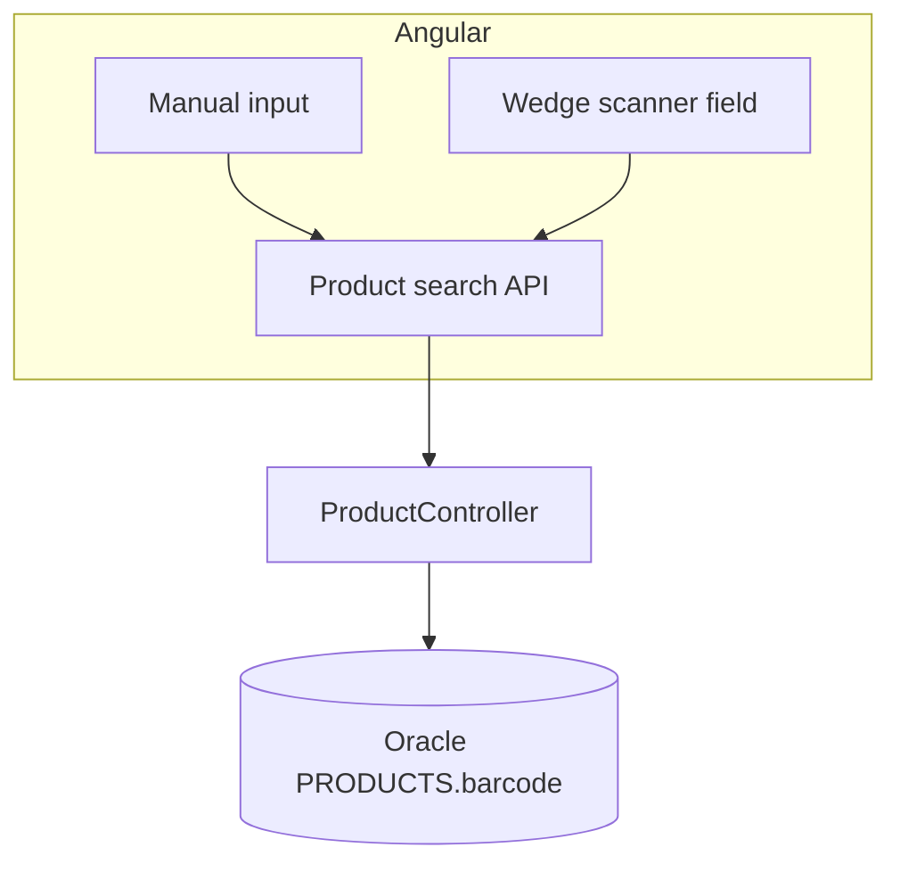
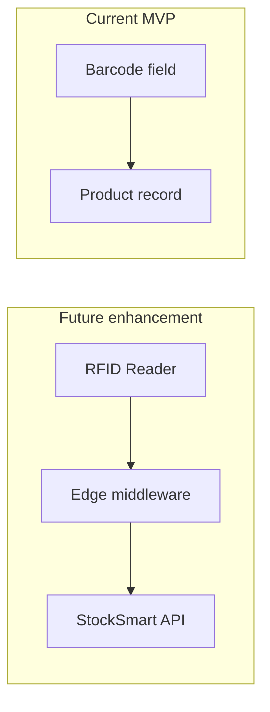

# Barcode & RFID — StockSmart

Academic-level identification support for the B.Tech project.

---

## Barcode (in scope)

### Data model

- **`Product.barcode`** — optional string, **unique** when set
- Lookup: `GET /api/products/by-barcode/{barcode}` (exact path may vary in implementation)

### Input methods

1. **Manual entry** — product form and search box
2. **Keyboard-wedge scanner** — single input with focus; scanner sends characters + Enter
3. **Camera scan (optional)** — browser BarcodeDetector or ZXing if time permits

### Backend

- Validate barcode uniqueness on create/update
- `ProductService.findByBarcode(String)` for resolution

### Frontend

- Shared barcode input component (autofocus for scanning demos)
- On scan/submit → call API → navigate to product or fill order line

### Not in scope

- GS1 check digit validation, GS1-128 application identifiers
- Separate `PRODUCT_IDENTIFIERS` table
- Offline scan buffer, idempotency keys, batch sync API

---

## RFID (future only)

Real RFID hardware is **not** integrated in this project.

### Documentation / placeholder

- Optional column `Product.rfidTag` or a `docs` note for viva: *"RFID would use EPC Gen2 tags and reader middleware; out of scope for MVP."*
- No EPCIS pipeline, SGTIN-96 bit parsing, or portal ingestion APIs

### Viva talking points

- Barcode = one identifier per SKU for demo
- RFID = many tags read at distance; would need anti-collision and event deduplication in production

---

## Summary

| Feature | MVP | Future |
|---------|-----|--------|
| Barcode on product | Yes | — |
| Search by barcode | Yes | — |
| Wedge-friendly input | Yes | — |
| Camera scan | Optional | — |
| GS1 / EPCIS / SGTIN-96 | No | Yes |
| RFID hardware | No | Yes |
