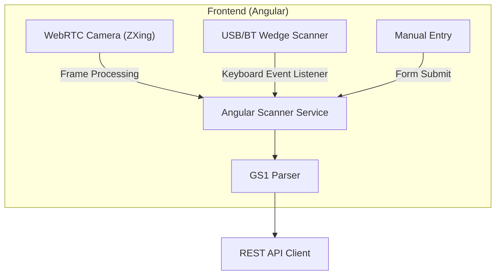
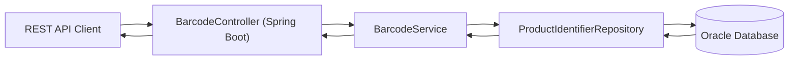
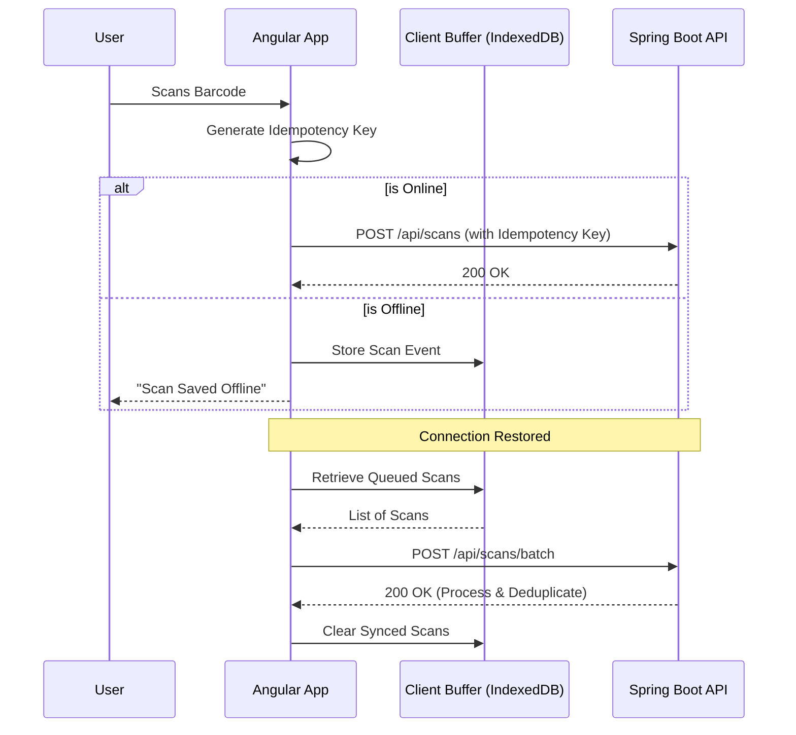
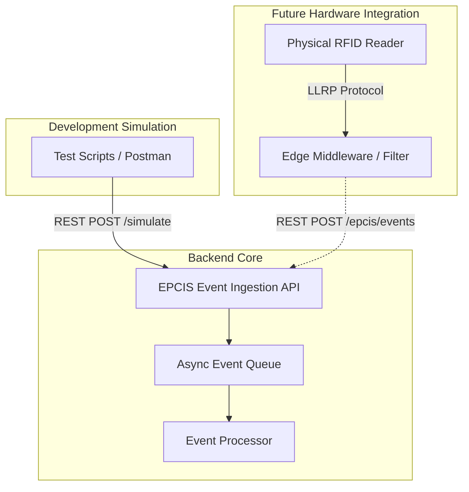
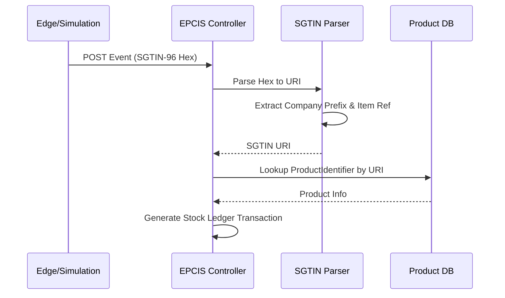
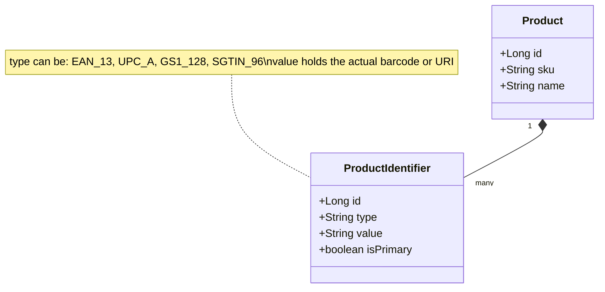
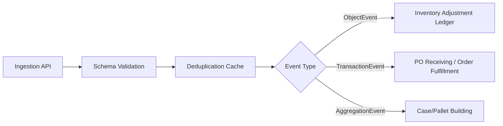

# Barcode & RFID Architecture

This document outlines the architecture for the scanning and identification systems within the **StockSmart** Retail Inventory Optimization & Management System. It covers the currently implemented barcode scanning features and the future-ready design for RFID integration.

---

## Barcode Architecture

### Supported Formats
StockSmart adheres to GS1 standards and currently supports:
- **EAN-13** (European Article Number)
- **UPC-A** (Universal Product Code)
- **GS1-128** (extended barcode with application identifiers)

### 1. Scanner Input Methods
The system captures barcode input via three primary mechanisms:
- **WebRTC Camera Scanning:** Uses modern browser APIs (ZXing / BarcodeDetector API) to scan directly from a mobile device or tablet camera.
- **USB/Bluetooth Keyboard-Wedge Scanner:** Physical hardware scanners that emulate keyboard input. The application uses a global keyboard event listener service to capture fast, sequential keystrokes.
- **Manual Entry Fallback:** A UI input field for users to manually type the barcode if the label is damaged.

### 2. GS1 Parsing
Once a raw string is captured, the system parses it according to GS1 rules:
- **Check Digit Validation:** Used for EAN-13 and UPC-A formats.
- **Application Identifier (AI) Parsing:** For GS1-128, extracting data such as GTIN (AI 01), Batch/Lot Number (AI 10), or Expiration Date (AI 17).

### 3. Angular Scanner Service
The `ScannerService` in the Angular frontend abstracts the underlying input method. Whether input comes from the camera, a wedge scanner, or manual entry, it normalizes the event and emits a structured scan event for consuming components.

### 4. Offline Scan Buffering
As dictated by project invariants (CLAUDE.md), offline resilience is required. 
- Scans are placed into a client-side buffer (e.g., IndexedDB or memory depending on the session).
- Each scan generates a unique **Idempotency Key**.
- When offline, scans queue locally. Upon connection restoration, the queue flushes to the backend in batches.

### 5. Barcode Registration
When introducing new products, barcodes are registered and mapped to a specific internal `Product` ID within the system.

### 6. Barcode Actions
Once a barcode is resolved, the user interface dynamically adapts based on the context:
- View product details
- Receive incoming inventory
- Perform manual stock adjustments
- Process POS sales/checkout

### 7. Backend Barcode Service
The Spring Boot backend exposes a `BarcodeService`. It is responsible for taking the scanned payload, validating the format, and querying the `ProductIdentifierRepository` to resolve the identifier to a distinct product and variant.

### Barcode Diagrams

#### Diagram 1: Barcode Scanning Flow (Camera and Wedge Paths)

#### Diagram 2: Barcode Resolution Architecture

#### Diagram 3: Offline Scan Buffering and Sync Flow

---

## RFID Architecture (Future-Ready)

### Standard
StockSmart is designed around **EPC Gen2** standards, specifically utilizing **SGTIN-96** encoding for item-level tracking.

### 1. RFID Tag Structure
The SGTIN-96 bit structure includes:
- **Header:** Identifies the SGTIN-96 format.
- **Filter:** Used for fast filtering (e.g., retail item vs. case).
- **Partition:** Defines the boundary between Company Prefix and Item Reference.
- **Company Prefix:** GS1 company identifier.
- **Item Reference:** Product identifier.
- **Serial Number:** Unique item-level serial number.

### 2. EPCIS Event Model
The system follows the Electronic Product Code Information Services (EPCIS) standard for events:
- **ObjectEvent:** Standard observation of a tag (e.g., inventory count).
- **AggregationEvent:** Grouping tags (e.g., packing items into a case).
- **TransactionEvent:** Associating tags with business transactions (e.g., receiving a Purchase Order).

### 3. Integration Architecture
Currently, the system is designed to accept RFID data, but physical hardware is not yet integrated. The pipeline:
`RFID Reader → Edge Server/Middleware → EPCIS Event Ingestion API → Spring Boot → Product/Inventory Resolution`

### 4. Development Simulation
Since physical RFID hardware is not integrated, the backend exposes a REST endpoint (`/api/rfid/simulate`) that accepts simulated RFID tag data. This enables end-to-end development and testing of the event pipeline.

### 5. Bulk Scan Processing
Unlike barcodes, RFID readers can read hundreds of tags per second. The architecture includes a batch processing pipeline capable of deduplicating and processing bulk EPCIS events asynchronously.

### 6. Identifier Abstraction
To support both legacy barcodes and future RFID tags, the system uses a polymorphic `ProductIdentifier` entity. It maps multiple identifier types (EAN, UPC, SGTIN) to the same underlying product catalog.

### 7. Future Hardware Integration Points
When physical hardware is introduced, the following will be required:
- Deployment of edge computing nodes (middleware) to filter and aggregate raw reader reads (LLRP protocol).
- Configuration of reader zones (antennas) mapped to specific `LOCATION_ID`s in StockSmart.
- Network configuration to forward edge events securely to the cloud EPCIS API.

### Implementation Status

| Feature | Status |
|---|---|
| Barcode scanning (camera) | **Currently Implemented** |
| Barcode scanning (keyboard wedge) | **Currently Implemented** |
| GS1 format parsing and validation | **Currently Implemented** |
| Product lookup by barcode | **Currently Implemented** |
| Offline scan buffering with idempotency | **Currently Implemented** |
| RFID tag simulation via REST API | **Development Simulation** |
| SGTIN-96 parsing and resolution | **Development Simulation** |
| EPCIS event ingestion pipeline | **Development Simulation** |
| Physical RFID reader integration | **Future Hardware Integration** |
| Edge computing middleware (LLRP) | **Future Hardware Integration** |
| Real-time bulk tag processing | **Future Hardware Integration** |

### RFID Diagrams

#### Diagram 4: RFID Integration Architecture (Current vs. Future)

#### Diagram 5: RFID Tag Resolution Flow

#### Diagram 6: Identifier Abstraction Model

#### Diagram 7: EPCIS Event Ingestion Pipeline (Future)

