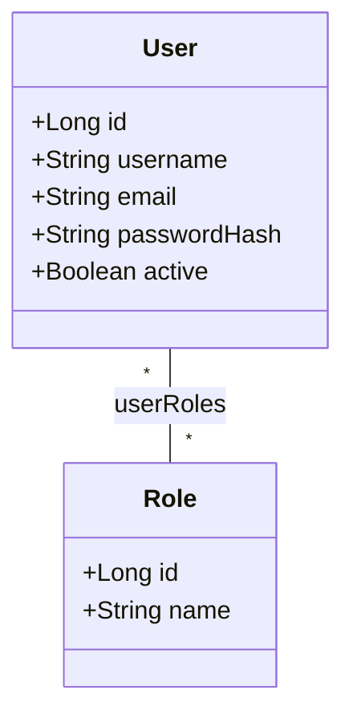
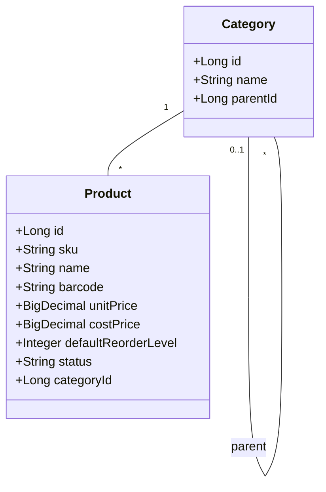
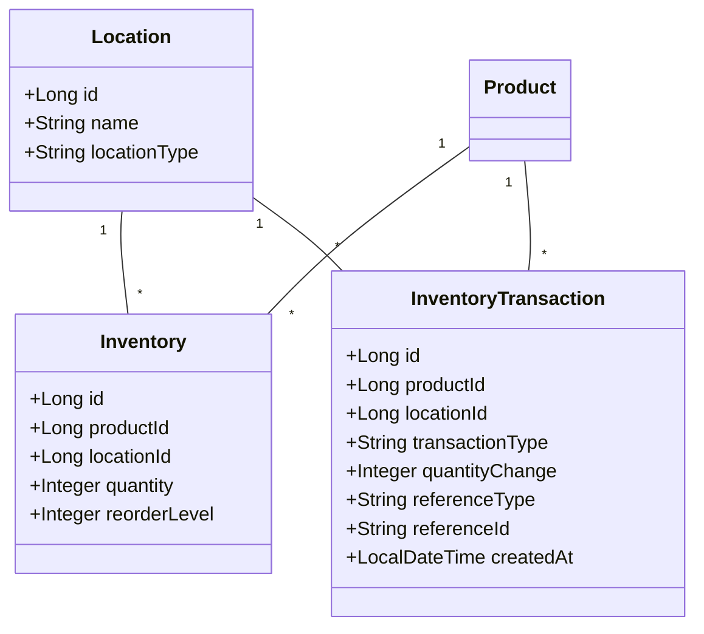
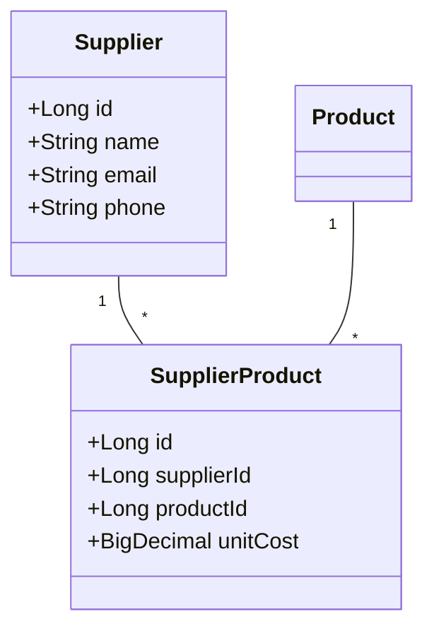
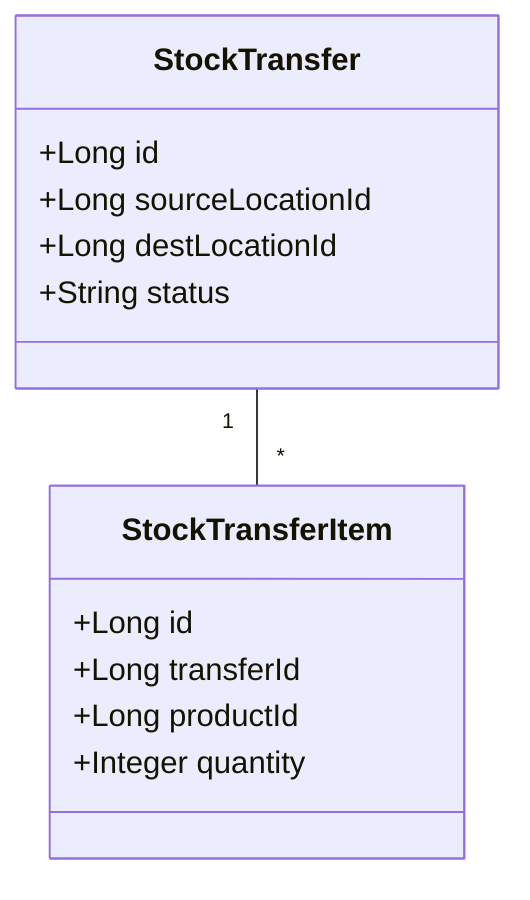
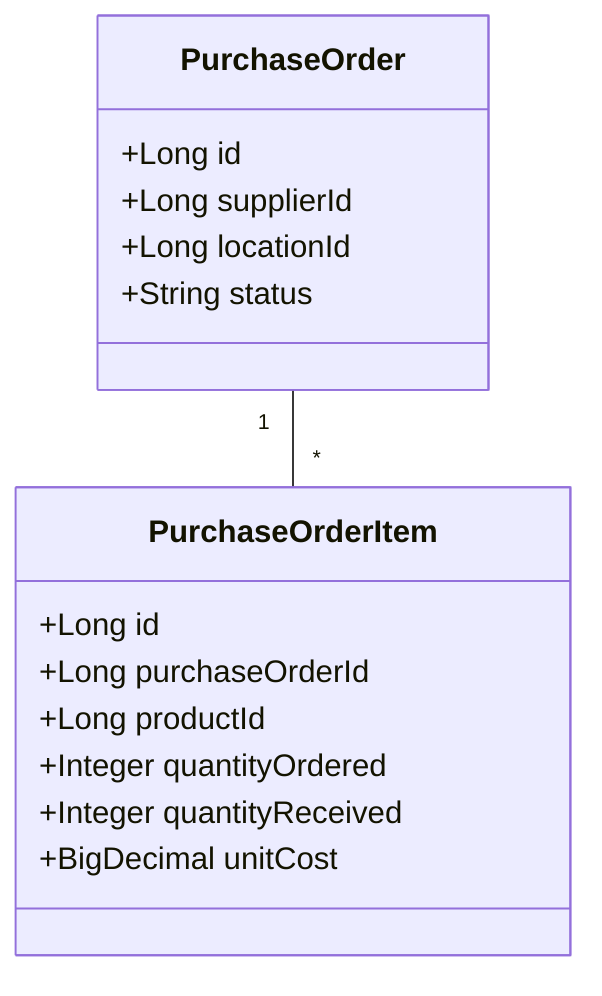
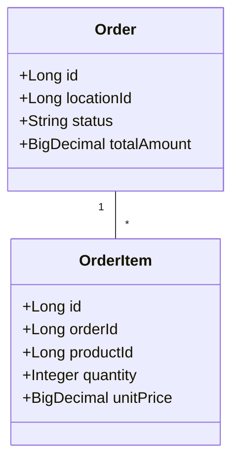
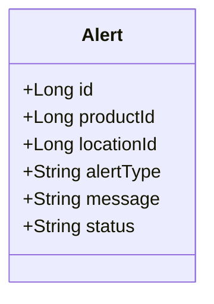
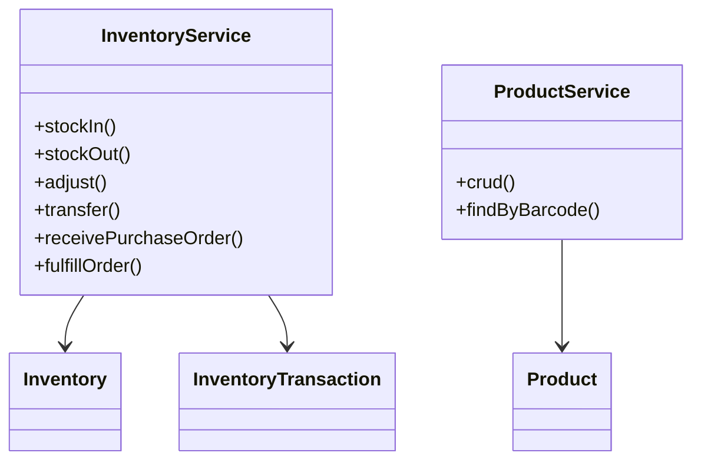

# StockSmart Domain Class Diagrams

Conceptual models aligned with [database.md](./database.md) and the college-level inventory design.

## 1. User / auth

Roles: `ADMIN`, `INVENTORY_MANAGER`, `STAFF`. No separate Permission entity in MVP.

---

## 2. Product catalog

---

## 3. Location & inventory

Stock updates go through **InventoryService**; transactions optional for history.

---

## 4. Suppliers

---

## 5. Stock transfer

---

## 6. Purchase order

---

## 7. Sales order

---

## 8. Alert

---

## 9. Service layer (conceptual)

