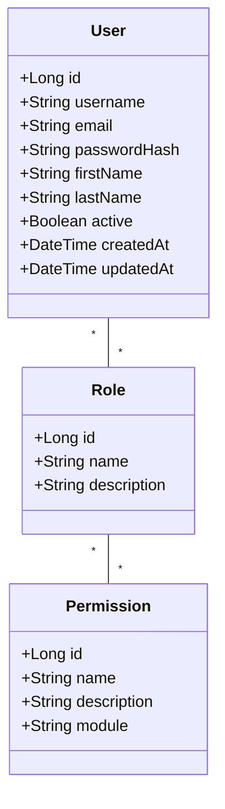
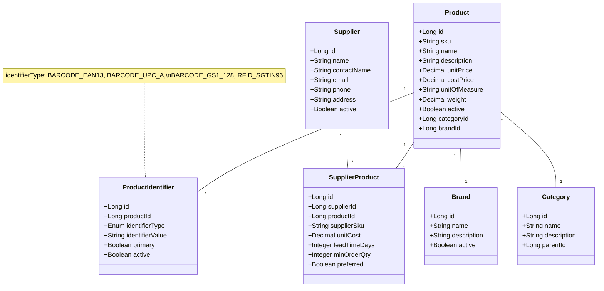
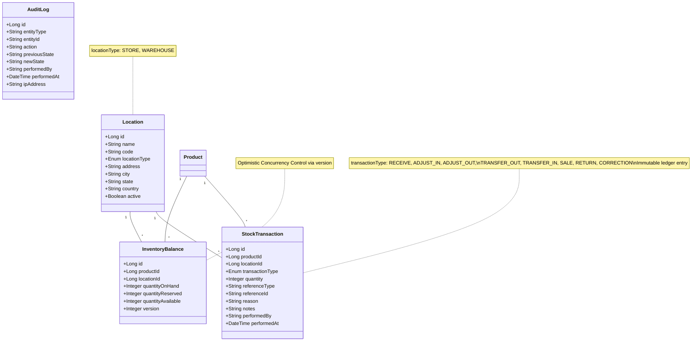
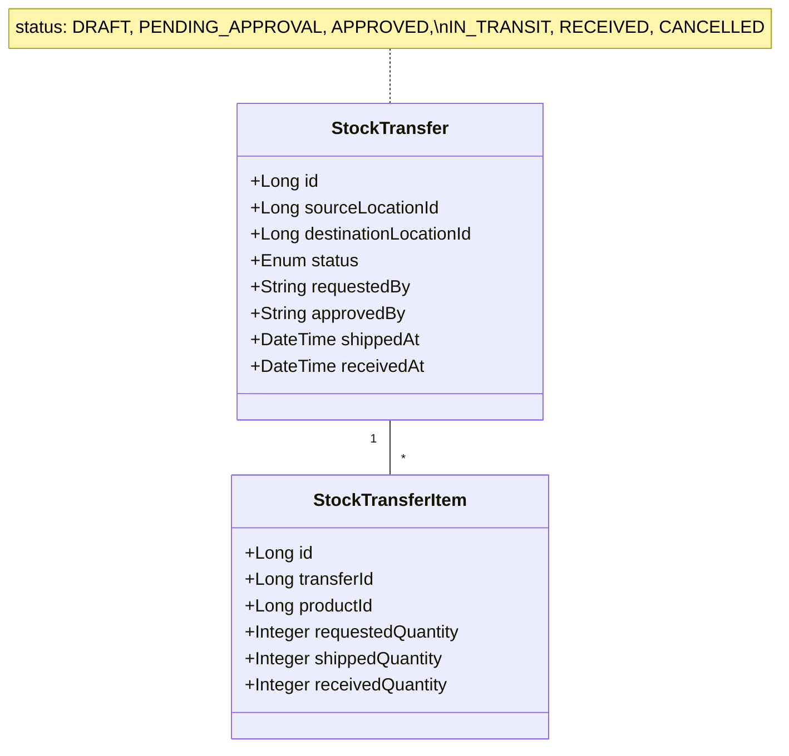
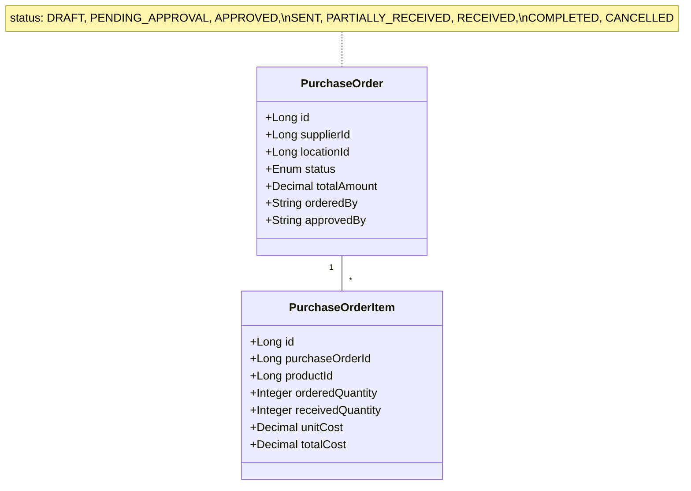
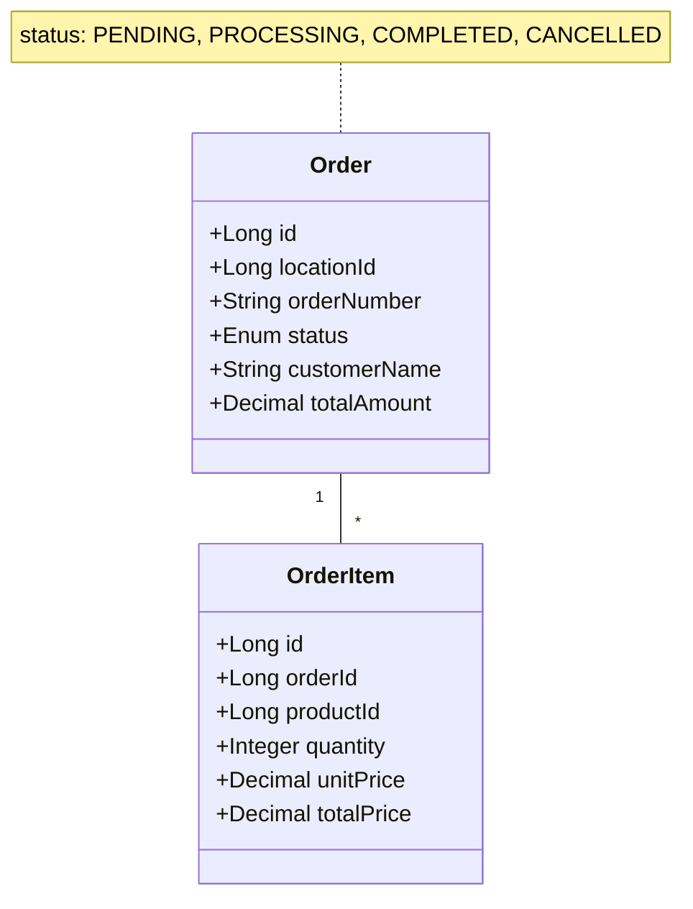
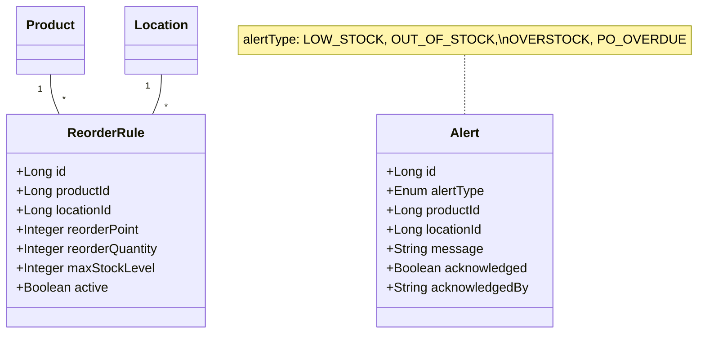
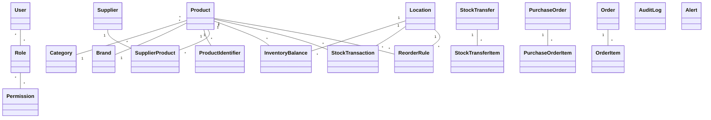

# StockSmart Domain Model Class Diagrams

This document contains conceptual Mermaid class diagrams representing the major domain objects and their relationships in the StockSmart project. The diagrams are consistent with the database design, utilizing principles such as double-entry stock ledgers and multi-location scoping.

## 1. User/Auth Domain

## 2. Product Domain

## 3. Location, Inventory (Ledger)

## 4. Transfers

## 5. Purchasing

## 6. Orders

## 7. Alerts & Reorder Rules

## 8. Full Overview (Simplified)

