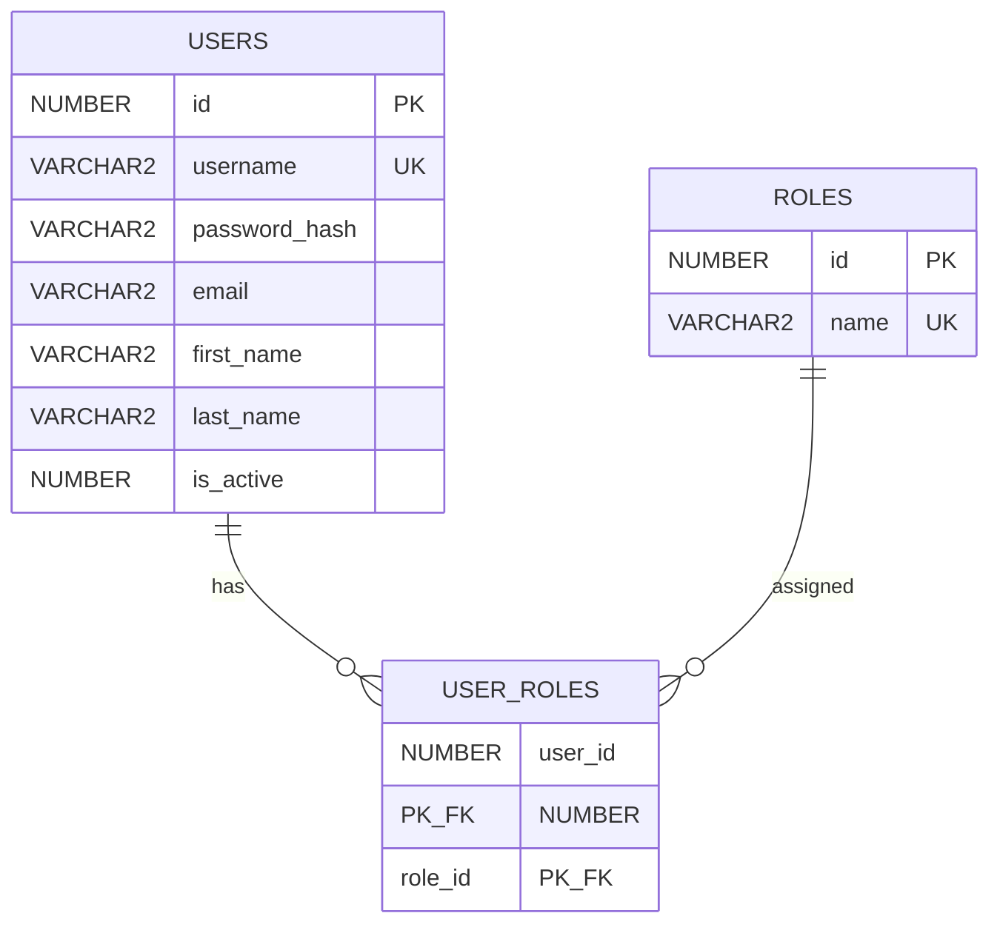
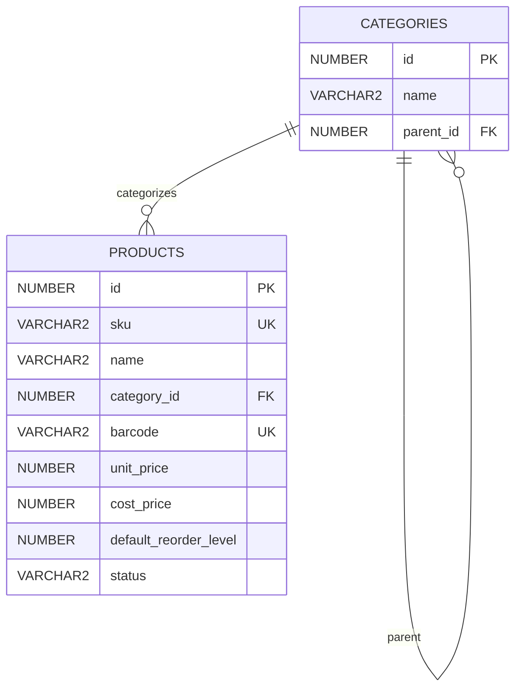
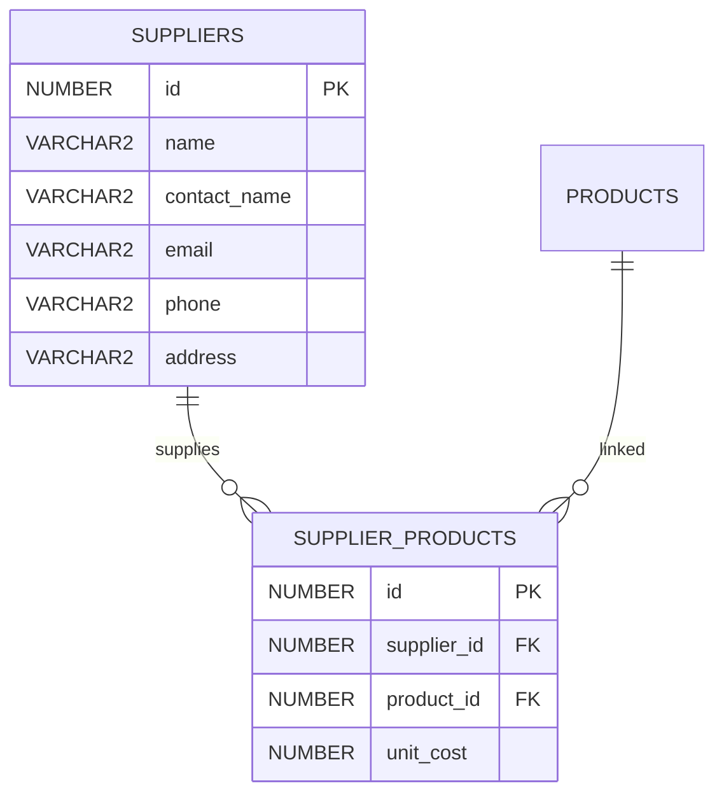
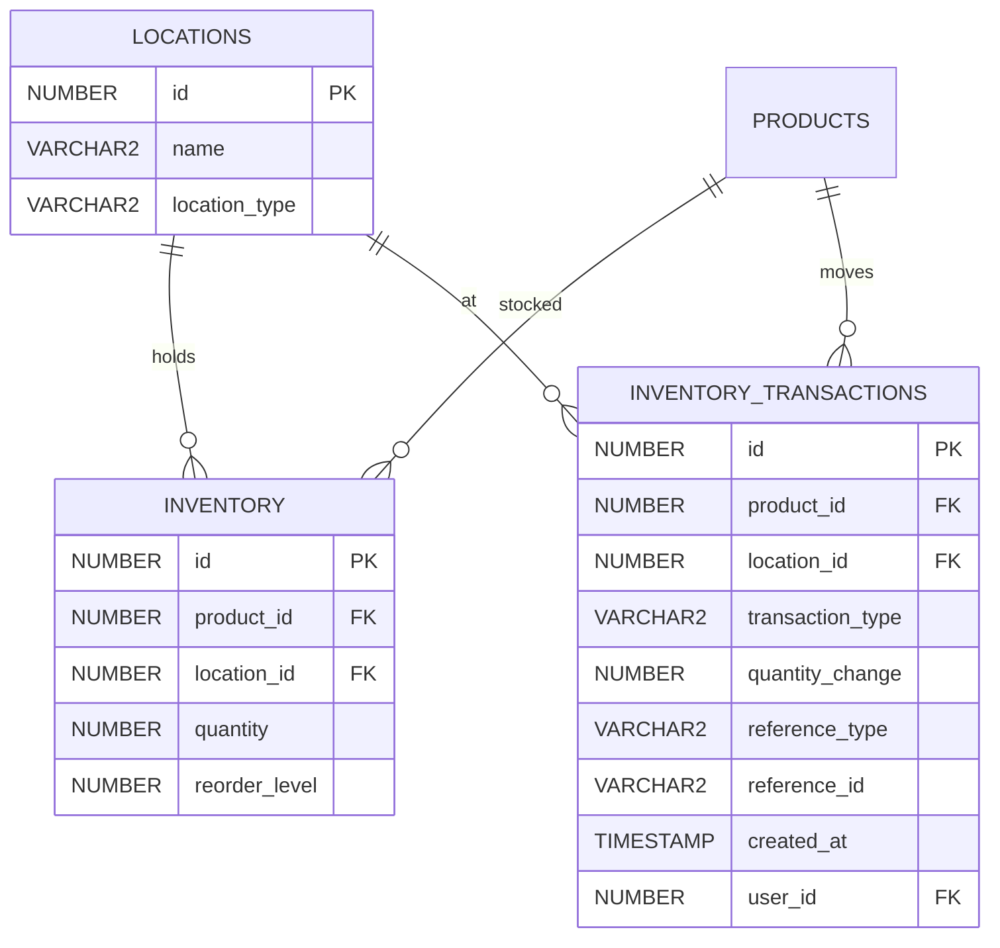
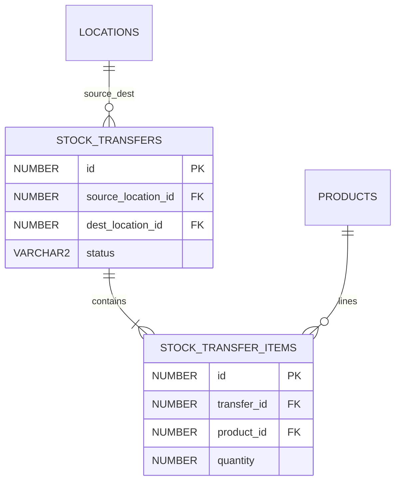
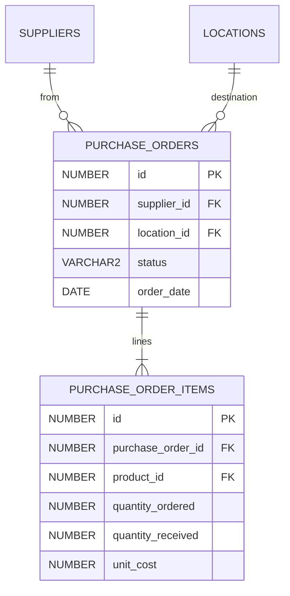
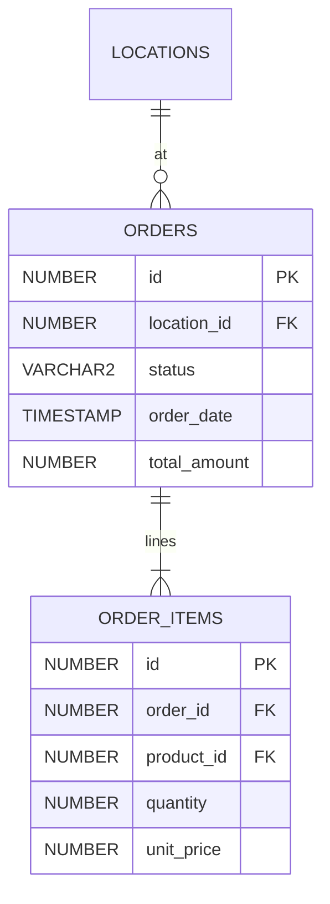
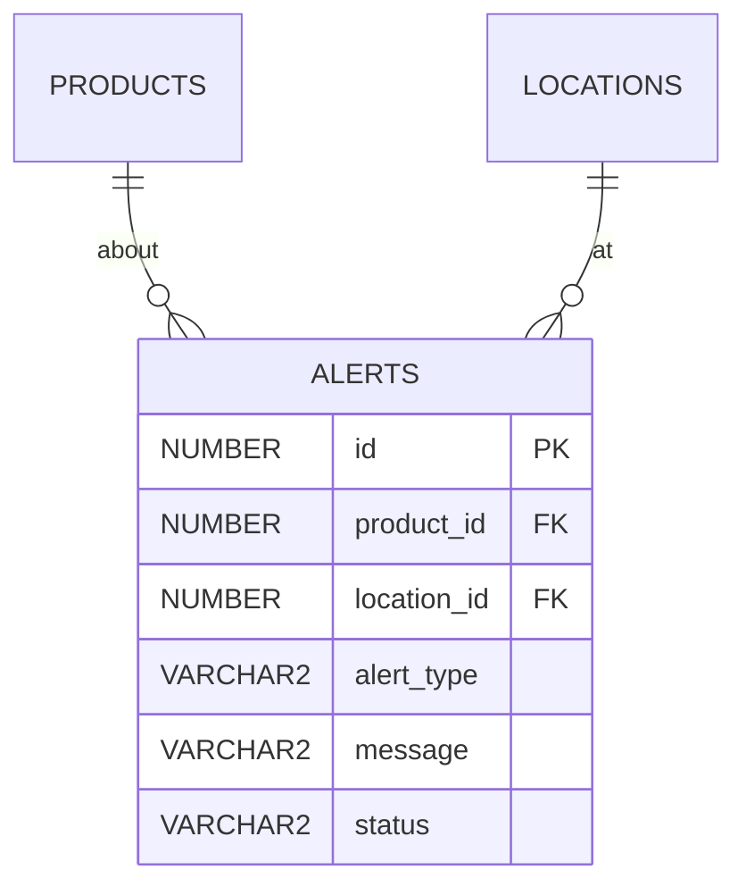
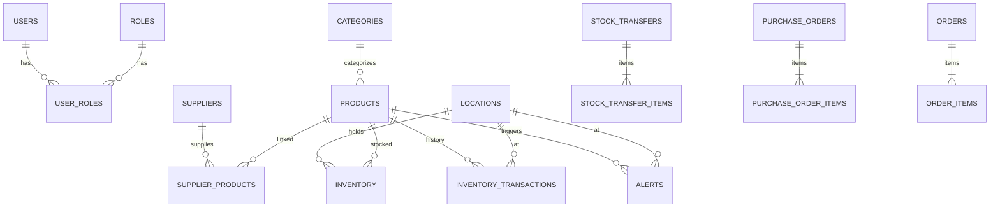

# StockSmart Database Design Document

Oracle schema design for the **B.Tech StockSmart** project. The model is **normalized** and aligned with [PROJECT.md](../PROJECT.md).

## Design principles (college level)

1. **Inventory quantity** is stored on `INVENTORY` and updated by application services (stock in/out, adjust, transfer, PO receive, order confirm).
2. Optional **`INVENTORY_TRANSACTION`** rows provide movement **history** for demos and reports — not an immutable accounting ledger.
3. **Multi-location:** operations reference `LOCATION_ID` where applicable.
4. **Security:** users and roles; **no** separate permissions table for MVP.
5. **Barcode:** column on `PRODUCT` (unique when set).
6. **Schema creation:** JPA `ddl-auto=update` in development **or** a provided SQL script — Flyway is **not** required.

Oracle notes:

- Primary keys: `NUMBER` with sequences (or IDENTITY where supported).
- Timestamps: `TIMESTAMP` or `TIMESTAMP WITH TIME ZONE`.
- Use `@SequenceGenerator` in JPA entities as needed.

---

## 1. User & role domain

**Roles (seed data):** `ADMIN`, `INVENTORY_MANAGER`, `STAFF`.

Standard audit columns on mutable tables: `created_at`, `updated_at`, optional `created_by`, `updated_by`.

---

## 2. Product catalog

- **Brand** table omitted for simplicity (optional future add-on).
- **RFID:** optional `rfid_tag` column on `PRODUCT` as placeholder only — no hardware integration.

---

## 3. Suppliers

Unique constraint on `(supplier_id, product_id)`.

---

## 4. Locations & inventory

- **Unique** `(product_id, location_id)` on `INVENTORY`.
- **transaction_type** examples: `STOCK_IN`, `STOCK_OUT`, `ADJUSTMENT`, `TRANSFER_OUT`, `TRANSFER_IN`, `PO_RECEIVE`, `ORDER_FULFILL`.
- No `version` column for optimistic locking in MVP.

---

## 5. Stock transfers

**Status:** `PENDING`, `COMPLETED`, `CANCELLED` (adjust if implementation uses ship/receive steps).

---

## 6. Purchase orders

**Status:** `DRAFT`, `SUBMITTED`, `PARTIAL`, `RECEIVED`, `CANCELLED`.

Receiving increases `INVENTORY.quantity` at `location_id`.

---

## 7. Sales orders

**Status:** `PENDING`, `CONFIRMED`, `COMPLETED`, `CANCELLED`. Confirm/complete reduces stock.

---

## 8. Alerts

**alert_type:** `LOW_STOCK`, `OUT_OF_STOCK`. May be generated by scheduled job or on inventory update.

---

## 9. Complete overview

---

## Indexing (recommended)

- `PRODUCTS(sku)`, `PRODUCTS(barcode)`
- `INVENTORY(location_id, product_id)` unique
- Foreign key columns indexed for join performance

---

## Removed from enterprise design

| Removed | Reason |
|---------|--------|
| `PERMISSIONS`, `ROLE_PERMISSIONS` | Simple role-based security |
| `PRODUCT_IDENTIFIERS` | Barcode on product |
| `INVENTORY_BALANCE.version` | No optimistic locking MVP |
| Immutable `STOCK_TRANSACTIONS` ledger rules | Simplified inventory + optional history |
| `AUDIT_LOG` with CLOB snapshots | JPA audit fields sufficient for project |

See **Future enhancements** in [PROJECT.md](../PROJECT.md).
