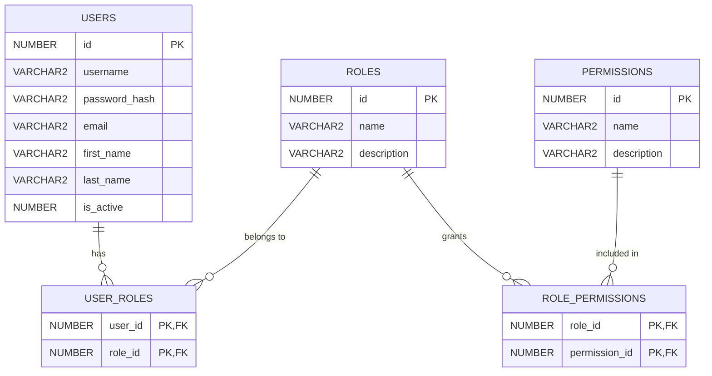
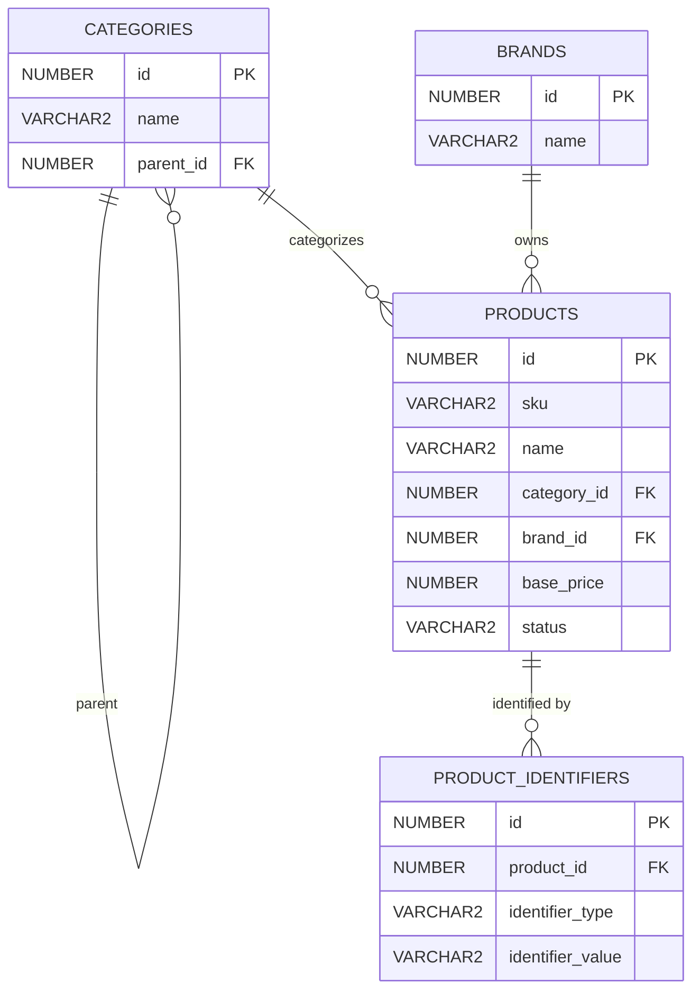
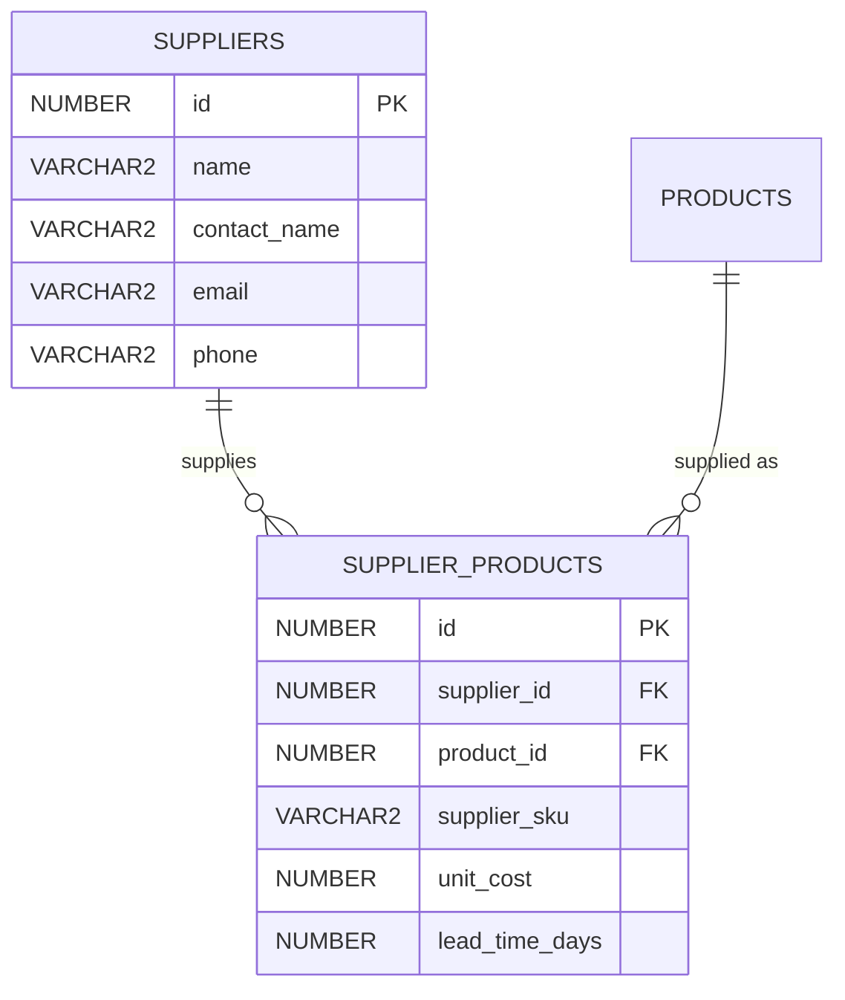
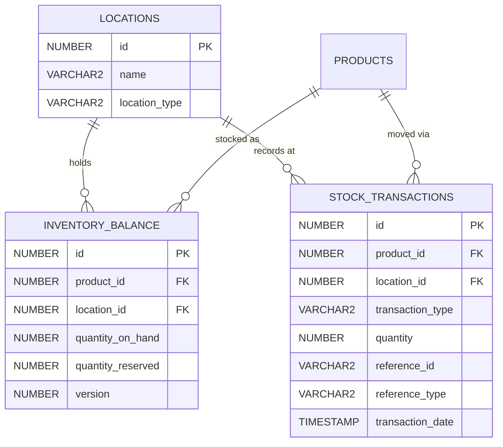
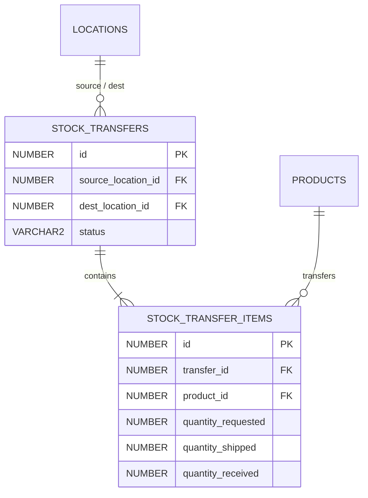
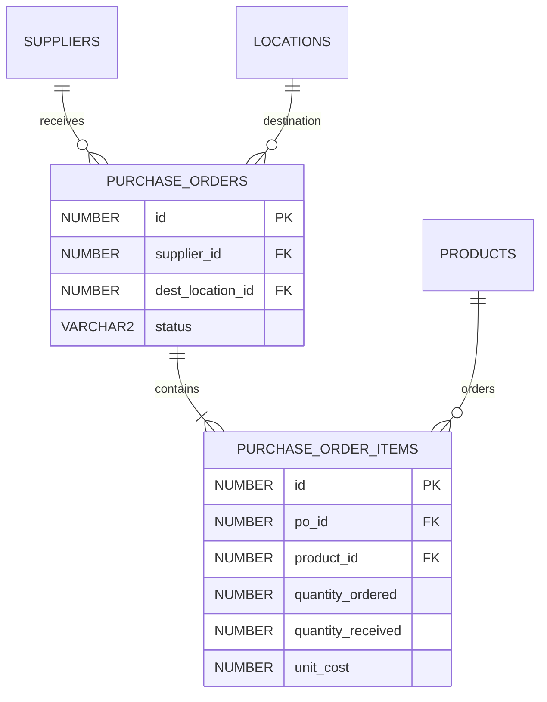
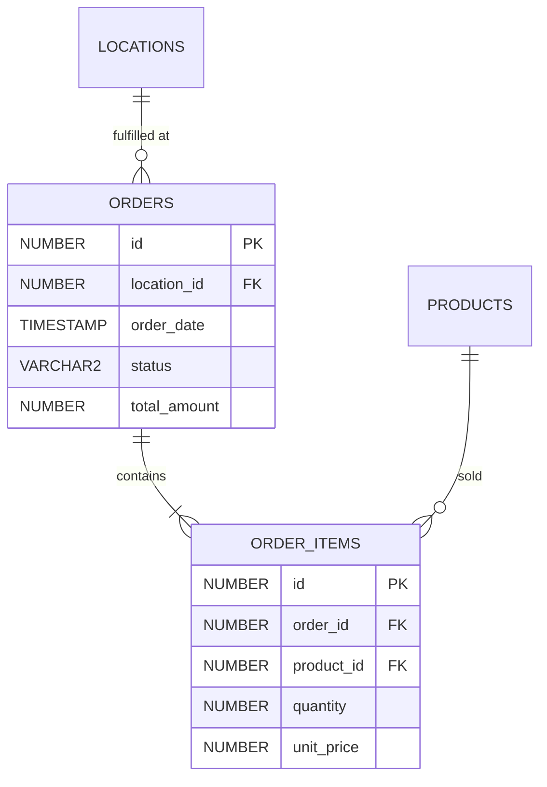
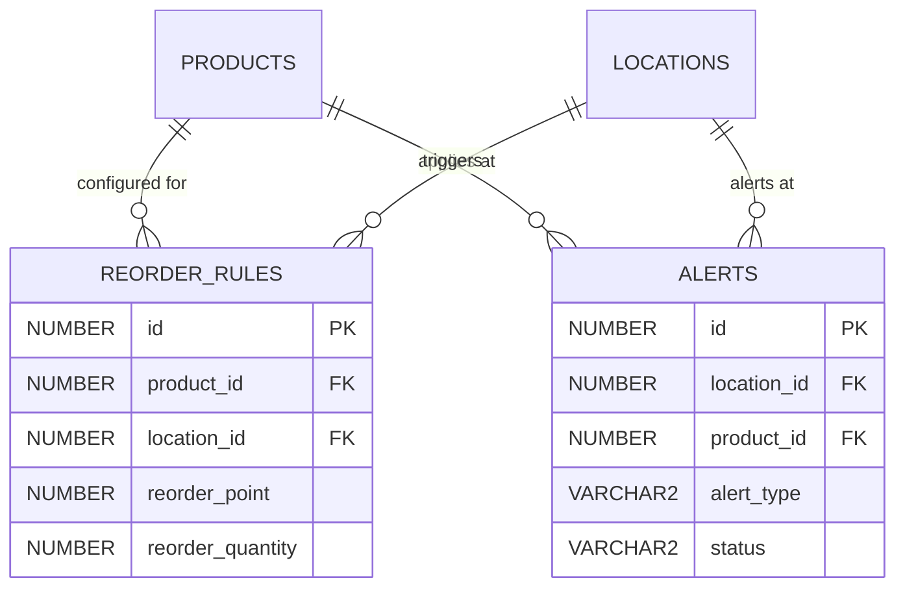
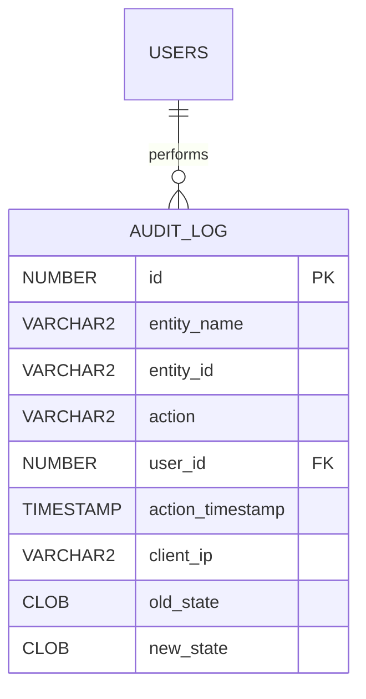
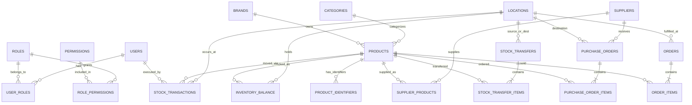

# StockSmart Database Design Document

This document outlines the Oracle Database schema design for the StockSmart Retail Inventory Optimization & Management System. The design adheres strictly to the architectural decisions outlined in `CLAUDE.md`, focusing on a double-entry stock ledger, GS1/EPCIS compliance, and robust multi-location inventory control.

## Architectural Principles Enforced in Database Design
1. **Double-Entry Stock Ledger**: Inventory is never updated via in-place raw updates. Every movement creates an immutable `STOCK_TRANSACTIONS` record.
2. **Optimistic Concurrency Control**: `INVENTORY_BALANCE` uses a `VERSION` column to prevent race conditions during concurrent modifications.
3. **Immutability**: `STOCK_TRANSACTIONS` and `AUDIT_LOG` records are insert-only and never updated or deleted. Corrections are handled via compensatory transactions.
4. **Multi-Location Scoping**: All operations (inventory, scanning, transfers) are strictly scoped to a `LOCATION_ID`.
5. **Oracle Specifics**: 
   - Primary keys use `NUMBER` with sequences.
   - Identifier lengths are kept within reasonable boundaries (historically 30 chars, though modern Oracle supports up to 128, we use conservative concise naming).
   - Timestamp columns utilize `TIMESTAMP WITH TIME ZONE`.
   - Audit trail state snapshots are stored in `CLOB` as JSON.

---

## 1. User Access & Security Domain

### Entity Relationship Diagram

### Table Definitions
- **USERS**: Stores system users.
  - `id` (NUMBER, PK): Sequence-generated.
  - `username` (VARCHAR2(50), UNIQUE, NOT NULL).
  - `password_hash` (VARCHAR2(255), NOT NULL).
  - `email` (VARCHAR2(255), UNIQUE, NOT NULL).
  - `first_name` (VARCHAR2(100), NOT NULL), `last_name` (VARCHAR2(100), NOT NULL).
  - `is_active` (NUMBER(1), DEFAULT 1).
  - Standard audit columns: `created_at`, `created_by`, `updated_at`, `updated_by`.
- **ROLES**: System roles (ADMIN, INVENTORY_MANAGER, STORE_MANAGER, etc.).
  - `id` (NUMBER, PK).
  - `name` (VARCHAR2(50), UNIQUE, NOT NULL).
  - Standard audit columns.
- **PERMISSIONS**: Granular permissions.
  - `id` (NUMBER, PK).
  - `name` (VARCHAR2(100), UNIQUE, NOT NULL).
  - Standard audit columns.
- **ROLE_PERMISSIONS** / **USER_ROLES**: Join tables for many-to-many relationships.

---

## 2. Product Catalog Domain

### Entity Relationship Diagram

### Table Definitions
- **PRODUCTS**: Product catalog.
  - `id` (NUMBER, PK).
  - `sku` (VARCHAR2(100), UNIQUE, NOT NULL).
  - `name` (VARCHAR2(255), NOT NULL).
  - `category_id` (NUMBER, FK to CATEGORIES, Nullable).
  - `brand_id` (NUMBER, FK to BRANDS, Nullable).
  - `base_price` (NUMBER(19,4), NOT NULL).
  - `status` (VARCHAR2(20), NOT NULL) - e.g., ACTIVE, INACTIVE, DISCONTINUED.
  - Standard audit columns.
- **CATEGORIES**: Hierarchical categories.
  - `id` (NUMBER, PK).
  - `name` (VARCHAR2(100), NOT NULL).
  - `parent_id` (NUMBER, FK to CATEGORIES.id).
  - Standard audit columns.
- **BRANDS**: Product brands.
  - `id` (NUMBER, PK), `name` (VARCHAR2(100), UNIQUE, NOT NULL).
- **PRODUCT_IDENTIFIERS**: Polymorphic identifier for GS1/EPCIS.
  - `id` (NUMBER, PK).
  - `product_id` (NUMBER, FK to PRODUCTS, NOT NULL).
  - `identifier_type` (VARCHAR2(20), NOT NULL) - EAN_13, UPC_A, GS1_128, SGTIN_96.
  - `identifier_value` (VARCHAR2(255), NOT NULL, Indexed).
  - Standard audit columns.

---

## 3. Supply Chain Domain

### Entity Relationship Diagram

### Table Definitions
- **SUPPLIERS**: Supplier directory.
  - `id` (NUMBER, PK), `name` (VARCHAR2(255), NOT NULL), `contact_name` (VARCHAR2(255)).
  - `email` (VARCHAR2(255)), `phone` (VARCHAR2(50)), `address` (VARCHAR2(500)).
- **SUPPLIER_PRODUCTS**: Which suppliers provide which products.
  - `id` (NUMBER, PK).
  - `supplier_id` (NUMBER, FK to SUPPLIERS, NOT NULL).
  - `product_id` (NUMBER, FK to PRODUCTS, NOT NULL).
  - `supplier_sku` (VARCHAR2(100)).
  - `unit_cost` (NUMBER(19,4), NOT NULL).
  - `lead_time_days` (NUMBER(4), NOT NULL).
  - Constraint: UNIQUE(supplier_id, product_id).

---

## 4. Location & Inventory Ledger Domain (Core Architecture)

### Entity Relationship Diagram

### Table Definitions
- **LOCATIONS**: Stores and warehouses.
  - `id` (NUMBER, PK).
  - `name` (VARCHAR2(255), NOT NULL).
  - `location_type` (VARCHAR2(20), NOT NULL) - STORE, WAREHOUSE.
  - `manager_id` (NUMBER, FK to USERS), `is_active` (NUMBER(1)).
- **INVENTORY_BALANCE**: Current cached stock levels with optimistic concurrency.
  - `id` (NUMBER, PK).
  - `product_id` (NUMBER, FK, NOT NULL), `location_id` (NUMBER, FK, NOT NULL).
  - `quantity_on_hand` (NUMBER, NOT NULL, DEFAULT 0).
  - `quantity_reserved` (NUMBER, NOT NULL, DEFAULT 0).
  - `version` (NUMBER, NOT NULL, DEFAULT 0) - **Crucial for JPA @Version**.
  - Constraint: UNIQUE(product_id, location_id).
- **STOCK_TRANSACTIONS**: **Immutable** ledger entries for double-entry bookkeeping.
  - `id` (NUMBER, PK).
  - `product_id` (NUMBER, FK, NOT NULL).
  - `location_id` (NUMBER, FK, NOT NULL).
  - `transaction_type` (VARCHAR2(30), NOT NULL) - RECEIVE, ADJUST_IN, ADJUST_OUT, TRANSFER_OUT, TRANSFER_IN, SALE, RETURN, CORRECTION.
  - `quantity` (NUMBER, NOT NULL) - Positive for IN, Negative for OUT.
  - `reference_id` (VARCHAR2(100)) - Link to PO, Order, Transfer.
  - `reference_type` (VARCHAR2(50)) - PO, ORDER, TRANSFER, MANUAL.
  - `transaction_date` (TIMESTAMP WITH TIME ZONE, NOT NULL).
  - `user_id` (NUMBER, FK to USERS).
  - `notes` (VARCHAR2(500)).
  - *No update_at/updated_by columns needed as records are immutable.*

---

## 5. Stock Transfers Domain

### Entity Relationship Diagram

### Table Definitions
- **STOCK_TRANSFERS**: Transfer headers.
  - `id` (NUMBER, PK).
  - `source_location_id` (NUMBER, FK to LOCATIONS, NOT NULL).
  - `dest_location_id` (NUMBER, FK to LOCATIONS, NOT NULL).
  - `status` (VARCHAR2(30), NOT NULL) - PENDING, SHIPPED, RECEIVED, CANCELLED.
  - Date/User tracking for requested, shipped, and received actions.
- **STOCK_TRANSFER_ITEMS**: Transfer lines.
  - `id` (NUMBER, PK), `transfer_id` (NUMBER, FK, NOT NULL).
  - `product_id` (NUMBER, FK, NOT NULL).
  - `quantity_requested`, `quantity_shipped`, `quantity_received` (NUMBER).

---

## 6. Purchasing Domain (Purchase Orders)

### Entity Relationship Diagram

### Table Definitions
- **PURCHASE_ORDERS**: Header.
  - `id` (NUMBER, PK).
  - `supplier_id` (NUMBER, FK), `destination_location_id` (NUMBER, FK).
  - `status` (VARCHAR2(30)) - DRAFT, SUBMITTED, PARTIAL, FULFILLED, CANCELLED.
  - `order_date`, `expected_date`.
- **PURCHASE_ORDER_ITEMS**: Lines.
  - `id` (NUMBER, PK), `po_id` (NUMBER, FK, NOT NULL), `product_id` (NUMBER, FK, NOT NULL).
  - `quantity_ordered` (NUMBER), `quantity_received` (NUMBER), `unit_cost` (NUMBER(19,4)).

---

## 7. Orders Domain (Sales)

### Entity Relationship Diagram

### Table Definitions
- **ORDERS**: Customer sales order header.
  - `id` (NUMBER, PK), `location_id` (NUMBER, FK, NOT NULL).
  - `customer_id` (NUMBER, Nullable).
  - `order_date` (TIMESTAMP WITH TIME ZONE), `status` (VARCHAR2(30)).
  - `total_amount` (NUMBER(19,4)).
- **ORDER_ITEMS**: Sales lines.
  - `id` (NUMBER, PK), `order_id` (NUMBER, FK, NOT NULL), `product_id` (NUMBER, FK, NOT NULL).
  - `quantity` (NUMBER), `unit_price` (NUMBER(19,4)), `line_total` (NUMBER(19,4)).

---

## 8. Alerts & Reorder Rules Domain

### Entity Relationship Diagram

### Table Definitions
- **REORDER_RULES**: Thresholds for automated alerts.
  - `id` (NUMBER, PK), `product_id` (NUMBER, FK), `location_id` (NUMBER, FK).
  - `reorder_point` (NUMBER), `reorder_quantity` (NUMBER), `is_active` (NUMBER(1)).
- **ALERTS**: System-generated alerts.
  - `id` (NUMBER, PK), `location_id` (NUMBER, FK), `product_id` (NUMBER, FK).
  - `alert_type` (VARCHAR2(30)) - LOW_STOCK, OUT_OF_STOCK.
  - `message` (VARCHAR2(500)).
  - `status` (VARCHAR2(30)) - UNREAD, ACKNOWLEDGED, RESOLVED.

---

## 9. System Audit Logging

### Entity Relationship Diagram

### Table Definitions
- **AUDIT_LOG**: **Immutable** system-wide audit trail.
  - `id` (NUMBER, PK).
  - `entity_name` (VARCHAR2(100), NOT NULL).
  - `entity_id` (VARCHAR2(100), NOT NULL).
  - `action` (VARCHAR2(30), NOT NULL) - INSERT, UPDATE, DELETE.
  - `user_id` (NUMBER, FK to USERS).
  - `action_timestamp` (TIMESTAMP WITH TIME ZONE, NOT NULL).
  - `client_ip` (VARCHAR2(45)).
  - `old_state` (CLOB) - JSON snapshot.
  - `new_state` (CLOB) - JSON snapshot.

---

## 10. Complete Database ER Overview (Simplified)

## Standard Audit Columns Pattern
Except for immutable tables (`STOCK_TRANSACTIONS`, `AUDIT_LOG`), all entities include the following standard tracking columns:
- `created_at` (TIMESTAMP WITH TIME ZONE, NOT NULL)
- `created_by` (NUMBER, FK to USERS, NOT NULL)
- `updated_at` (TIMESTAMP WITH TIME ZONE, NOT NULL)
- `updated_by` (NUMBER, FK to USERS, NOT NULL)

## Indexing Strategy Notes
- **Primary Indexes**: Auto-generated by Oracle for all `PK` and `UNIQUE` constraints.
- **Foreign Key Indexes**: Every `FK` must have a corresponding index to prevent table locks and improve join performance.
- **Business Lookups**: Indexes required on `PRODUCTS.sku`, `PRODUCT_IDENTIFIERS.identifier_value`, and `STOCK_TRANSACTIONS.transaction_date`.
- **Location-Scoping Indexes**: Compound indexes on `(location_id, product_id)` across `INVENTORY_BALANCE`, `REORDER_RULES`, and `ALERTS` to optimize location-specific dashboard queries.
