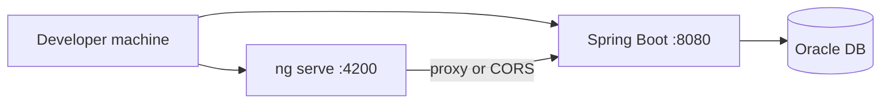
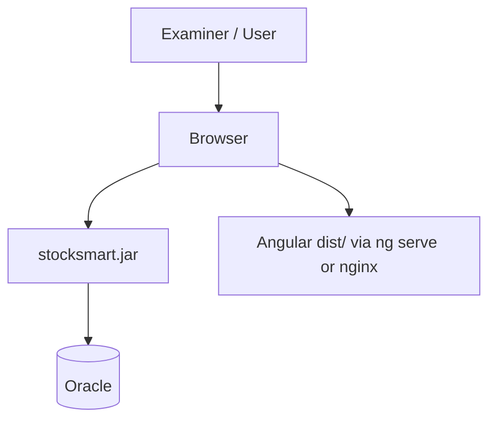

# StockSmart Deployment (Academic Project)

Simple deployment model for development, demo, and viva — not multi-node production.

## 1. Development architecture

### Angular

- Run: `ng serve --port 4200`
- Proxy API calls to backend via `proxy.conf.json` **or** CORS on Spring Boot

### Spring Boot

- Run: `./mvnw spring-boot:run -Dspring-boot.run.profiles=dev`
- Configure datasource in `application-dev.yml`

### Oracle

- Local Oracle XE / 23ai Free **or** Docker container
- Create user/schema for StockSmart
- Schema: JPA `spring.jpa.hibernate.ddl-auto=update` for dev (document in README)

---

## 2. Demo / submission packaging

- **Backend:** `java -jar stocksmart.jar --spring.profiles.active=dev`
- **Frontend:** `ng build` → serve `dist/` with any static server **or** run `ng serve` during live demo
- Provide **seed SQL or CommandLineRunner** for demo users and sample products

---

## 3. Environment variables

| Variable | Purpose |
|----------|---------|
| `SPRING_DATASOURCE_URL` | JDBC URL |
| `SPRING_DATASOURCE_USERNAME` | DB user |
| `SPRING_DATASOURCE_PASSWORD` | DB password |
| `JWT_SECRET` | Signing key |
| `JWT_EXPIRATION_MS` | Token lifetime |

---

## 4. Optional Docker (team choice)

Single `docker-compose.yml` with Oracle only — app runs on host. Full containerization of Spring + Angular is optional.

**Not required:** Kubernetes, load balancers, RAC, secrets vault, Flyway migration user split, WAF.

---

## 5. Health check

- Spring Boot Actuator `/actuator/health` optional for demo

---

## 6. Backup for viva

- Export Oracle schema or dump demo data
- Tag git commit used for demonstration

---

## Future production topics (documentation only)

- HTTPS termination (nginx)
- Multiple API instances behind load balancer
- Flyway migrations, separate DDL user
- Oracle Data Guard / RAC
