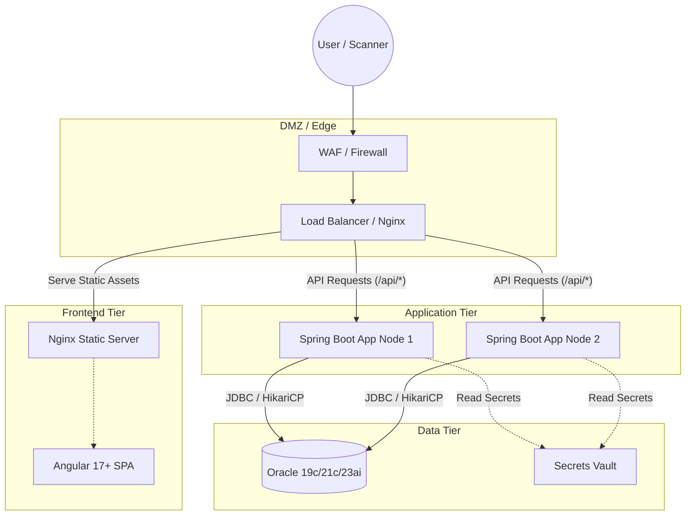
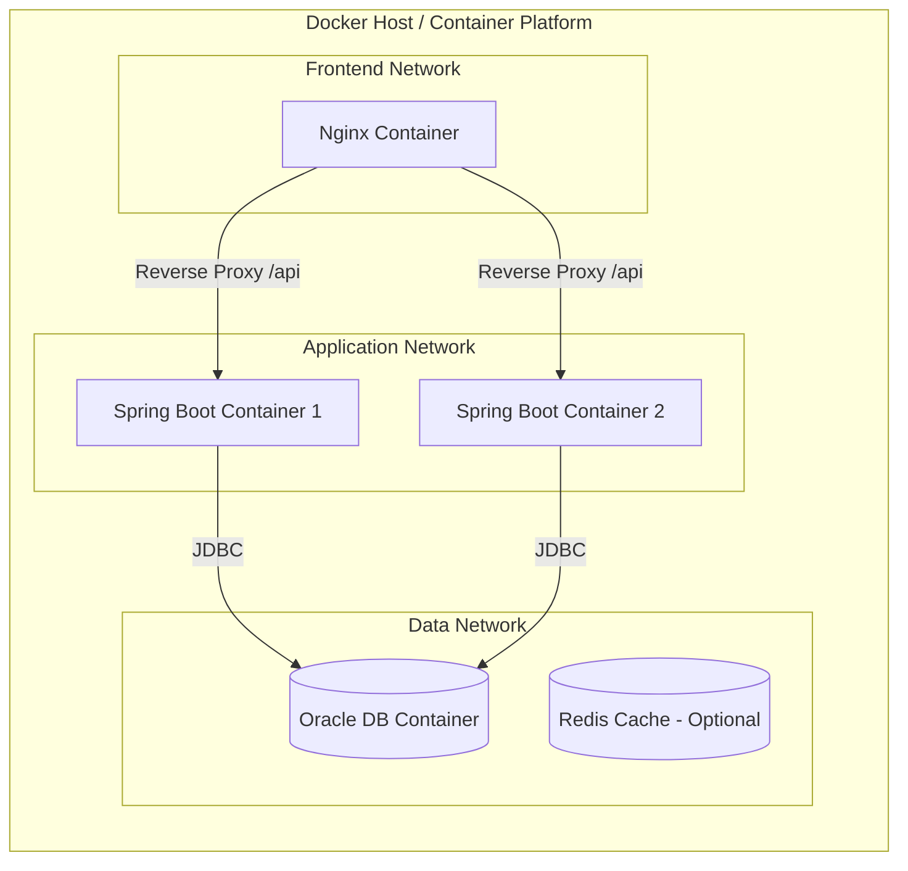
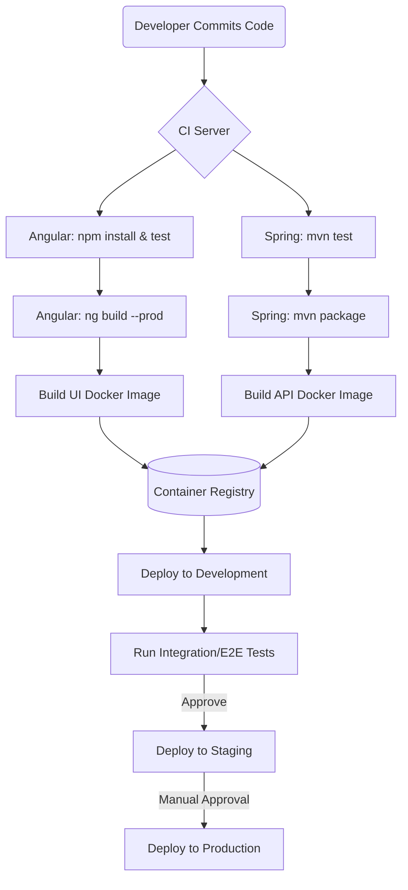
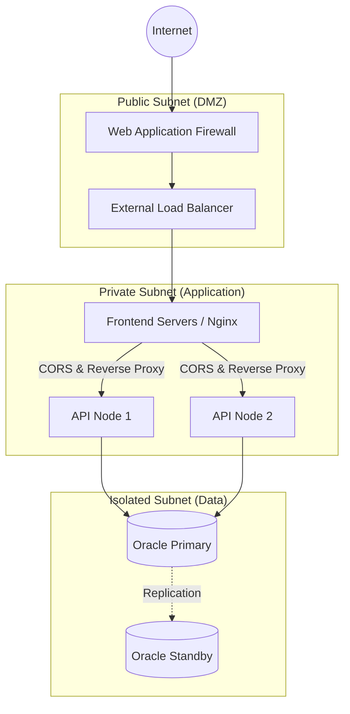
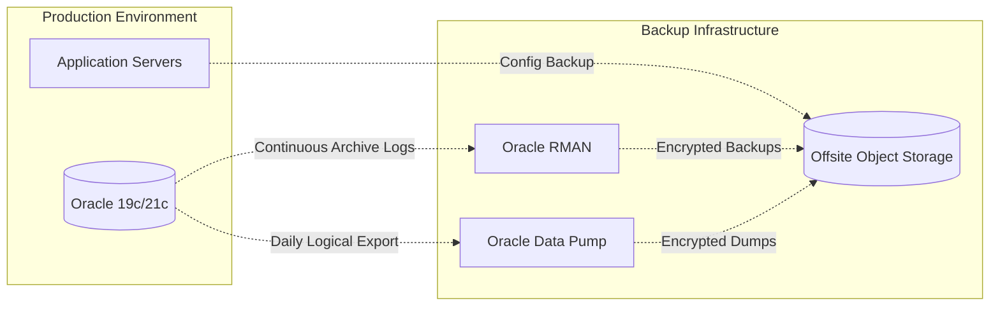

# StockSmart Deployment Architecture

This document outlines the deployment strategy, environments, and infrastructure architecture for the StockSmart Retail Inventory Optimization & Management System.

## 1. Deployment Architecture

The following diagram illustrates the high-level deployment architecture for a production environment.

### 1.1 Angular Deployment
- **Build Process**: The application is built using `npm run build -- --configuration production` which enables AOT compilation, minification, and tree-shaking.
- **Hosting**: The resulting static files (`index.html`, JS, CSS, assets) are served via an Nginx reverse proxy.
- **Optimization**:
  - Gzip and Brotli compression are enabled on the Nginx server to reduce payload size.
  - Cache-busting is implemented via content-hashed filenames generated by the Angular CLI.
  - Long-lived caching headers (e.g., `Cache-Control: max-age=31536000`) are applied to hashed assets, while `index.html` is never cached (`no-store, no-cache`).

### 1.2 Spring Boot Deployment
- **Packaging**: The backend is packaged as an executable JAR file and wrapped in a Docker container using a multi-stage build.
- **Runtime**: Java 17 or Java 21 LTS is used as the runtime environment.
- **Profiles**: Environment-specific configurations are managed via Spring profiles (`dev`, `test`, `staging`, `prod`).
- **JVM Tuning**:
  - Heap size is configured based on container limits (e.g., `-Xms2g -Xmx2g`).
  - Container-aware JVM flags (`-XX:+UseContainerSupport`, `-XX:MaxRAMPercentage=75.0`).
  - G1GC or ZGC is used for low-latency garbage collection.
- **Health Checks**: The application exposes the `/actuator/health` and `/actuator/info` endpoints for readiness and liveness probes.

### 1.3 Oracle Database
- **Engine**: Oracle Database 19c, 21c, or 23ai.
- **Schema Management**: Flyway is used to automatically apply schema migrations on application startup.
- **Connection Pooling**: HikariCP is configured for optimal database connection management (e.g., max pool size based on CPU cores + disk spindles).
- **Storage**: Dedicated tablespaces for data (`STOCKSMART_DATA`) and indexes (`STOCKSMART_IDX`) to optimize disk I/O.
- **Resilience**: Deployed in high-availability mode (e.g., Oracle RAC or Data Guard) for production.

---

## 2. Container Orchestration & Strategy

StockSmart utilizes Docker for containerization across all environments.

### 2.1 Docker Strategy
- **Frontend Dockerfile**: Multi-stage build starting with a Node.js image to run the Angular CLI build, followed by a lightweight Nginx Alpine image to serve the static assets.
- **Backend Dockerfile**: Multi-stage build using Maven/Gradle to compile the Spring Boot JAR, followed by an Eclipse Temurin or Amazon Corretto JRE image.
- **Local Development**: A `docker-compose.dev.yml` is used to spin up an Oracle DB container (e.g., `gvenzl/oracle-free`), application, and frontend services for seamless onboarding.
- **Staging/Production**: A robust `docker-compose.yml` or Kubernetes manifests are used to deploy the stack with appropriate resource limits, health checks, and restart policies.

---

## 3. CI/CD Pipeline

The Continuous Integration and Continuous Deployment pipeline automates the build, test, and release process.

---

## 4. Network Topology and Communication

### 4.1 API Communication & HTTPS
- **Reverse Proxy**: Nginx acts as a reverse proxy, routing requests to `/api/*` to the Spring Boot backend, while serving Angular files for all other routes.
- **CORS**: Cross-Origin Resource Sharing is configured on the Spring Boot side (and Nginx if separated) to allow requests only from trusted origins based on the environment.
- **TLS Termination**: All HTTP traffic is redirected to HTTPS. TLS termination happens at the edge Load Balancer or Nginx using enterprise certificates or Let's Encrypt.
- **Base URLs**: The Angular application determines the API base URL dynamically or via environment-specific configuration (`environment.prod.ts`).

---

## 5. Security and Configuration

### 5.1 Environment Configuration
- **Spring Boot**: Utilizes externalized configuration (YAML files) with environment-specific overrides (`application-prod.yml`).
- **Feature Flags**: Application behavior can be toggled using configuration properties or a feature flag management tool.

### 5.2 Secrets Management
- **Never Commit Secrets**: Passwords, API keys, and JWT secrets are never committed to version control.
- **Injection**: Secrets are injected into the containers at runtime using environment variables.
- **Vault**: In enterprise deployments, a secrets manager (e.g., HashiCorp Vault, AWS Secrets Manager) is used. The Spring Boot application fetches credentials on startup or via native integration.
- **JWT Key**: The HMAC or RSA key used to sign JWTs for authentication is securely rotated and provided via the environment.

---

## 6. Observability

### 6.1 Logging
- **Structured Logging**: Logback is configured to output JSON-formatted logs in staging and production to facilitate indexing.
- **Centralized Aggregation**: Logs are shipped to a centralized logging system (e.g., ELK Stack - Elasticsearch, Logstash, Kibana) or Datadog/Splunk.
- **Log Levels**: Default level is `INFO`, with `DEBUG` available for specific packages in development or lower environments.
- **Log Rotation**: Logs written to disk (if any) are rotated daily or by size to prevent disk exhaustion.

### 6.2 Monitoring
- **Actuator**: Spring Boot Actuator exposes health, metrics, and application info endpoints.
- **Prometheus & Grafana**: The `/actuator/prometheus` endpoint is scraped by a Prometheus server. Grafana provides dashboards for:
  - JVM Memory & CPU utilization.
  - HikariCP connection pool statistics.
  - HTTP request latencies and error rates.
  - Business metrics (e.g., scan rates, inventory discrepancies).
- **Uptime Monitoring**: External probes continuously check the `/actuator/health` endpoint and alert on failures.

---

## 7. Backup and Disaster Recovery

Ensuring data integrity for the immutable ledger is paramount.

### 7.1 Backup Strategy
- **Oracle RMAN**: Used for physical backups, enabling Point-in-Time Recovery (PITR). Incremental backups run daily, with a full backup weekly.
- **Data Pump (expdp)**: Used for logical backups of specific schemas or tables for granular recovery options.
- **Archive Logs**: Database operates in `ARCHIVELOG` mode to ensure transactions up to the point of failure can be recovered.
- **Configuration Backup**: Nginx and application configuration files are backed up and versioned in Git.

### 7.2 Disaster Recovery Plan
- **RTO (Recovery Time Objective)**: Defined based on business SLA (e.g., < 4 hours).
- **RPO (Recovery Point Objective)**: Defined based on business SLA (e.g., < 15 minutes, relying on archive log replication).
- **Offsite Storage**: All backups are encrypted and stored in an offsite location (e.g., AWS S3, separate geographic region).
- **Regular Testing**: Backup restoration is tested periodically in an isolated environment to validate the DR plan.

---

## 8. Deployment Environments

1. **Development (Local)**
   - Target: Developer workstations.
   - Stack: Docker Compose (`docker-compose.dev.yml`), H2 (in-memory) or Oracle Free container, local Angular server.
   - Purpose: Rapid prototyping and unit testing.

2. **Testing / CI**
   - Target: Build server.
   - Stack: Ephemeral containers (Testcontainers for Java, ChromeHeadless for Angular).
   - Purpose: Automated validation of PRs.

3. **Staging**
   - Target: Pre-production infrastructure.
   - Stack: Replica of production (Load balanced, dedicated DB).
   - Purpose: User Acceptance Testing (UAT), QA, and integration validation.

4. **Production**
   - Target: Live user-facing infrastructure.
   - Stack: High-availability mode, multi-node application tier, replicated DB, full monitoring and alerting enabled.
   - Purpose: End-user consumption and daily store operations.
