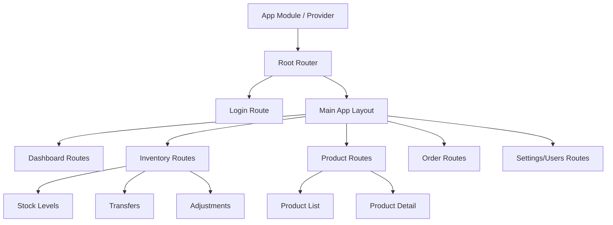
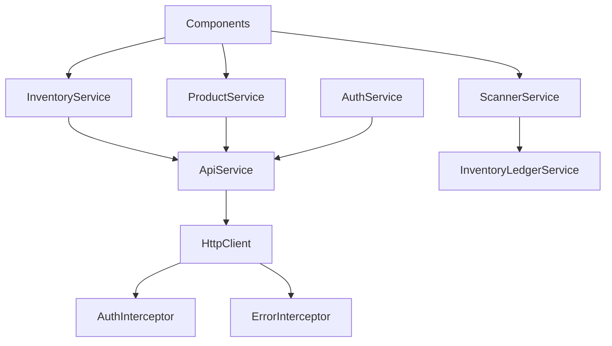
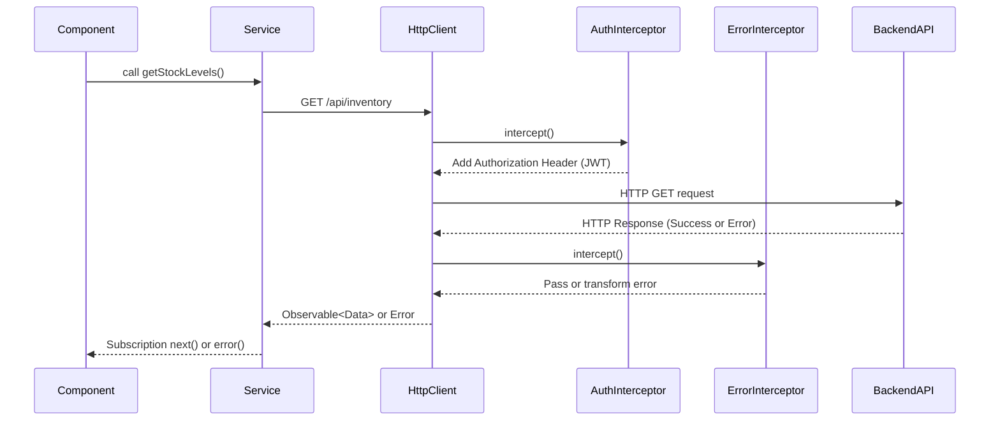
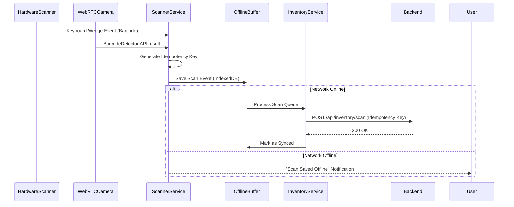

# Frontend Architecture: StockSmart

This document outlines the frontend architecture for the **StockSmart** application, an enterprise-grade retail inventory optimization and management system. The frontend is built using **Angular 17+** with TypeScript 5.x, utilizing Standalone Components, RxJS, and Angular Signals.

---

## 1. Application Shell

The Application Shell provides the foundational layout and structural elements of the StockSmart frontend.

- **Root Component (`AppComponent`)**: Initializes core services (Auth, Theming, Scanner listener) and contains the main `<router-outlet>`.
- **Layout Structure**: 
  - **Header (Top Nav)**: Contains the user profile, global search (barcodes/products), current location context (crucial for multi-location scoping), and notification bell (alerts).
  - **Sidebar (Side Nav)**: Collapsible navigation menu categorized by features (Dashboard, Inventory, Purchasing, etc.).
  - **Content Area**: The dynamic `<router-outlet>` where feature components are rendered.
  - **Footer/Status Bar**: Displays system status, offline/online network status, and active scanner mode.

---

## 2. Routing Strategy

We utilize a lazy-loaded routing strategy to ensure optimal initial load times. Each major feature domain is a standalone route mapped to a lazy-loaded component or routes array.

### Routing Hierarchy Diagram



---

## 3. Authentication

Authentication is token-based (JWT) interacting with the Spring Security backend.

- **Storage**: JWT access tokens are stored securely in memory or `sessionStorage` (depending on persistence requirements), with refresh tokens securely stored in HttpOnly cookies where applicable.
- **Login Flow**: 
  1. User submits credentials.
  2. `AuthService` makes POST request to `/api/auth/login`.
  3. Upon success, stores JWT and decodes user payload (roles, default location).
  4. User is redirected to `/dashboard` or the originally requested URL.
- **Logout Flow**: Clears local token data, alerts backend to invalidate (if stateful), and redirects to `/login`.

---

## 4. Route Guards

Route protection relies on Angular 14+ **Functional Route Guards**.

- **`authGuardFn`**: Checks `AuthService` to ensure a valid JWT exists. Redirects to `/login` if unauthenticated.
- **`roleGuardFn`**: Accepts expected roles/permissions in the route's `data` object. Checks if the authenticated user has the necessary Granular RBAC permissions to access the route.
- **`locationContextGuardFn`**: Ensures the user has selected a valid `LOCATION_ID` context before accessing inventory-altering routes.

---

## 5. Shared Components

StockSmart enforces the **Smart (Container) & Presentational (Dumb)** component pattern. Presentational components are highly reusable and standalone.

- **Data Tables**: Reusable, paginated, sortable table component supporting server-side processing.
- **Forms**: Reusable input wrappers with consistent error message display for validation.
- **Modals/Dialogs**: Centralized service utilizing Angular Material Dialog or custom overlay for confirmations.
- **Notifications**: Toast notification service for success/error alerts.
- **Loaders**: Global loading spinners for route transitions; inline skeleton loaders for data fetching.
- **Search & Autocomplete**: Debounced search inputs for product lookups and supplier selection.

---

## 6. Feature Modules/Components

As per Angular 17+ conventions, all components are **Standalone Component**s organized by feature domain.

*   **Authentication**: Login, Register (if applicable), Forgot Password.
*   **Dashboard**: KPI widgets, Charts, Alerts summary.
*   **Products**: Product List, Create/Edit Product, Product Detail, Categories, Brands.
*   **Inventory**: Stock Levels (by location), Receiving, Adjustments (with ledger reasons), Transaction History.
*   **Locations**: Store/Warehouse List, Location Detail.
*   **Suppliers**: Supplier List, Create/Edit Supplier, Supplier Detail, Supplier Products catalog.
*   **Purchase Orders**: PO List, Create PO, PO Detail, Approval Workflow UI.
*   **Orders**: Order List, Create Order, Order Detail, Processing status.
*   **Stock Transfers**: Transfer List, Create Transfer, Transfer Detail, Approval UI.
*   **Alerts**: Low-stock alerts view, Notifications center.
*   **Reports**: Report generation filters, Export (CSV/PDF) actions.
*   **Users/Roles**: User management list, Role & permission assignment UI.
*   **Audit**: Audit log viewer, Advanced filtering by entity/date.
*   **Barcode/Scanner**: Floating scanner component, Barcode manual input, Scan history feed.

---

## 7. Services

Services handle business logic, state, and external communication, maintaining strict separation from UI components.

### Service Dependency Diagram



- **`ApiService`**: Wrapper around `HttpClient` providing standard CRUD operations.
- **`AuthService`**: Manages user identity, tokens, and RBAC permissions.
- **`ScannerService`**: Listens for hardware scanner events, interfaces with WebRTC cameras, manages the offline scan buffer.
- **`NotificationService`**: Dispatches toast messages and handles real-time alerts.

---

## 8. Models/Interfaces

TypeScript interfaces are strictly typed to mirror Backend DTOs (Data Transfer Objects), never JPA entities.

```typescript
export interface ProductDto {
  id: string;
  sku: string;
  name: string;
  barcode: string;
  categoryId: string;
}

export interface InventoryBalanceDto {
  locationId: string;
  productId: string;
  quantity: number;
  version: number; // For optimistic concurrency
}
```

---

## 9. Forms

All business forms use **Reactive Forms** (`ReactiveFormsModule`) heavily utilizing strict typing introduced in Angular 14+.

- `FormGroup`, `FormControl`, and `FormArray` are typed with models matching the DTOs.
- Custom validators enforce business rules (e.g., negative stock adjustments require a specific reason code).

---

## 10. HTTP Communication

All external communication routes through `HttpClient`.

### HTTP Flow with Interceptors



---

## 11. Error Handling

We strictly handle **RFC 7807 Problem Details** emitted by the Spring Boot backend.

- **`HttpErrorInterceptor`**: Catches 4xx and 5xx responses.
- Parses the RFC 7807 JSON envelope (`type`, `title`, `status`, `detail`, `instance`).
- Dispatches user-friendly messages via `NotificationService`.
- Triggers navigation to `/403` or `/404` for unauthorized or missing resources.

---

## 12. Loading States

- **Global Spinner**: Tied to a `RouterEvent` listener and an `HttpInterceptor` that counts active requests, preventing double-submissions.
- **Skeleton Screens**: Used in complex dashboards and list views (Products, Inventory) to provide perceived performance while data loads.

---

## 13. State Management

For managing application state (like the current active location, user session, and cart/scan queue), we use **RxJS BehaviorSubjects** alongside modern **Angular Signals**.

- Global read-heavy states (e.g., `currentUser`, `currentLocationId`) are exposed as Signals (`toSignal()`) for optimized change detection in templates.
- Reactive streams (e.g., debounced search results) remain as RxJS Observables used with the `async` pipe.

---

## 14. Responsive Design

- **Mobile-First Approach**: Core workflows (especially Receiving, Stock Adjustment, and Scanning) are optimized for tablet and rugged mobile devices used in warehouses.
- **CSS Framework**: Tailwind CSS (or similar utility classes mapped to design tokens) handles responsive breakpoints.
- Flexible layouts ensure data tables collapse into card views on narrow screens.

---

## 15. Scanner Integration

Scanner integration is critical for stock operations and must be fault-tolerant.

### Scanner Integration Flow



- **Inputs**: Supports both physical hardware scanners (via keyboard wedge event listeners filtering rapid keystrokes) and mobile cameras (ZXing / Web BarcodeDetector API).
- **Offline Resilience**: Scans generate an `Idempotency-Key` and are buffered locally in `IndexedDB`.
- **Syncing**: Once network connectivity is restored, the buffered queue flushes to the backend. The idempotency key ensures double-scanning is ignored by the ledger.

---

## Appendix: Proposed Directory Structure

```text
frontend/
├── src/
│   ├── app/
│   │   ├── core/                  # Singleton services, interceptors, guards
│   │   │   ├── auth/
│   │   │   ├── http/
│   │   │   └── scanner/
│   │   ├── shared/                # Presentational components, pipes, directives
│   │   │   ├── components/
│   │   │   ├── directives/
│   │   │   └── models/
│   │   ├── features/              # Feature modules (Standalone)
│   │   │   ├── dashboard/
│   │   │   ├── inventory/
│   │   │   ├── products/
│   │   │   ├── orders/
│   │   │   └── ...
│   │   ├── layout/                # Shell components (Header, Sidebar)
│   │   ├── app.component.ts       # Root Component
│   │   ├── app.routes.ts          # Main routing file
│   │   └── app.config.ts          # App providers (replaces app.module.ts)
│   ├── assets/
│   │   ├── i18n/                  # Translation files
│   │   └── images/
│   ├── styles/                    # Global SCSS / Tailwind directives
│   ├── environments/              # Dev/Prod environment configs
│   └── main.ts                    # Application bootstrap
```
