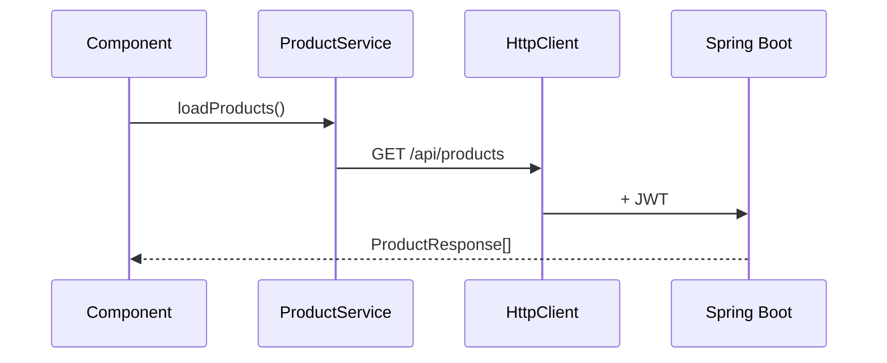

# Frontend Architecture — StockSmart

Angular **17+** SPA for the B.Tech project. Standalone components, simple structure, no mandatory state library.

---

## 1. Application shell

- **AppComponent** — router outlet, layout
- **Layout:** sidebar navigation, top bar (user, logout), content area
- **Lazy routes** optional; flat routes acceptable for project size

```mermaid
flowchart TD
    App[AppComponent] --> Login[/login]
    App --> Main[MainLayout]
    Main --> Dashboard
    Main --> Products
    Main --> Inventory
    Main --> Orders
    Main --> PO[Purchase Orders]
    Main --> Users[/users admin]
```

---

## 2. Routes (target)

| Path | Page | Roles |
|------|------|-------|
| `/login` | Login | public |
| `/dashboard` | KPI dashboard | all authenticated |
| `/products` | Product CRUD | manager, admin |
| `/categories` | Categories | manager, admin |
| `/suppliers` | Suppliers | manager, admin |
| `/locations` | Locations | manager, admin |
| `/inventory` | Stock levels & actions | manager, staff |
| `/transfers` | Stock transfers | manager |
| `/purchase-orders` | POs | manager |
| `/orders` | Sales orders | staff+ |
| `/alerts` | Low stock | all |
| `/reports` | Reports | manager, admin |
| `/users` | User admin | admin |

---

## 3. Authentication

- **AuthService** — login, logout, `currentUser$`, token storage
- **AuthInterceptor** — attach JWT
- **authGuard** — redirect to login
- **roleGuard** — read `data.roles` on route config

---

## 4. HTTP & errors

- **HttpClient** services per domain (`ProductService`, `InventoryService`, …)
- **HttpErrorInterceptor** — show toast/snackbar from API `message` field
- Simple error JSON from backend (no RFC 7807 requirement)

---

## 5. Forms

- **ReactiveFormsModule** for all business forms
- Validators mirror backend (@NotBlank, min, etc.)

---

## 6. Feature components (suggested)

| Area | Components |
|------|------------|
| Products | list, form, barcode search |
| Inventory | table by location, adjust dialog, stock in/out |
| Orders | list, form, confirm button |
| Dashboard | kpi cards, charts |
| Shared | data table, confirm dialog, loading spinner |

Smart vs presentational split is **recommended** but not mandatory — keep readable for viva.

---

## 7. Barcode UX

- `BarcodeInputComponent` — autofocus, `(scan)` output event
- Product list filter by barcode
- Optional: listen for rapid keypress + Enter (wedge)

**Not in scope:** offline IndexedDB queue, idempotency sync

---

## 8. Styling

- Clean responsive CSS/SCSS or Angular Material
- Consistent spacing, readable tables for demo

---

## 9. Testing (optional)

- Unit tests for services and guards with `HttpClientTestingModule`
- One e2e happy path (login → dashboard) if time permits

See [testing.md](./testing.md).

---

## Diagram: data flow



---

## Future enhancements

- NgRx store, PWA offline scans, RFC 7807 error parser, location context guard, camera scanner module
