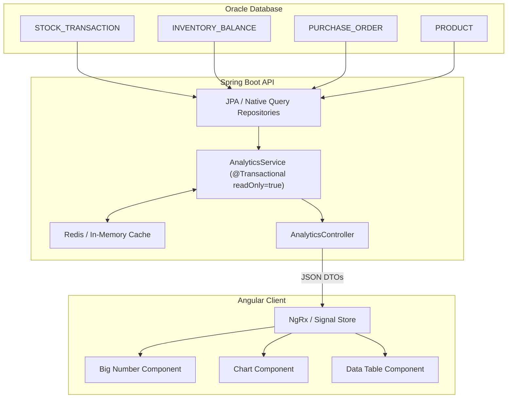
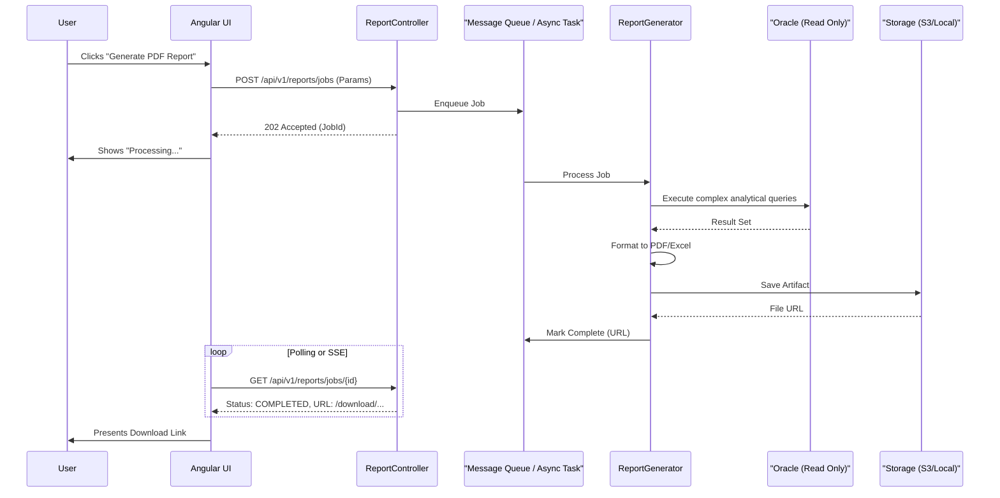
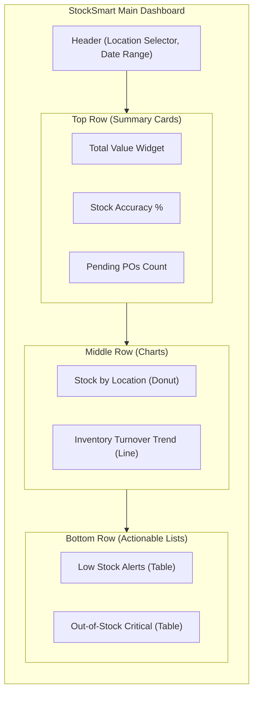

# StockSmart KPI & Reporting Architecture

## Overview
This document outlines the Key Performance Indicators (KPIs) and the reporting framework for the StockSmart Retail Inventory Optimization & Management System. All KPIs respect the core architectural tenets, specifically the double-entry stock ledger, multi-location scoping, and immutable audit trails.

## Inventory KPIs

### 1. Total Inventory Value
- **Definition:** The total financial value of all current inventory on hand.
- **Formula:** $\sum (\text{quantity\_on\_hand} \times \text{cost\_price})$
- **Required Data:** `INVENTORY_BALANCE.quantity_on_hand`, `PRODUCT.cost_price`, `LOCATION.location_id`
- **Data Source:** Join between `INVENTORY_BALANCE` and `PRODUCT` tables, grouped by or filtered by location.
- **API Requirement:** `GET /api/v1/analytics/inventory-value?locationId={id}`
- **UI Representation:** Big Number widget (Summary card) with a sparkline showing 30-day trend.
- **Limitations:** Only reflects current cost price, not historical cost unless average cost is tracked over time.

### 2. Stock by Location
- **Definition:** Total quantity and value of inventory distributed across all retail stores and warehouses.
- **Formula:** $\sum (\text{quantity\_on\_hand})$ grouped by `location_id`
- **Required Data:** `INVENTORY_BALANCE.quantity_on_hand`, `LOCATION.name`
- **Data Source:** Aggregation on `INVENTORY_BALANCE` joined with `LOCATION`.
- **API Requirement:** `GET /api/v1/analytics/stock-by-location`
- **UI Representation:** Donut chart or Bar chart.
- **Limitations:** Does not account for inventory in transit (handled by transfers).

### 3. Low-Stock Products
- **Definition:** Products where current inventory levels have fallen below their defined reorder point.
- **Formula:** Count of products where `quantity_on_hand < reorder_point`
- **Required Data:** `INVENTORY_BALANCE.quantity_on_hand`, `INVENTORY_BALANCE.reorder_point`
- **Data Source:** Filter on `INVENTORY_BALANCE` where on-hand is less than reorder point.
- **API Requirement:** `GET /api/v1/analytics/low-stock?locationId={id}`
- **UI Representation:** Data table with alert badges and quick-action "Create PO" button.
- **Limitations:** Static reorder points may not account for seasonal demand spikes.

### 4. Out-of-Stock Products
- **Definition:** Products with an active status that have zero or negative quantity on hand.
- **Formula:** Count of products where `quantity_on_hand <= 0` and `status = 'ACTIVE'`
- **Required Data:** `INVENTORY_BALANCE.quantity_on_hand`, `PRODUCT.status`
- **Data Source:** Filter on `INVENTORY_BALANCE` and `PRODUCT`.
- **API Requirement:** `GET /api/v1/analytics/out-of-stock?locationId={id}`
- **UI Representation:** Critical Alert List (Red colored rows).
- **Limitations:** Negative stock implies a ledger imbalance or timing issue with receiving/sales.

### 5. Inventory Turnover Rate
- **Definition:** The number of times inventory is sold or used in a time period. Measures inventory efficiency.
- **Formula:** $\text{Cost of Goods Sold (COGS)} / \text{Average Inventory Value}$
- **Required Data:** `STOCK_TRANSACTION` (sales/outbound), `PRODUCT.cost_price`, date ranges.
- **Data Source:** Aggregation of outbound `STOCK_TRANSACTION` entries against historical `INVENTORY_BALANCE` states.
- **API Requirement:** `GET /api/v1/analytics/turnover-rate?startDate={d1}&endDate={d2}&locationId={id}`
- **UI Representation:** Gauge chart or Line chart over time.
- **Limitations:** Complex to calculate accurately without snapshotting daily inventory values.

### 6. Fast-Moving & Slow-Moving Products
- **Definition:** Identifies products with the highest and lowest outbound velocity.
- **Formula:** Top N and Bottom N products by total outbound quantity in `STOCK_TRANSACTION` over period.
- **Required Data:** `STOCK_TRANSACTION.quantity`, `STOCK_TRANSACTION.transaction_type`, `PRODUCT_ID`
- **Data Source:** Grouping `STOCK_TRANSACTION` where type is 'SALE' or 'DISPATCH'.
- **API Requirement:** `GET /api/v1/analytics/product-velocity?type={fast|slow}&period={days}`
- **UI Representation:** Horizontal bar chart (Top 10 / Bottom 10).
- **Limitations:** Slow-moving lists may include newly added products unless age is factored in.

### 7. Stock Accuracy
- **Definition:** The percentage of accurate system inventory compared to physical cycle counts.
- **Formula:** $1 - (|\text{System Qty} - \text{Physical Qty}| / \text{System Qty})$
- **Required Data:** `STOCK_TRANSACTION` (where type='ADJUSTMENT' or 'CYCLE_COUNT_DISCREPANCY').
- **Data Source:** Analysis of variance in audit logs or adjustment transactions.
- **API Requirement:** `GET /api/v1/analytics/stock-accuracy?locationId={id}&period={days}`
- **UI Representation:** KPI Card with a percentage (Target: 99%+).
- **Limitations:** Highly dependent on the frequency and rigor of physical cycle counts.

### 8. Pending Purchase Orders
- **Definition:** Number and monetary value of active Purchase Orders not yet received.
- **Formula:** Count and Sum of POs where `status` is 'ISSUED' or 'PARTIAL'.
- **Required Data:** `PURCHASE_ORDER.status`, `PURCHASE_ORDER.total_amount`
- **Data Source:** Query on `PURCHASE_ORDER` table.
- **API Requirement:** `GET /api/v1/analytics/pending-pos`
- **UI Representation:** Summary card and paginated list.
- **Limitations:** Does not reflect POs that are delayed unless cross-referenced with expected delivery dates.

### 9. Supplier Performance (On-time Delivery Rate)
- **Definition:** The percentage of purchase orders fulfilled on or before the expected delivery date.
- **Formula:** $(\text{POs Received On Time} / \text{Total POs Received}) \times 100$
- **Required Data:** `PURCHASE_ORDER.expected_date`, `PURCHASE_ORDER.actual_receive_date`, `SUPPLIER_ID`
- **Data Source:** Join between `PURCHASE_ORDER` and `SUPPLIER`.
- **API Requirement:** `GET /api/v1/analytics/supplier-performance?supplierId={id}`
- **UI Representation:** Radar chart or standard bar chart grouped by supplier.
- **Limitations:** Subjective to the accuracy of data entry upon physical receipt.

### 10. Dead Stock
- **Definition:** Inventory that has had no outbound movement over a long period (e.g., 6+ months).
- **Formula:** Current `INVENTORY_BALANCE` where max(`STOCK_TRANSACTION.created_at`) < (Now - X days).
- **Required Data:** `INVENTORY_BALANCE`, `STOCK_TRANSACTION`
- **Data Source:** Subqueries identifying max transaction date per product/location.
- **API Requirement:** `GET /api/v1/analytics/dead-stock?thresholdDays=180`
- **UI Representation:** Warning list widget.
- **Limitations:** Expensive database query if not materialized or cached.

## Reporting Framework

### Report Types
1. **Inventory Reports:** Stock levels, valuation, reorder reports.
2. **Sales Reports:** Product velocity, historical turnover.
3. **Procurement Reports:** PO status, supplier performance.
4. **Audit Reports:** Cycle count variances, immutable ledger extracts.

### Report Parameters
All reports must support dynamic filtering based on the application's Multi-Location scoping invariant:
- **Date Range:** Start/End timestamps.
- **Location:** Specific Store/Warehouse ID or all accessible locations.
- **Category:** Product hierarchy filtering.
- **Supplier:** Sourcing filters.

### Export Formats
Reports must be accessible via UI but also exportable via API in standard formats:
- **PDF:** For management printouts (generated via JasperReports or similar backend library).
- **CSV:** For raw data analysis in tools like Pandas or Excel.
- **Excel (.xlsx):** Formatted spreadsheets with basic styling.

### Report Generation Architecture
For performance, large reports bypass the synchronous REST thread:
1. Client requests report generation via POST to `/api/v1/reports/jobs`.
2. Backend returns `HTTP 202 Accepted` with a Job ID.
3. Background worker executes complex read-only queries against read-replicas (where applicable).
4. Results are serialized to temporary object storage (or file system).
5. Client polls or receives SSE/WebSocket notification of completion and downloads the file.

---

## Architecture Diagrams

### 1. KPI Data Flow

### 2. Report Generation Pipeline

### 3. Dashboard Layout Overview

