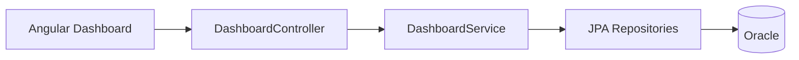

# StockSmart KPI & Reporting

KPIs for the **B.Tech dashboard** — calculated from Oracle data via Spring services and exposed as REST endpoints for Angular charts/tables.

## Principles

- Metrics use **`INVENTORY`**, **`PRODUCT`**, **`LOCATION`**, **`PURCHASE_ORDER`**, **`ORDER`** tables.
- Optional **`INVENTORY_TRANSACTION`** for movement reports (not required for core KPIs).
- Filter by **`locationId`** where noted for location-scoped views.

---

## Core KPIs (MVP)

### 1. Total products

- **Formula:** `COUNT(*)` from `PRODUCTS` where status active
- **API:** `GET /api/dashboard/total-products`

### 2. Total inventory quantity

- **Formula:** `SUM(quantity)` from `INVENTORY`
- **API:** `GET /api/dashboard/total-quantity?locationId=optional`

### 3. Total inventory value

- **Formula:** `SUM(quantity * cost_price)` joining `INVENTORY` and `PRODUCT`
- **API:** `GET /api/dashboard/inventory-value?locationId=optional`

### 4. Low-stock products

- **Formula:** count/list where `quantity < reorder_level`
- **API:** `GET /api/dashboard/low-stock?locationId=optional`
- **UI:** Table with badge; link to create PO

### 5. Out-of-stock products

- **Formula:** `quantity = 0` (and product active)
- **API:** `GET /api/dashboard/out-of-stock?locationId=optional`

### 6. Products by category

- **Formula:** `COUNT(product)` grouped by `category_id`
- **API:** `GET /api/dashboard/products-by-category`
- **UI:** Pie or bar chart

### 7. Stock by location

- **Formula:** `SUM(quantity)` grouped by `location_id`
- **API:** `GET /api/dashboard/stock-by-location`
- **UI:** Bar chart

### 8. Pending purchase orders

- **Formula:** POs where status in (`SUBMITTED`, `PARTIAL`)
- **API:** `GET /api/dashboard/pending-purchase-orders`

### 9. Total orders

- **Formula:** `COUNT(*)` from `ORDERS` (optional filter by date/status)
- **API:** `GET /api/dashboard/total-orders`

---

## Reports (should)

| Report | Data source |
|--------|-------------|
| Inventory listing | `INVENTORY` + product + location |
| Movement history | `INVENTORY_TRANSACTION` if enabled |
| PO summary | `PURCHASE_ORDER` + items |
| Order summary | `ORDER` + items |

Export as CSV from Angular or backend endpoint — implementation choice.

---

## Removed from enterprise KPI set

- Inventory turnover, stock accuracy %, supplier on-time SLA, FIFO valuation, ML forecasting
- These can be discussed as **future enhancements** in project report

---

## Dashboard wireflow

---

## UI widgets (suggested)

| KPI | Widget |
|-----|--------|
| Totals | Summary cards |
| By category / location | Chart.js or ng2-charts |
| Low stock | Data table |
| Pending POs | List + count badge |
