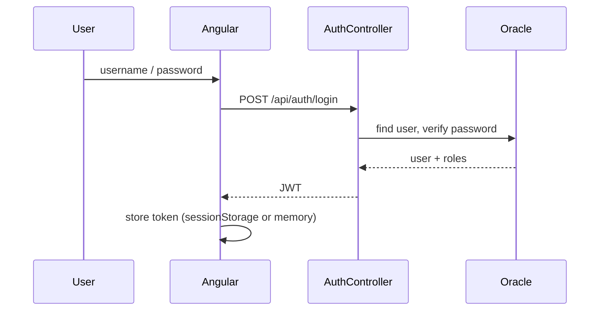
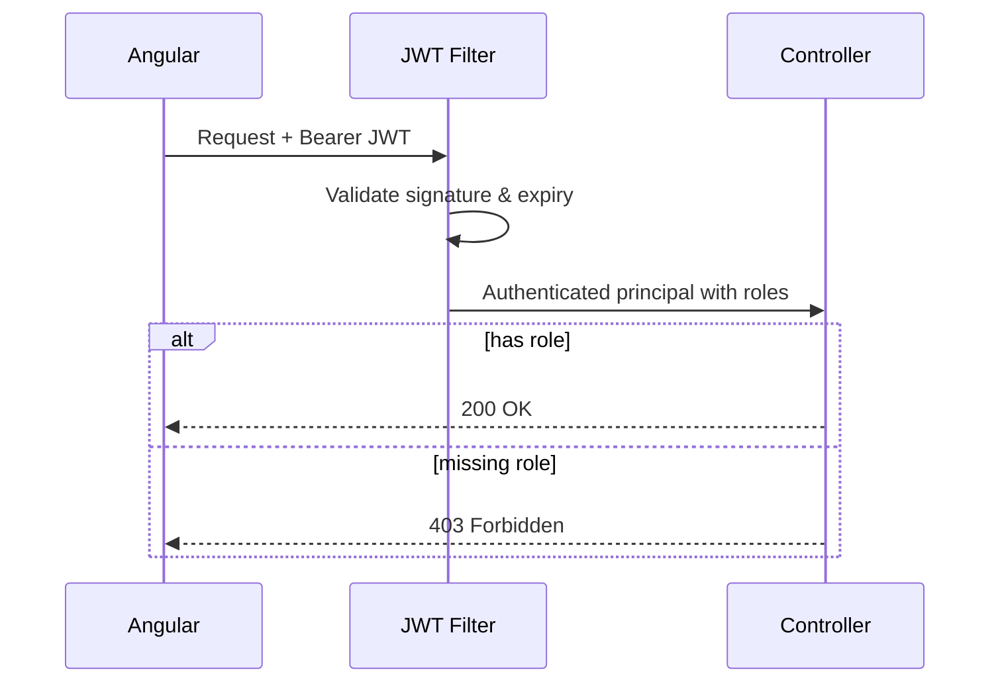
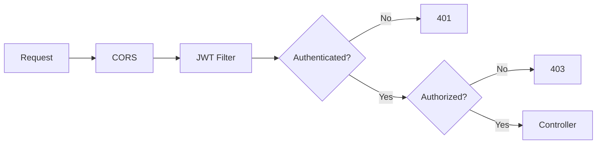
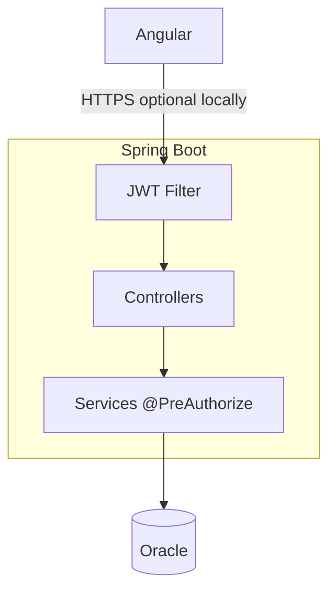

# Security Architecture — StockSmart

College-level security for the B.Tech project: **JWT authentication** and **simple role-based authorization**.

---

## 1. Authentication

- Users stored in Oracle with BCrypt **password hash**.
- **Login:** `POST /api/auth/login` with username/password.
- **Response:** JWT access token (include username and roles in claims or load roles server-side).
- **Logout:** Client discards token (optional server deny-list not required for MVP).



### Token storage (Angular)

- **sessionStorage** or in-memory service for access token (document choice in README).
- Send `Authorization: Bearer <token>` on each API call via **AuthInterceptor**.

### Refresh tokens

**Not required for MVP.** Optional future enhancement.

---

## 2. Authorization

### Roles

| Role | Typical access |
|------|----------------|
| `ADMIN` | All modules + user management |
| `INVENTORY_MANAGER` | Inventory, POs, transfers, suppliers, reports |
| `STAFF` | View inventory/products, create/process orders, barcode lookup |

### Enforcement

- Spring Security `@PreAuthorize("hasRole('ADMIN')")` or `hasAnyRole(...)` on controllers/services.
- Angular **route guards** hide menu items and block routes by role.

No separate `PERMISSIONS` table or `PRODUCT_READ`-style authorities required.



---

## 3. Password handling

- BCrypt encoding (strength 10+).
- Minimum length validation (e.g. 8 characters) on create/reset.
- Generic message on login failure: "Invalid credentials".

Password reset via email is **out of scope** unless added as extra credit.

---

## 4. API protection



- CORS allowed for `http://localhost:4200` in development.
- Public endpoints: login, health (optional).

---

## 5. Input validation

| Layer | Mechanism |
|-------|-----------|
| Angular | Reactive Form validators |
| API | Jakarta Validation on DTOs |
| DB | Parameterized JPA queries |

---

## 6. Error responses

Simple JSON (not RFC 7807 required):

```json
{
  "status": 401,
  "message": "Invalid credentials"
}
```

Do not expose stack traces to clients in demo/production profile.

---

## 7. CORS (development)

| Setting | Value |
|---------|--------|
| Allowed origins | `http://localhost:4200` |
| Methods | GET, POST, PUT, PATCH, DELETE, OPTIONS |
| Headers | Authorization, Content-Type |

---

## 8. Configuration secrets

Use environment variables or `application-dev.yml` (not committed with real passwords):

- `SPRING_DATASOURCE_URL`, username, password
- `JWT_SECRET`, `JWT_EXPIRATION_MS`

---

## 9. Audit

- JPA **`@CreatedDate` / `@LastModifiedDate`** on entities.
- Optional **`InventoryTransaction`** for who changed stock.
- Full **AUDIT_LOG** with JSON snapshots → future enhancement.

---

## 10. Security overview diagram



---

## Future enhancements

- Refresh token rotation, httpOnly cookies + CSRF
- Granular permissions matrix
- Rate limiting, WAF, secrets vault
- Separate Flyway DB user, immutable audit log
