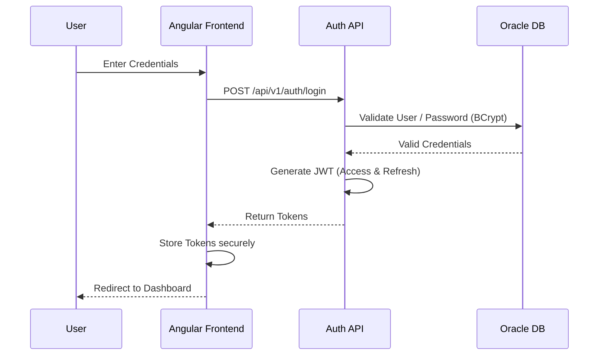
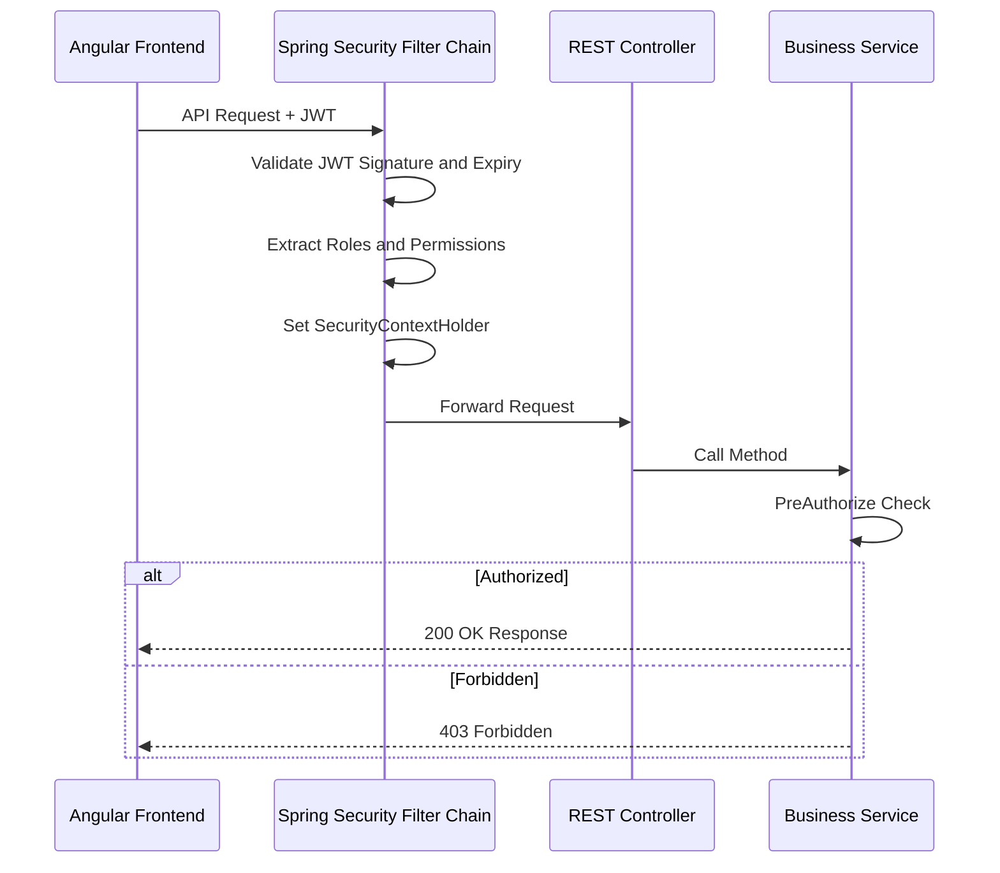
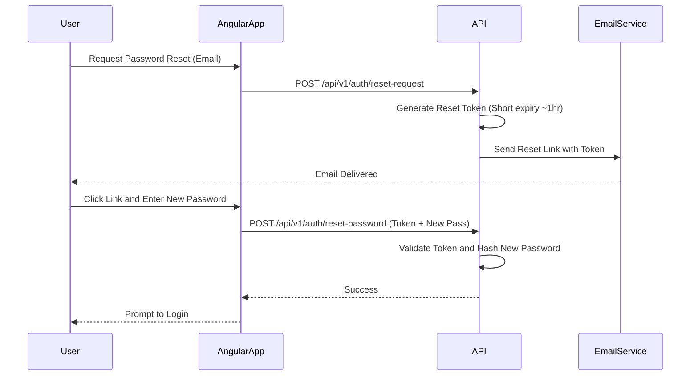
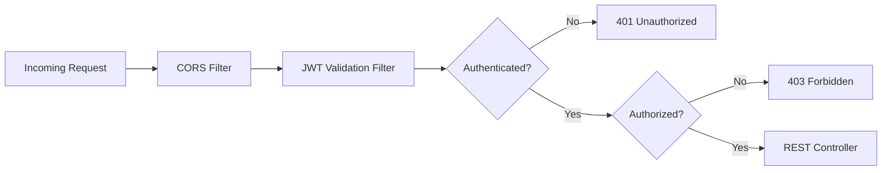
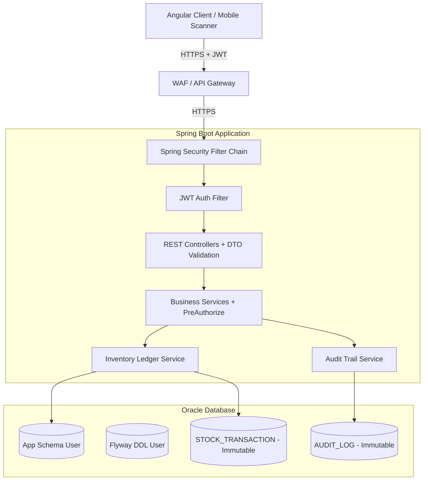

# Security Architecture — StockSmart

This document outlines the security architecture and implementation details for the StockSmart Retail Inventory Optimization & Management System.

---

## 1. Authentication

Authentication is implemented statelessly using JSON Web Tokens (JWT).

### Login Flow
- User submits credentials → Validated against database → Access Token + Refresh Token generated.

### Token Structure
- **Header**: Algorithm & Token Type (e.g., `HS256`, `JWT`).
- **Payload**: Contains `userId`, `username`, `roles`, `permissions`, and `exp` (expiry).
- **Signature**: HMAC-SHA256 (or RS256 for asymmetric) signed with server secret.

### Token Expiry Strategy
| Token | Lifetime | Purpose |
|---|---|---|
| Access Token | 15–30 minutes | Short-lived, used for API authorization |
| Refresh Token | 7 days | Long-lived, used to obtain new access tokens |

### Refresh Token Rotation
- On each refresh, the old refresh token is invalidated and a new one is issued.
- Prevents replay attacks with stolen refresh tokens.

### Token Storage (Angular)
| Method | Pros | Cons |
|---|---|---|
| **httpOnly Cookie** (Recommended) | Immune to XSS | Requires CSRF protection |
| **localStorage** | Simple to implement | Vulnerable to XSS |

### Logout
- Client clears stored tokens.
- Server blocklists the current refresh token (stored in DB or cache).
- Access tokens expire naturally (short lifetime).

### Authentication Flow Diagram


---

## 2. Authorization

StockSmart uses granular Role-Based Access Control (RBAC).

### Roles
| Role | Description |
|---|---|
| `ADMIN` | Full system access, user/role management |
| `INVENTORY_MANAGER` | Inventory operations, adjustments, transfers |
| `STORE_MANAGER` | Store-level operations, approvals |
| `WAREHOUSE_STAFF` | Receiving, picking, shipping |
| `PROCUREMENT_MANAGER` | Purchase orders, supplier management |
| `SALES_STAFF` | Order processing, product lookup |

### Granular Permissions

| Module | Permissions |
|---|---|
| Products | `PRODUCT_READ`, `PRODUCT_WRITE`, `PRODUCT_DELETE` |
| Inventory | `INVENTORY_VIEW`, `INVENTORY_RECEIVE`, `INVENTORY_ADJUST` |
| Transfers | `TRANSFER_CREATE`, `TRANSFER_APPROVE`, `TRANSFER_EXECUTE` |
| Purchase Orders | `PO_CREATE`, `PO_APPROVE`, `PO_SEND`, `PO_RECEIVE` |
| Orders | `ORDER_CREATE`, `ORDER_PROCESS`, `ORDER_CANCEL` |
| Users | `USER_READ`, `USER_WRITE`, `USER_DELETE` |
| Roles | `ROLE_READ`, `ROLE_WRITE` |
| Reports | `REPORT_VIEW`, `REPORT_EXPORT` |
| Audit | `AUDIT_VIEW` |
| Dashboard | `DASHBOARD_VIEW` |
| Alerts | `ALERT_VIEW`, `ALERT_MANAGE` |
| Barcode/RFID | `SCAN_EXECUTE`, `IDENTIFIER_MANAGE` |

### RBAC Permission Matrix

| Role | Products | Inventory | Transfers | Purchase Orders | Orders | Users | Reports | Audit |
|---|---|---|---|---|---|---|---|---|
| ADMIN | R/W/D | All | All + Approve | All + Approve | All | R/W/D | View/Export | View |
| INVENTORY_MANAGER | R/W | All | Create/Approve | Read | Read | — | View/Export | View |
| STORE_MANAGER | Read | View/Adjust | Create/Approve | Read/Request | Create/Process | — | View | View |
| WAREHOUSE_STAFF | Read | Receive/Adjust | Execute | Receive | — | — | — | — |
| PROCUREMENT_MANAGER | Read | View | Read | All + Approve | Read | — | View/Export | View |
| SALES_STAFF | Read | View | — | — | Create/Process | — | — | — |

### Enforcement
- **Method-level**: Spring Security `@PreAuthorize("hasAuthority('PERMISSION_NAME')")` on service methods.
- **URL-level**: Spring Security filter chain configuration for API paths.
- **Frontend**: Route guards check permissions before navigation.

### Authorization Flow Diagram


---

## 3. Password Handling

- **Hashing**: All passwords are hashed using `BCrypt` (strength factor 10+).
- **Complexity Rules**: Enforced at the application level:
  - Minimum 8 characters
  - At least 1 uppercase letter
  - At least 1 lowercase letter
  - At least 1 digit
  - At least 1 special character
- **Password History**: Optionally prevent reuse of last N passwords.

### Password Reset Flow


---

## 4. API Protection

### Spring Security Filter Chain


- **CORS Filter**: Validates origin, method, and headers.
- **JWT Validation Filter**: Custom `OncePerRequestFilter` validates token on every request.
- **Exception Translation**: Security exceptions are mapped to RFC 7807 responses.

### Additional Protections
- **Rate Limiting**: Bucket4j or API gateway-level throttling to prevent brute-force attacks.
- **Request Size Limits**: Maximum payload size enforced to prevent DoS.
- **IP Logging**: All requests log client IP for audit trail.

---

## 5. Input Validation

| Layer | Mechanism | Purpose |
|---|---|---|
| Angular Forms | Reactive Form Validators | Client-side UX feedback |
| REST Controller | Jakarta Validation (`@NotBlank`, `@Size`, `@Pattern`, `@Positive`) | Server-side DTO validation |
| JPA/Hibernate | Parameterized queries | SQL injection prevention |
| Angular DomSanitizer | Built-in sanitization | XSS prevention |

---

## 6. Error Handling

### RFC 7807 Problem Details
All security-related errors return standardized Problem Details:

```json
{
  "type": "https://stocksmart.com/errors/authentication-failed",
  "title": "Authentication Failed",
  "status": 401,
  "detail": "Invalid credentials",
  "instance": "/api/v1/auth/login"
}
```

### Security Error Principles
- **Never expose stack traces** in API responses (production).
- **Never reveal account existence**: Login failures return generic "Invalid credentials" regardless of whether the username exists.
- **Never expose internal server details**: Error messages are sanitized.

---

## 7. CORS Configuration

| Property | Development | Production |
|---|---|---|
| Allowed Origins | `http://localhost:4200` | `https://app.stocksmart.com` |
| Allowed Methods | `GET, POST, PUT, PATCH, DELETE, OPTIONS` | Same |
| Allowed Headers | `Authorization, Content-Type, X-Requested-With` | Same |
| Allow Credentials | `true` | `true` |
| Max Age | `3600` | `3600` |

---

## 8. Sensitive Configuration

- **Spring Profiles**: Environment-specific configuration files (`application-dev.yml`, `application-prod.yml`).
- **Environment Variables**: All secrets injected via environment variables:
  - `SPRING_DATASOURCE_URL`
  - `SPRING_DATASOURCE_USERNAME`
  - `SPRING_DATASOURCE_PASSWORD`
  - `JWT_SECRET_KEY`
  - `JWT_EXPIRATION_MS`
- **Never hardcode secrets** in source code or configuration files committed to Git.

---

## 9. Database Credentials

### Separation of Duties

| User | Privileges | Purpose |
|---|---|---|
| Application User | DML only (SELECT, INSERT, UPDATE) | Runtime application operations |
| Migration User | DDL (CREATE, ALTER, DROP) | Flyway schema migrations |
| Admin User | Full DBA | Database maintenance, emergency access |

- Credentials are externalized via environment variables or secrets vault (HashiCorp Vault, AWS Secrets Manager).
- Connection strings use JDBC over TLS in production environments.

---

## 10. Audit Logging

Every state-altering action results in an immutable record in the `AUDIT_LOG` table.

### Captured Data

| Field | Description |
|---|---|
| `entity_type` | The entity being modified (e.g., PRODUCT, INVENTORY_BALANCE) |
| `entity_id` | The primary key of the entity |
| `action` | The action performed (CREATE, UPDATE, DELETE) |
| `previous_state` | JSON snapshot of the entity before modification |
| `new_state` | JSON snapshot of the entity after modification |
| `performed_by` | The authenticated user who performed the action |
| `performed_at` | Timestamp with timezone |
| `ip_address` | Client IP address from the request |

### Immutability
- Records in `AUDIT_LOG` and `STOCK_TRANSACTION` are **NEVER** updated or deleted.
- Corrections must be handled by compensatory reversal transactions.

---

## 11. Security Boundaries

### Security Architecture Overview


### Boundary Summary
| Boundary | Protocol | Authentication |
|---|---|---|
| Browser ↔ Nginx | HTTPS (TLS 1.2+) | JWT in Authorization header or httpOnly cookie |
| Nginx ↔ Spring Boot | HTTP (internal network) or HTTPS | Forwarded JWT |
| Spring Boot ↔ Oracle | JDBC over TLS (production) | Database credentials via secrets |
