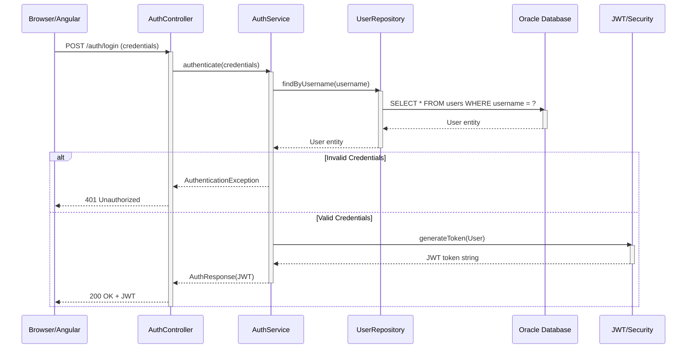
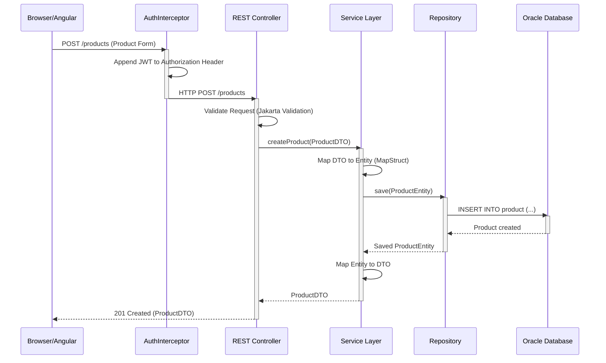
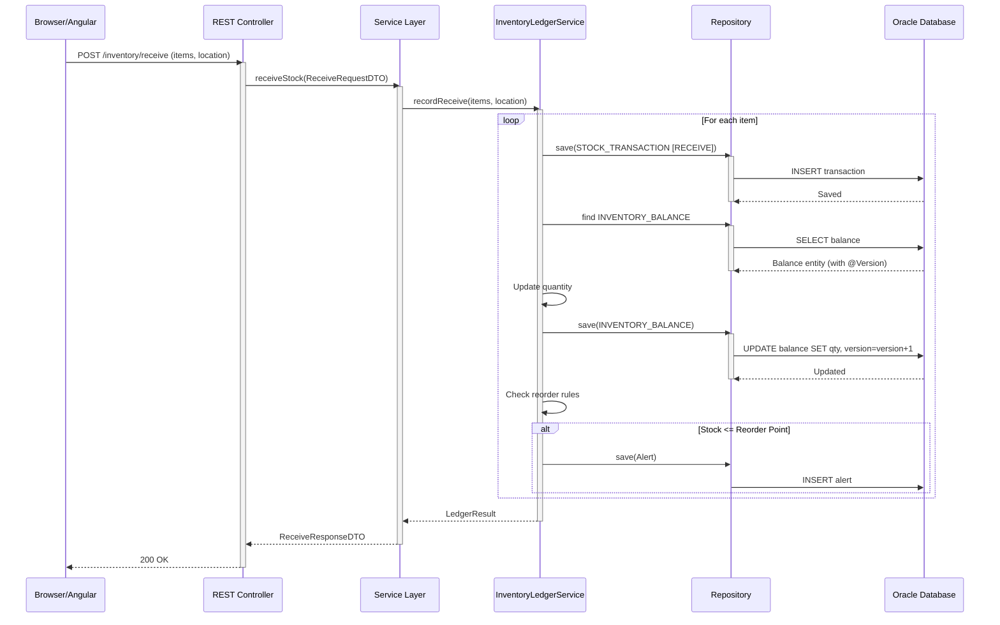
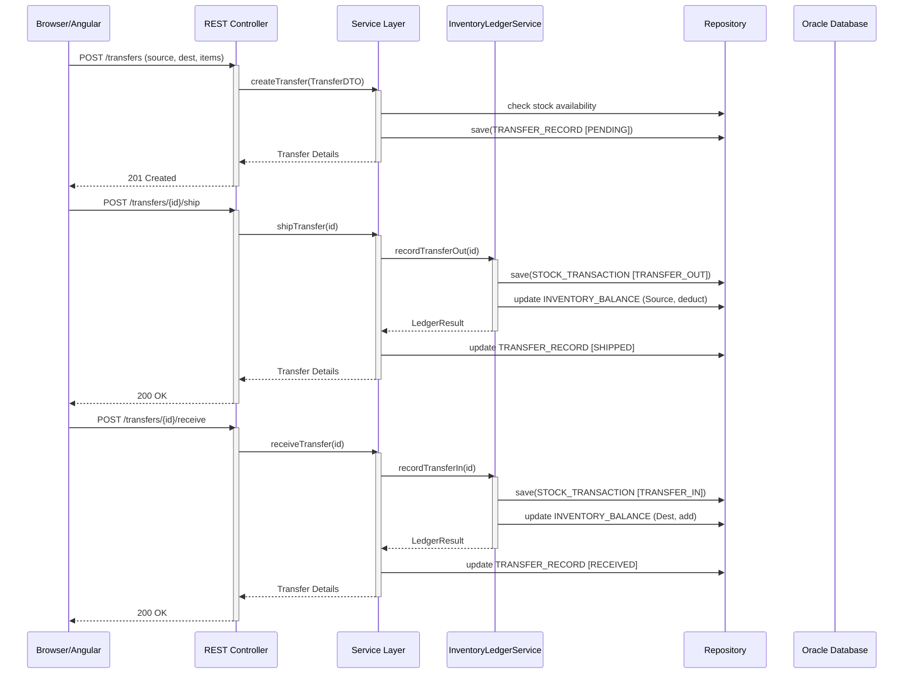
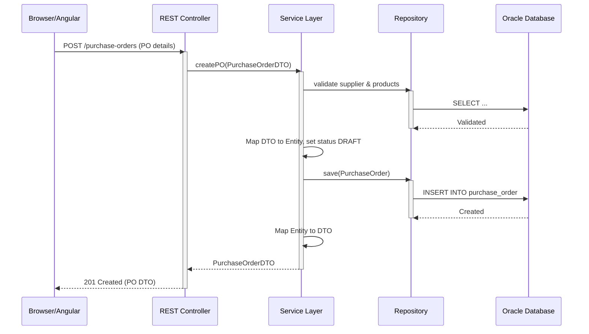
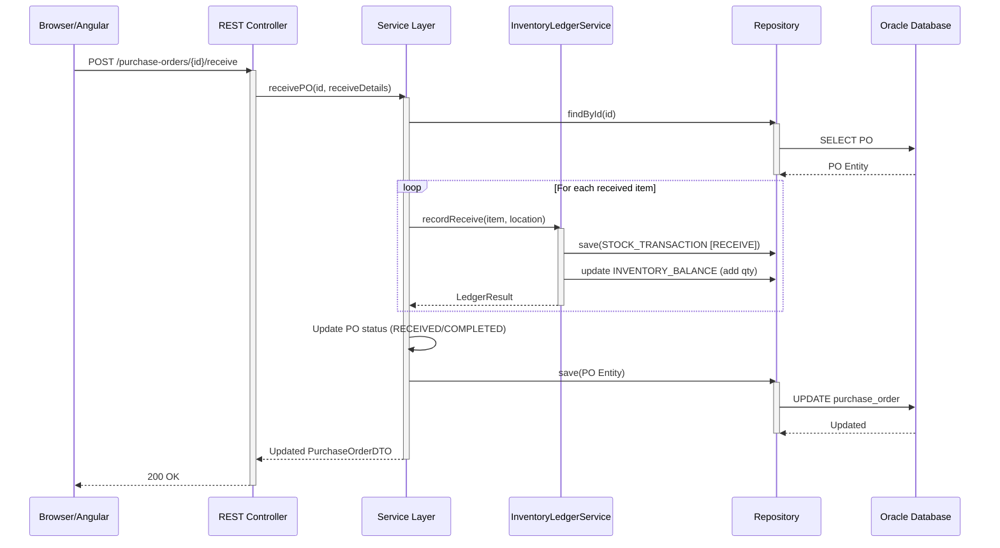
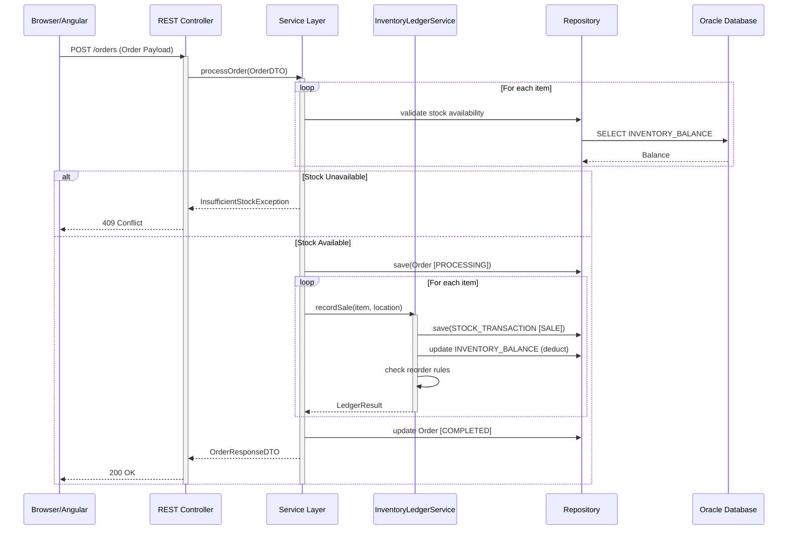
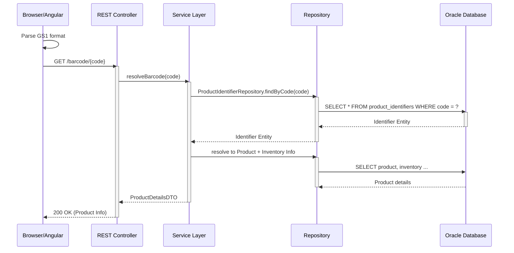
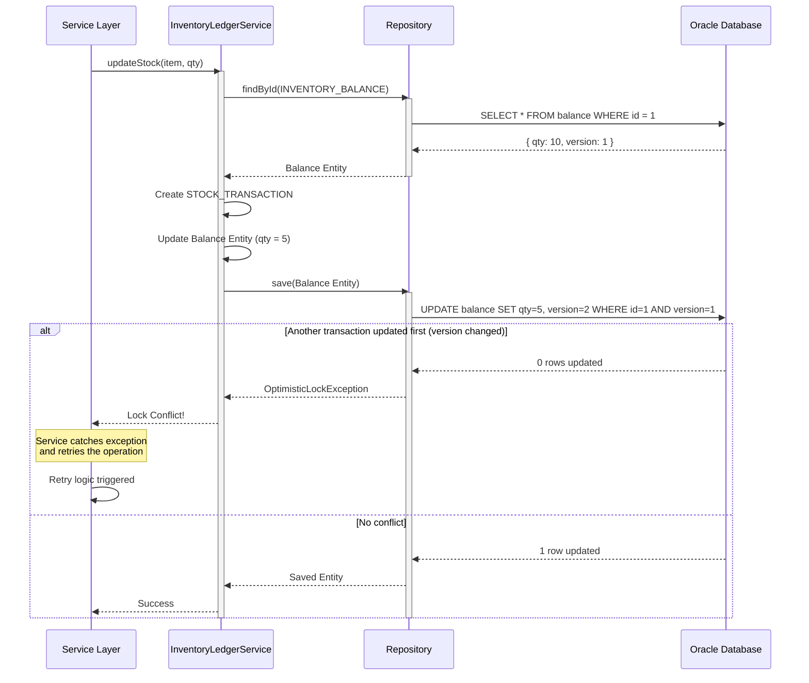
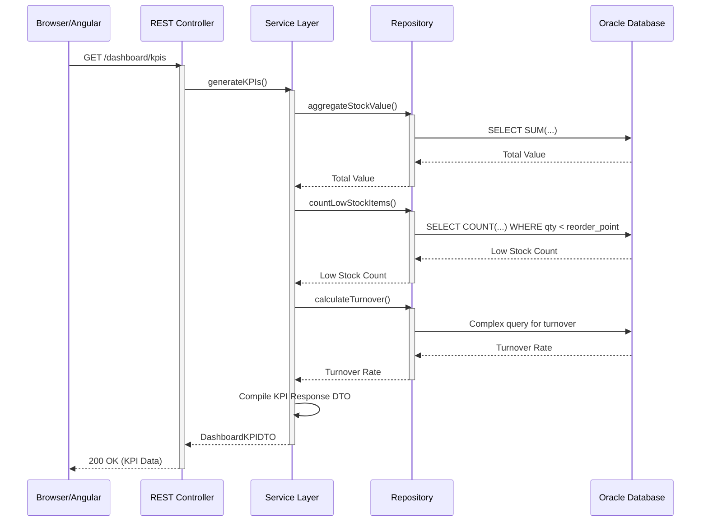

# StockSmart Sequence Diagrams

This document contains sequence diagrams for key flows within the StockSmart application architecture, aligning with the Hexagonal Architecture and Double-Entry Stock Ledger principles.

## 1. Login Flow

User enters credentials, gets authenticated via the `UserRepository`, and receives a JWT for subsequent requests.

## 2. Product Creation

User fills out a new product form. The request is authenticated via an interceptor, validated, mapped via MapStruct, and persisted.

## 3. Inventory Receiving

User receives items into stock. The system records immutable ledger transactions and updates balances with version checks.

## 4. Stock Transfer

Transferring stock between locations. Involves creating a transfer, shipping (transfer out), and receiving (transfer in) via the LedgerService.

## 5. Purchase Order Creation

Drafting a new purchase order for a supplier.

## 6. Purchase Order Fulfillment

Approving a PO and receiving goods from a supplier. Items are added to inventory.

## 7. Order Processing

Customer creates an order, reserving and deducting stock via SALE transactions.

## 8. Barcode Lookup

Client reads a GS1 barcode and fetches product details.

## 9. Inventory Balance Update (Optimistic Locking)

Handling concurrency when multiple users attempt to update the same inventory balance.

## 10. KPI Generation

Dashboard fetches metrics requiring multiple aggregate repository queries.

