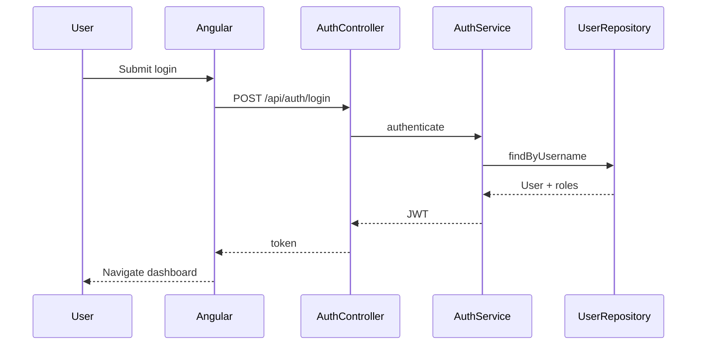
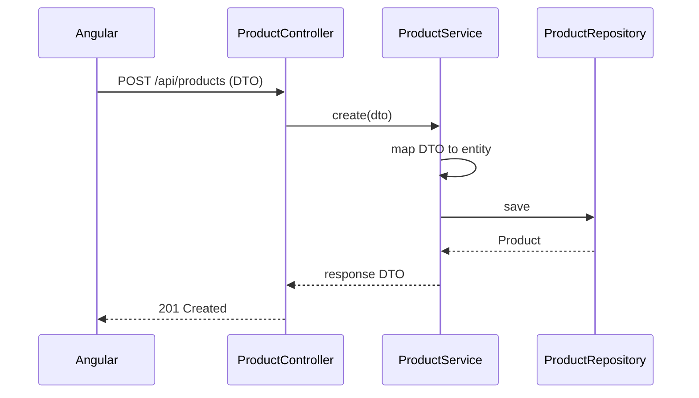
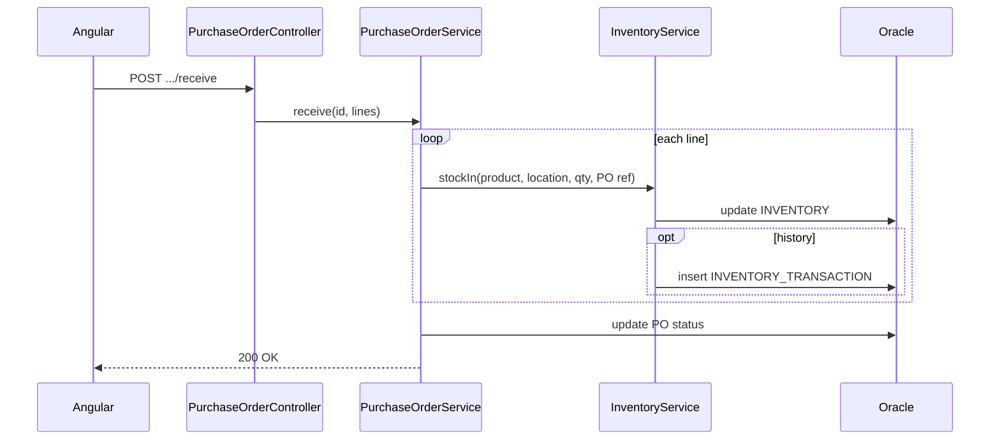
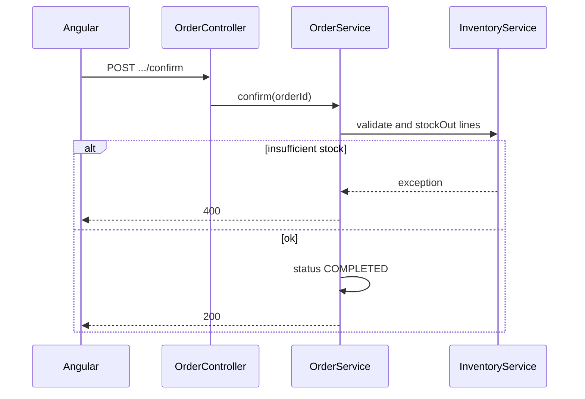
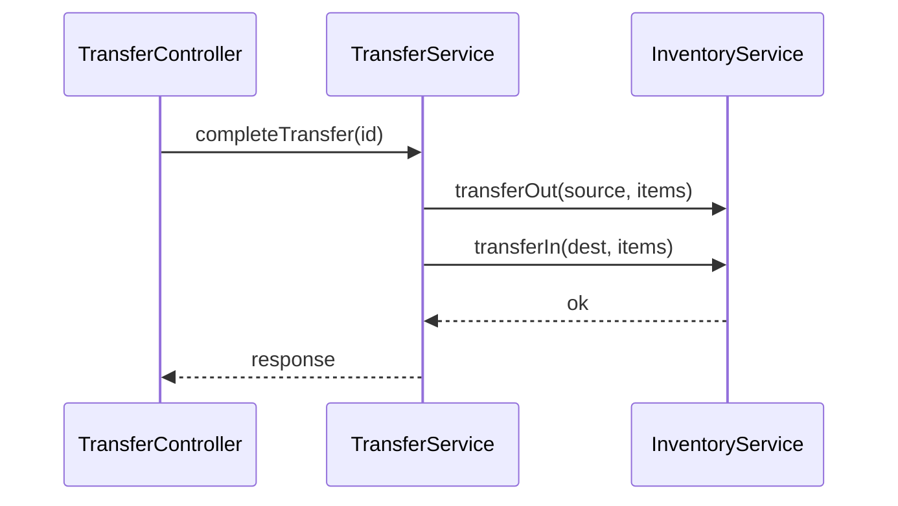
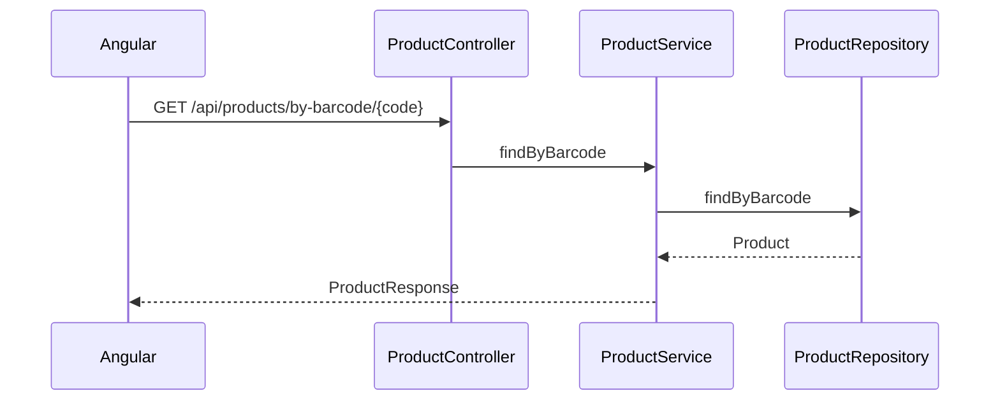
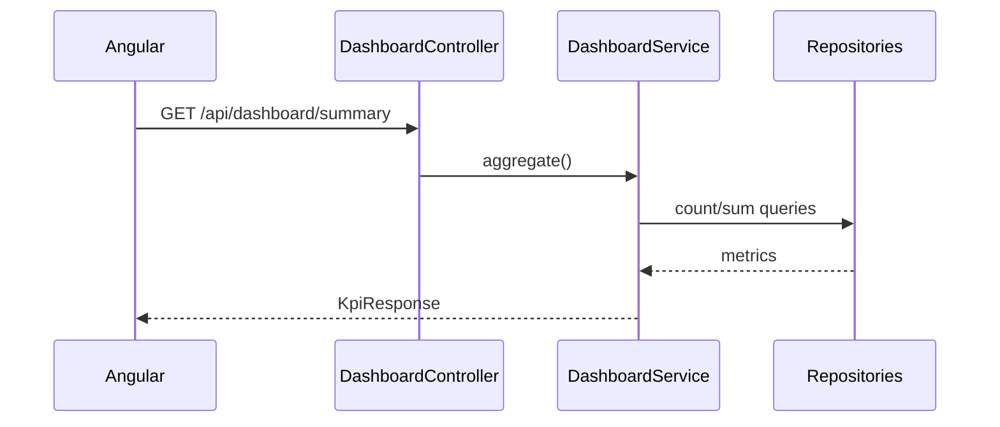

# StockSmart Sequence Diagrams

Key interactions for the **layered monolith** design (Controller → Service → Repository → Oracle).

---

## 1. Login

---

## 2. Create product

---

## 3. Receive purchase order

---

## 4. Confirm sales order

---

## 5. Stock transfer

---

## 6. Barcode lookup

---

## 7. Dashboard KPI

---

## Removed from enterprise sequence doc

- InventoryLedgerService, MapStruct mapper step, OptimisticLockException retry, GS1 parse step, EPCIS ingestion, RFC 7807 envelope details
