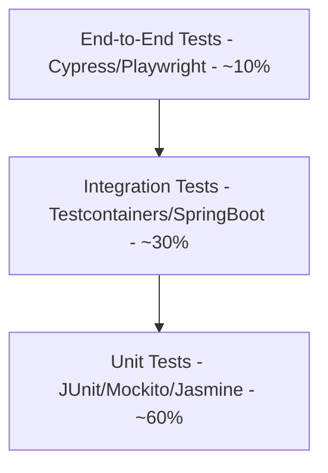
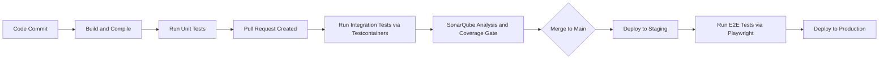
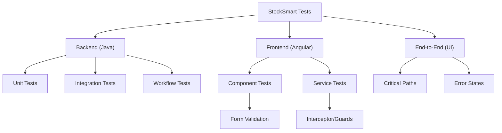

# StockSmart — Comprehensive Testing Strategy

This document outlines the testing strategy, standards, and targets for the StockSmart Retail Inventory Optimization & Management System.

---

## 1. Testing Philosophy

The StockSmart project follows the **Test Pyramid** methodology, which emphasizes writing a large number of fast, isolated unit tests, a moderate amount of integration tests, and a smaller number of comprehensive, end-to-end (E2E) UI tests.



---

## 2. Backend Testing (Java / Spring Boot)

We leverage JUnit 5, Mockito, and Testcontainers to ensure high reliability of the ledger and business logic.

### 2.1 Unit Tests
- **Framework**: JUnit 5 + Mockito
- **Scope**: Services, MapStruct mappers, validators, utility classes
- **Approach**: Test business logic in complete isolation, no Spring context loading
- **Focus**: Pure logic, edge cases, boundary conditions

### 2.2 Service Tests
- **Scope**: Service method logic with mocked repositories
- **Critical Coverage Areas**:
  - Inventory ledger operations (receive, adjust, transfer, sale)
  - Stock balance calculations (available = onHand - reserved)
  - Reorder rule evaluation
  - GS1 barcode parsing and validation
  - Purchase order state machine transitions
  - Transfer lifecycle management

### 2.3 Repository Tests
- **Annotation**: `@DataJpaTest`
- **Database**: Embedded H2 or lightweight Testcontainers (Oracle)
- **Scope**: Custom `@Query` methods, JPA Specifications, native Oracle queries
- **Important**: Validate that complex aggregation queries for KPIs return correct results

### 2.4 Controller/API Tests
- **Annotation**: `@WebMvcTest`
- **Tool**: MockMvc
- **Scope**: 
  - Request/response mapping correctness
  - DTO validation (Jakarta Validation annotations)
  - RFC 7807 Problem Details error responses
  - Security annotations (`@PreAuthorize`) enforcement
  - Pagination and sorting parameters

### 2.5 Integration Tests
- **Annotation**: `@SpringBootTest`
- **Database**: Testcontainers with Oracle or PostgreSQL for CI environments
- **Scope**: Full request flow from Controller → Service → Repository → Database
- **Key scenarios**:
  - Complete inventory receiving workflow
  - Stock transfer end-to-end
  - Purchase order lifecycle
  - Order processing with stock deduction

### 2.6 Authentication Tests
| Test Case | Description |
|---|---|
| Valid login | Correct credentials return JWT tokens |
| Invalid password | Returns 401, no account existence leak |
| Token validation | Valid JWT grants access |
| Expired token | Returns 401 with clear error |
| Refresh token | New access token issued, old refresh invalidated |
| Invalid refresh | Rejected, returns 401 |

### 2.7 Authorization Tests
| Test Case | Description |
|---|---|
| Role-based access | ADMIN can access all, SALES_STAFF cannot manage users |
| Permission check | `@PreAuthorize` enforced on service methods |
| Forbidden access | Returns 403 with RFC 7807 response |
| Missing permission | Operations without required permission are rejected |
| Cross-location access | Users can only access data for their assigned locations |

### 2.8 Inventory Workflow Tests
- **Double-Entry Ledger Consistency**: After every operation, verify:
  - `STOCK_TRANSACTION` record exists with correct type and quantity
  - `INVENTORY_BALANCE.quantityOnHand` reflects the transaction
  - `INVENTORY_BALANCE.version` was incremented
- **Optimistic Locking Conflict**:
  - Simulate concurrent updates to same `INVENTORY_BALANCE`
  - Verify `OptimisticLockException` is thrown
  - Verify retry logic succeeds on second attempt
- **Balance Integrity**: `quantityAvailable = quantityOnHand - quantityReserved`

### 2.9 Order Workflow Tests
- Order creation with stock availability check
- Stock reservation on order processing
- `STOCK_TRANSACTION (SALE)` creation on completion
- Balance deduction verification
- Order cancellation and stock return (`STOCK_TRANSACTION (RETURN)`)

### 2.10 Stock Transfer Tests
- Transfer lifecycle: DRAFT → PENDING_APPROVAL → APPROVED → IN_TRANSIT → RECEIVED
- Source balance deduction (TRANSFER_OUT transaction)
- Destination balance increase (TRANSFER_IN transaction)
- Discrepancy recording on partial receipt
- Cancellation at various stages

### 2.11 Barcode Tests
- EAN-13 check digit validation (valid and invalid codes)
- UPC-A check digit validation
- GS1-128 Application Identifier parsing
- Barcode lookup resolving to correct product
- Unknown barcode handling (404 response)
- Duplicate barcode registration prevention

### 2.12 KPI/Reporting Tests
- Total inventory value calculation accuracy
- Low-stock count against reorder rules
- Inventory turnover rate formula verification
- Report generation with correct date range filtering
- Export format validation (CSV structure, PDF generation)

---

## 3. Frontend Testing (Angular)

Frontend testing uses Jasmine/Karma (or Jest) for component and service tests.

### 3.1 Component Tests
- **Tool**: `TestBed`
- **Scope**: Component rendering, `@Input()` / `@Output()` bindings, user interactions, DOM updates
- **Pattern**: Test presentational (dumb) components separately from smart (container) components

### 3.2 Service Tests
- **Tool**: `HttpClientTestingModule`
- **Scope**: HTTP services making API calls
- **Approach**: Mock backend API responses, verify request parameters, test error handling

### 3.3 Guard Tests
- Test `CanActivateFn` guards for proper authentication checks
- Verify redirect to login for unauthenticated users
- Verify role-based route access restrictions

### 3.4 Interceptor Tests
- **AuthInterceptor**: Verify JWT token attachment to outgoing requests
- **HttpErrorInterceptor**: Verify global error handling, toast notification triggering, 401 redirect to login

### 3.5 Form Tests
- Reactive form creation and validation rules
- Cross-field validation (e.g., min stock <= max stock)
- Dynamic form fields (e.g., PO items, transfer items)
- Form submission payload correctness

### 3.6 Scanner Tests
- Scanner service event emission from camera/wedge/manual
- GS1 format parsing in frontend
- Offline scan buffering (IndexedDB operations)
- Idempotency key generation uniqueness
- Queue flush on reconnection

---

## 4. End-to-End Tests

For full system verification, we employ E2E testing mimicking actual user behavior.

### Framework
Cypress or Playwright

### Critical Paths

| Path | Description |
|---|---|
| Authentication | Login, logout, session expiry, role-based navigation |
| Product Management | Create, edit, search, view products |
| Inventory Receiving | Receive stock via PO, verify balance update |
| Stock Transfer | Create, approve, ship, receive transfer |
| Purchase Order | Create PO, approve, receive goods |
| Order Processing | Create order, process, verify stock deduction |
| Barcode Scanning | Scan barcode, view product, trigger action |
| Dashboard | Load KPIs, verify widget data |

### Cross-Cutting Concerns
- Navigation and routing
- Loading states and skeleton screens
- Error toast notifications
- Responsive design on different viewports

---

## 5. Requirement-to-Test Traceability

Every business requirement must be traceable to a set of tests to ensure absolute compliance.

### Mapping Strategy
`FR-001` (Functional Requirement) maps directly to specific test classes and methods.

### Naming Convention
Test method names or `@DisplayName` annotations reference the requirement ID:
```java
@Test
@DisplayName("FR-005: Ledger must record inventory receive transaction accurately")
void shouldCreateReceiveTransactionInLedger() { ... }
```

### Coverage Tracking
- Maintain a traceability matrix mapping FR/NFR IDs to test classes
- Review coverage per requirement during PR reviews
- Identify untested requirements during sprint planning

### Traceability Matrix Example

| Requirement | Test Class | Test Methods | Status |
|---|---|---|---|
| FR-001 | `ProductServiceTest` | `shouldCreateProduct`, `shouldValidateProductSku` | ✅ Covered |
| FR-010 | `InventoryLedgerServiceTest` | `shouldRecordReceiveTransaction`, `shouldUpdateBalance` | ✅ Covered |
| FR-015 | `StockTransferServiceTest` | `shouldCreateTransfer`, `shouldApproveTransfer` | ✅ Covered |

---

## 6. Test Data Strategy

### Test Fixtures
- Use factory patterns or builder classes to generate realistic test entities
- Libraries: Datafaker for random realistic data, custom Builder classes for domain objects

### Database Seeding (Integration Tests)
- Flyway test migrations for stable baseline data
- `@Sql` annotations to load scenario-specific data before tests
- Test data scripts organized per domain area

### State Cleanup
- `@Transactional` on test methods for automatic rollback
- Testcontainers provide fresh database per test class
- No shared mutable state between tests

---

## 7. CI/CD Testing Pipeline



### Pipeline Gates

| Gate | Trigger | Required |
|---|---|---|
| Unit Tests | Every commit | Must pass 100% |
| Lint / Static Analysis | Every commit | Must pass |
| Integration Tests | PR merge | Must pass 100% |
| Coverage Gate | PR merge | Backend ≥ 80%, Ledger/Security ≥ 90% |
| E2E Tests | Staging deployment | Critical paths must pass |
| Manual Approval | Production deployment | Required |

---

## 8. Code Coverage Targets

### Backend (JaCoCo)
| Module | Target |
|---|---|
| Overall | ≥ 80% line coverage |
| Inventory Ledger | ≥ 90% line coverage |
| Security/Auth | ≥ 90% line coverage |
| Controllers | ≥ 75% line coverage |
| Utilities | ≥ 85% line coverage |

### Frontend (Istanbul/Karma)
| Category | Target |
|---|---|
| Components | ≥ 70% coverage |
| Services | ≥ 80% coverage |
| Guards/Interceptors | ≥ 90% coverage |
| Overall | ≥ 70% coverage |

---

## 9. Test Category Overview


