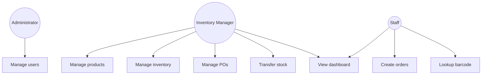

# StockSmart Use Cases

Academic use case catalog for viva and project report. Aligned with [requirements.md](./requirements.md).

## Actors

| Actor | Description |
|-------|-------------|
| **Administrator** | Manages users (`ADMIN`) |
| **Inventory Manager** | Stock, POs, transfers, reports |
| **Staff** | Orders, lookup, basic inventory view |

---

## Use case diagram (high level)

---

## Selected use cases

### UC-01: Login

- **Actor:** Any user  
- **Flow:** Enter credentials → API validates → JWT returned → access app  
- **Postcondition:** Authenticated session with role claims  

### UC-02: Manage product

- **Actor:** Inventory manager, Admin  
- **Flow:** CRUD product including SKU, prices, category, **barcode**  
- **Rules:** Unique SKU; unique barcode when set  

### UC-03: Receive purchase order

- **Actor:** Inventory manager  
- **Precondition:** PO in receivable status  
- **Flow:** Enter received quantities → **InventoryService** increases stock → PO status updated  
- **Exception:** Received qty exceeds ordered → validation error  

### UC-04: Adjust stock

- **Actor:** Inventory manager  
- **Flow:** Select product/location → enter delta + reason → quantity updated  
- **Exception:** Negative adjustment below zero → rejected  

### UC-05: Transfer stock

- **Actor:** Inventory manager  
- **Flow:** Select source, destination, lines → complete → source decreased, destination increased  

### UC-06: Process sales order

- **Actor:** Staff  
- **Flow:** Create order → confirm → stock decreased → status COMPLETED  
- **Exception:** Insufficient stock → order not confirmed  

### UC-07: Lookup by barcode

- **Actor:** Staff  
- **Flow:** Scan or type barcode → API returns product → show details or add to order  

### UC-08: View KPI dashboard

- **Actor:** Manager, Staff (read-only KPIs)  
- **Flow:** Dashboard loads aggregated metrics from database  

### UC-09: Manage users (Admin)

- **Actor:** Administrator  
- **Flow:** Create user, assign role, deactivate user  

### UC-10: Low-stock alert

- **Actor:** System (batch or on update)  
- **Flow:** When `quantity < reorderLevel`, create/update alert record or dashboard flag  

---

## RFID (future)

**UC-F01:** Ingest RFID tag reads — *placeholder only*; document hardware integration as post-MVP enhancement.

---

## Removed from enterprise use cases

- Immutable audit log UI, granular permission administration, GS1-128 AI parsing, offline scan sync, ledger reversal transactions, optimistic lock retry
