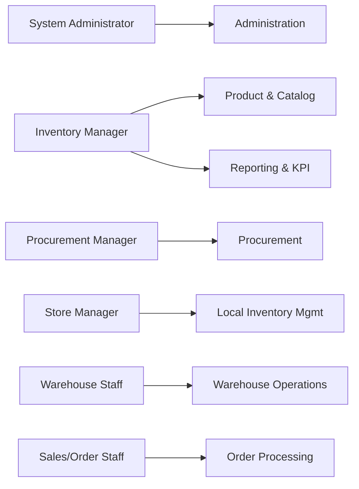
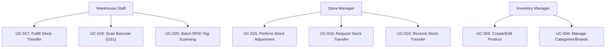
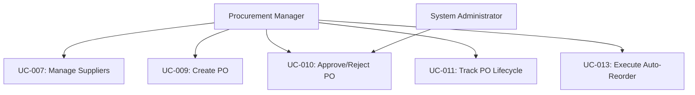
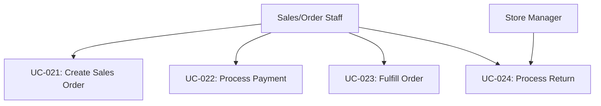
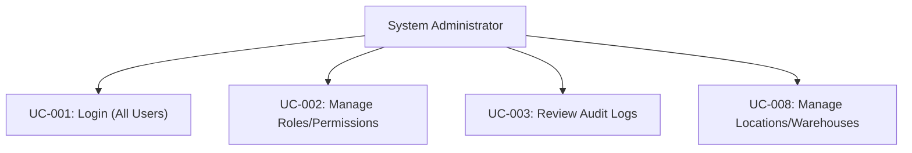
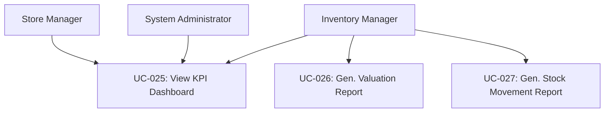

# StockSmart - Use Cases and Actor Analysis

## 1. Actor Analysis

The following actors interact with the StockSmart system. Each role is designed to support the hierarchical and operational needs of a multi-location retail environment.

### 1.1 System Administrator
- **Justification:** Essential for configuring the system, maintaining security, managing high-level organizational structures, and ensuring audit compliance.
- **Responsibilities:** Manage overall system configuration, configure system-wide settings, manage master roles and users, monitor system health, and oversee audit logs.
- **Permissions:** Full access to all modules, including sensitive audit and security settings. Bypasses standard location-scoping for global configuration.
- **Major Interactions:** User Management, Role/Permission Management, Location/Warehouse setup, Audit Log Review.

### 1.2 Inventory Manager
- **Justification:** Required to oversee the central catalog, define standard operating procedures for inventory handling, and monitor global stock health.
- **Responsibilities:** Maintain master product catalog, categorize products, set pricing/cost thresholds, monitor global inventory levels, establish low-stock alerts, and perform company-wide inventory analysis.
- **Permissions:** Global read access to inventory levels across all locations. Write access to product catalog, categories, brands, global stock adjustments, and reporting modules.
- **Major Interactions:** Product Management (CRUD), Location Inventory Overview, Low-Stock Alert configuration, KPI Dashboards, Inventory Reports.

### 1.3 Store Manager
- **Justification:** Acts as the localized owner of a specific retail location, responsible for localized stock accuracy and store operations.
- **Responsibilities:** Oversee store-specific inventory, approve local stock adjustments, request stock transfers from warehouses, manage local staff, and monitor store-specific KPIs.
- **Permissions:** Read/Write access strongly scoped to their assigned `LOCATION_ID`. Can approve local adjustments and initiate internal stock transfers.
- **Major Interactions:** Stock Adjustments, Stock Transfers (request and receive), Order Processing overrides, Store KPI Dashboard, Local Staff management.

### 1.4 Warehouse Staff
- **Justification:** The primary operational users performing physical material handling, receiving, and shipping at distribution centers or store backrooms.
- **Responsibilities:** Receive incoming shipments, pick and pack items for transfers or orders, perform cycle counts, and execute barcode/RFID scanning.
- **Permissions:** Scoped to their specific warehouse `LOCATION_ID`. Write access restricted to transaction-based activities (receiving, fulfilling, counting) rather than master data modification.
- **Major Interactions:** Inventory Receiving, PO Fulfillment, Stock Transfer Fulfillment, Barcode Scanning (GS1), RFID Scanning.

### 1.5 Procurement Manager
- **Justification:** Manages the supply chain relationships and inbound product pipeline to ensure adequate stock levels without over-purchasing.
- **Responsibilities:** Manage supplier database, negotiate costs, create and issue Purchase Orders (POs), manage auto-reorder workflows, and track PO lifecycles.
- **Permissions:** Global access to supplier data, purchasing workflows, and reorder alerts.
- **Major Interactions:** Supplier Management, PO Lifecycle, Reorder Workflows, Low-Stock Alerts.

### 1.6 Sales/Order Staff
- **Justification:** Customer-facing associates who process outbound inventory transactions (sales) directly impacting local stock levels.
- **Responsibilities:** Ring up customer sales, process customer returns, look up product availability for customers, and answer basic product inquiries.
- **Permissions:** Highly restricted. Read access to product catalog and local stock levels. Write access to Sales Orders and Returns within their `LOCATION_ID`.
- **Major Interactions:** Order Processing, Barcode Scanning (Point of Sale), Returns processing.

---

## 2. Mermaid Diagrams

### 2.1 Overall Use Case Overview

### 2.2 Inventory Management Use Cases

### 2.3 Procurement Use Cases

### 2.4 Order Processing Use Cases

### 2.5 Administration Use Cases

### 2.6 Reporting/KPI Use Cases

---

## 3. Detailed Use Cases

### 3.1 User Authentication & Management

**UC-001: User Login**
- **Actor:** All Users
- **Preconditions:** User has a registered account and valid credentials.
- **Main Flow:**
  1. User navigates to login page.
  2. User enters username and password.
  3. System validates credentials against database.
  4. System generates and issues a stateless JWT.
  5. User is redirected to their role-specific dashboard.
- **Alternative Flow:** User forgot password -> system initiates password reset workflow.
- **Exception Flow:** Invalid credentials -> system shows generic error message, denies access.
- **Postconditions:** User is authenticated and an active session is established.

**UC-002: Manage User Roles and Permissions**
- **Actor:** System Administrator
- **Preconditions:** Admin is logged in and authorized.
- **Main Flow:**
  1. Admin navigates to User Management.
  2. Admin selects a user to edit.
  3. Admin assigns or revokes specific roles (e.g., Store Manager) and scopes them to a specific `LOCATION_ID`.
  4. System saves changes and updates access control lists.
- **Alternative Flow:** Admin creates a brand new user profile and assigns roles simultaneously.
- **Exception Flow:** Admin attempts to remove the last Super Admin -> system prevents the action.
- **Postconditions:** User's permissions are immediately updated for their next API request.

**UC-003: Review System Audit Logs**
- **Actor:** System Administrator
- **Preconditions:** Admin is logged in.
- **Main Flow:**
  1. Admin navigates to Audit Logs section.
  2. Admin filters logs by date, user ID, module, or entity ID.
  3. System queries the immutable `AUDIT_LOG` records and displays results.
  4. Admin views the "before" and "after" state snapshots of a record.
- **Exception Flow:** Database timeout querying massive log history -> system requests narrower date filters.
- **Postconditions:** Audit analysis is complete.

**UC-004: Manage System Settings**
- **Actor:** System Administrator
- **Preconditions:** Admin is logged in.
- **Main Flow:**
  1. Admin navigates to Global Settings.
  2. Admin updates system-wide parameters (e.g., global currency, default timezone, global tax rates).
  3. Admin saves the configuration.
- **Alternative Flow:** Admin puts the system in maintenance mode for updates.
- **Postconditions:** System settings are applied globally.

### 3.2 Product & Location Management

**UC-005: Create/Edit Product**
- **Actor:** Inventory Manager
- **Preconditions:** User is authenticated.
- **Main Flow:**
  1. Manager navigates to Product Catalog and clicks "Add Product".
  2. Manager enters product details (SKU, Name, Description, Base Price, Cost, Category, GS1 Barcode).
  3. System validates SKU uniqueness and GS1 format.
  4. System saves product record.
- **Alternative Flow:** Editing an existing product's metadata (excluding SKU).
- **Exception Flow:** SKU already exists -> System throws validation error (RFC 7807 problem details).
- **Postconditions:** Product is available in the catalog for inventory operations.

**UC-006: Manage Categories and Brands**
- **Actor:** Inventory Manager
- **Preconditions:** User is authenticated.
- **Main Flow:**
  1. Manager navigates to Taxonomy section.
  2. Manager adds a new Category (e.g., "Electronics") and assigns optional parent categories.
  3. System saves the hierarchical data.
- **Postconditions:** Categories are available for product association.

**UC-007: Manage Supplier Directory**
- **Actor:** Procurement Manager
- **Preconditions:** User is authenticated.
- **Main Flow:**
  1. Manager navigates to Suppliers directory.
  2. Manager inputs supplier details (Name, Contact, Address, Lead Times, Payment Terms).
  3. System validates and saves the supplier record.
- **Postconditions:** Supplier can be associated with Purchase Orders.

**UC-008: Manage Location and Warehouses**
- **Actor:** System Administrator / Inventory Manager
- **Preconditions:** User is authenticated.
- **Main Flow:**
  1. Admin creates a new Location (Store or Warehouse).
  2. Admin defines the `LOCATION_ID`, physical address, and capacity.
  3. System initializes empty `INVENTORY_BALANCE` records dynamically as items are received at this location.
- **Postconditions:** New location is active and can receive stock.

### 3.3 Procurement

**UC-009: Create Purchase Order**
- **Actor:** Procurement Manager
- **Preconditions:** Supplier and Products exist.
- **Main Flow:**
  1. Manager selects a Supplier.
  2. Manager adds line items (products, quantities, negotiated unit cost).
  3. Manager specifies the destination `LOCATION_ID`.
  4. System calculates totals and generates a PO record in "Draft" state.
- **Exception Flow:** Destination location is inactive -> System rejects the PO creation.
- **Postconditions:** PO is saved and awaiting approval.

**UC-010: Approve/Reject Purchase Order**
- **Actor:** Procurement Manager / System Administrator
- **Preconditions:** PO is in "Draft" or "Pending Approval" state.
- **Main Flow:**
  1. Manager reviews the PO details.
  2. Manager clicks "Approve".
  3. System updates PO status to "Approved" and notifies the Supplier.
- **Alternative Flow:** Manager rejects PO with a reason code.
- **Postconditions:** PO is authorized for fulfillment.

**UC-011: Track PO Lifecycle**
- **Actor:** Procurement Manager
- **Preconditions:** PO exists.
- **Main Flow:**
  1. Manager views the PO dashboard.
  2. Manager sees status transitions (Draft -> Approved -> Shipped -> Partially Received -> Completed).
- **Postconditions:** Manager is informed of supply chain status.

**UC-012: Configure Low-Stock Alerts**
- **Actor:** Inventory Manager
- **Preconditions:** Products exist.
- **Main Flow:**
  1. Manager selects a Product and a `LOCATION_ID`.
  2. Manager defines the Minimum Threshold and Reorder Point.
  3. System saves the configuration.
- **Postconditions:** System will trigger alerts when `INVENTORY_BALANCE` drops below the threshold.

**UC-013: Execute Auto-Reorder Workflow**
- **Actor:** Procurement Manager
- **Preconditions:** Low-stock alerts triggered.
- **Main Flow:**
  1. System highlights items below reorder points.
  2. Manager reviews system-generated draft POs for these items based on preferred suppliers.
  3. Manager modifies quantities if needed and approves the batch.
- **Postconditions:** Automated POs are sent to suppliers.

### 3.4 Inventory Operations & Receiving

**UC-014: Receive Inventory against PO**
- **Actor:** Warehouse Staff
- **Preconditions:** Approved PO exists, physical goods have arrived at the specific `LOCATION_ID`.
- **Main Flow:**
  1. Staff opens the Receiving module and selects the PO.
  2. Staff inputs/scans received quantities for each line item.
  3. System triggers the `InventoryLedgerService`.
  4. System creates immutable `STOCK_TRANSACTION` records (Type: RECEIPT).
  5. System updates `INVENTORY_BALANCE` for the location using optimistic locking (`@Version`).
  6. PO status updates to "Completed" (or "Partially Received").
- **Exception Flow:** Version collision during balance update -> JPA `OptimisticLockException` is caught, system automatically retries the ledger update.
- **Postconditions:** Stock is physically and systematically available at the location.

**UC-015: Perform Stock Adjustment**
- **Actor:** Store Manager / Inventory Manager
- **Preconditions:** Inventory exists at location.
- **Main Flow:**
  1. Manager selects an item and the local `LOCATION_ID`.
  2. Manager enters the actual physical count or adjustment delta (+/-).
  3. Manager provides a compulsory Reason Code (e.g., Shrinkage, Damaged, Found).
  4. System executes a ledger entry (`STOCK_TRANSACTION`, Type: ADJUSTMENT).
  5. System updates `INVENTORY_BALANCE`.
- **Postconditions:** Inventory balance aligns with physical reality; financial discrepancies are logged.

**UC-016: Request Stock Transfer**
- **Actor:** Store Manager
- **Preconditions:** Receiving location is known.
- **Main Flow:**
  1. Store Manager selects items needed and target warehouse `LOCATION_ID`.
  2. System verifies source warehouse has sufficient stock.
  3. System creates a Transfer Request in "Pending" status.
- **Postconditions:** Warehouse is notified of the request.

**UC-017: Fulfill Stock Transfer**
- **Actor:** Warehouse Staff
- **Preconditions:** Pending Transfer Request exists.
- **Main Flow:**
  1. Staff picks the requested items and packs them.
  2. Staff marks transfer as "Shipped" in the system.
  3. System generates a `STOCK_TRANSACTION` (Type: TRANSFER_OUT) for the warehouse location, reducing its balance.
  4. Items are in "In Transit" status.
- **Postconditions:** Items leave warehouse inventory.

**UC-018: Receive Stock Transfer**
- **Actor:** Store Manager / Warehouse Staff
- **Preconditions:** Transfer is "In Transit".
- **Main Flow:**
  1. Receiving store staff unpacks items.
  2. Staff marks transfer as "Received".
  3. System generates a `STOCK_TRANSACTION` (Type: TRANSFER_IN) for the store location, increasing its balance.
- **Exception Flow:** Short shipment (missing items) -> System generates a discrepancy adjustment.
- **Postconditions:** Items are available in the store's inventory.

### 3.5 Scanning Integration

**UC-019: Scan Barcode (GS1) for Item Lookup**
- **Actor:** Warehouse Staff / Sales Staff
- **Preconditions:** Device has barcode scanning hardware or WebRTC camera enabled.
- **Main Flow:**
  1. Staff points scanner at a GS1 standard barcode (EAN-13, UPC-A).
  2. The Angular keyboard-wedge event listener captures the scan.
  3. Frontend triggers API call to resolve the SKU.
  4. System displays product details and real-time local `INVENTORY_BALANCE`.
- **Alternative Flow:** Device is offline -> Frontend logs the scan in local IndexedDB buffering, syncs later using idempotency keys.
- **Postconditions:** Item is identified.

**UC-020: Batch RFID Tag Scanning for Intake**
- **Actor:** Warehouse Staff
- **Preconditions:** Products tagged with EPC Gen2 (SGTIN-96) RFID tags.
- **Main Flow:**
  1. Staff moves a pallet through an RFID portal.
  2. Portal ingests EPCIS-compatible event data.
  3. System parses SGTIN-96 bits to extract Company Prefix, Item Reference, and Serial Number.
  4. System automatically drafts a Receiving document with aggregated quantities.
- **Exception Flow:** Unrecognized RFID tags -> System isolates them into an "Unknown Tag" exception queue.
- **Postconditions:** Rapid batch intake is prepared for confirmation.

### 3.6 Order Processing

**UC-021: Create Sales Order**
- **Actor:** Sales/Order Staff
- **Preconditions:** Customer is ready to purchase; items are in stock.
- **Main Flow:**
  1. Staff scans items at POS.
  2. System builds the Sales Order cart.
  3. System calculates subtotal, taxes, and total.
- **Postconditions:** Order is ready for payment.

**UC-022: Process Sales Order Payment**
- **Actor:** Sales/Order Staff
- **Preconditions:** Sales Order is calculated.
- **Main Flow:**
  1. Staff selects payment method (Cash, Card).
  2. External payment gateway confirms funds (simulated).
  3. Order status updates to "Paid".
- **Postconditions:** Order is ready for fulfillment.

**UC-023: Fulfill Order / Deduct Inventory**
- **Actor:** Sales/Order Staff / Warehouse Staff
- **Preconditions:** Order is "Paid".
- **Main Flow:**
  1. System automatically triggers the `InventoryLedgerService`.
  2. System creates a `STOCK_TRANSACTION` (Type: SALE) scoped to the origin `LOCATION_ID`.
  3. System decreases the `INVENTORY_BALANCE`.
  4. Order status updates to "Fulfilled".
- **Exception Flow:** OptimisticLockException due to simultaneous sale of last item -> System rolls back transaction, alerts staff of stockout.
- **Postconditions:** Inventory accurately reflects the sale.

**UC-024: Process Customer Return**
- **Actor:** Sales/Order Staff / Store Manager
- **Preconditions:** Customer presents receipt or order number.
- **Main Flow:**
  1. Staff looks up original Sales Order.
  2. Staff selects items being returned and inspects condition.
  3. System issues refund.
  4. System creates a `STOCK_TRANSACTION` (Type: RETURN).
  5. System increases local `INVENTORY_BALANCE`.
- **Alternative Flow:** Item is damaged -> Item is returned to a special "Quarantine" location balance rather than sellable floor stock.
- **Postconditions:** Customer is refunded, inventory is updated.

### 3.7 Reporting & KPI Dashboards

**UC-025: View KPI Dashboard**
- **Actor:** Store Manager, Inventory Manager, Admin
- **Preconditions:** User is authenticated.
- **Main Flow:**
  1. User navigates to Home Dashboard.
  2. System aggregates data for relevant KPIs (Stockout Rate, Inventory Turnover, Total Value on Hand).
  3. If user is Store Manager, data is scoped strictly to their `LOCATION_ID`. If Admin/Inv Manager, data is global.
  4. UI renders Angular charts/graphs.
- **Postconditions:** User is informed of operational metrics.

**UC-026: Generate Inventory Valuation Report**
- **Actor:** Inventory Manager
- **Preconditions:** Products have associated cost data.
- **Main Flow:**
  1. Manager selects "Valuation Report" and parameters (Date, Location).
  2. System multiplies current `INVENTORY_BALANCE` quantities by product unit cost.
  3. System exports a standardized JSON or PDF report.
- **Postconditions:** Financial valuation is available.

**UC-027: Generate Stock Movement Report**
- **Actor:** Inventory Manager
- **Preconditions:** Ledger transactions exist.
- **Main Flow:**
  1. Manager selects a date range and location.
  2. System queries the immutable `STOCK_TRANSACTION` ledger.
  3. System lists all Receipts, Sales, Transfers, and Adjustments in chronological order.
- **Postconditions:** A complete audit trail of physical movement is provided.
